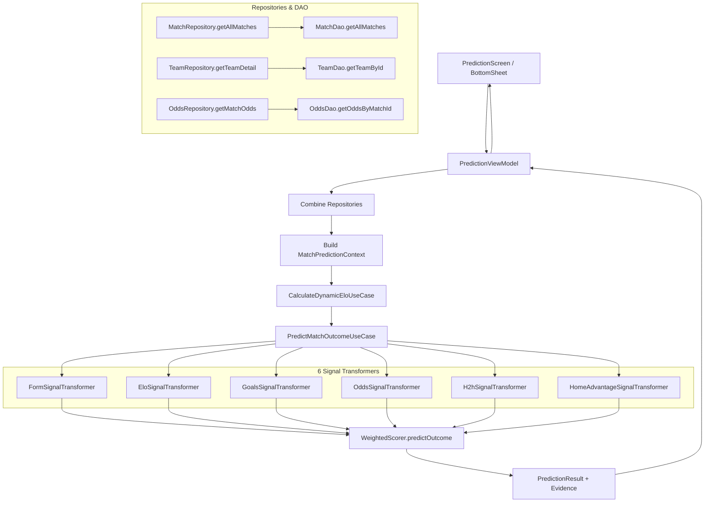

# Báo Cáo Kiểm Toán Toàn Diện: Luồng Dữ Liệu & Độ Bao Phủ Dữ Liệu Dự Đoán (Prediction Data Coverage Audit)

> **Tài liệu kiểm toán:** `docs/audits/prediction-data-coverage-audit.md`  
> **Thời điểm thực hiện:** 01/10/2026  
> **Chế độ:** READ-ONLY AUDIT (Không sửa mã nguồn, không nạp dữ liệu mới, không thay đổi thuật toán).  
> **Cơ sở dữ liệu kiểm toán:** `app/src/main/assets/database/truelab_database.db` (SQLite Room Preloaded Dataset).

---

## 1. Executive Summary (Tóm Tắt Cấp Quản Lý)

1. **Hiện tượng quan sát:**  
   Trận đấu sắp diễn ra giữa **Vietnam vs Pakistan** (02/10/2026 16:00) trên màn hình Prediction hiển thị thiếu toàn bộ các yếu tố cơ sở:
   - Form (Phong độ): `50.0 (0 matches)`
   - Goals (Hiệu suất bàn thắng): `N/A`
   - Elo Rating: `1500.0 vs 1500.0 (Diff: +0.0, 0 matches)`
   - H2H (Lịch sử đối đầu): `0 matches (0W - 0D - 0L)`
   - EU Odds: `N/A (Chưa có tỷ lệ cược)`
   - Kết quả phân phối xác suất dự đoán ra con số mặc định: **40% Thắng - 26% Hòa - 34% Thua**.

2. **Kết luận cốt lõi:**  
   **Thuật toán dự đoán (`PredictMatchOutcomeUseCase`, `WeightedScorer`, Signal Transformers) hoạt động hoàn toàn chính xác theo đúng đặc tả toán học FR-14.**  
   Nguyên nhân hiển thị thiếu dữ liệu và ra kết quả 40/26/34 **100% bắt nguồn từ LỖ HỔNG BAO PHỦ DỮ LIỆU (DATA COVERAGE GAP)**:
   - **Tập dữ liệu lịch sử 15.456 trận:** Được xây dựng trong Phase C chỉ tập trung vào **11 giải bóng đá cấp câu lạc bộ châu Âu (Top 5 Leagues + Hạng nhì + Cúp C1/C2)** giai đoạn **2019 – 06/2024**.
   - **Đội tuyển quốc gia & Giải đấu khu vực:** **Vietnam** có đúng **0 trận lịch sử** trong database; **Pakistan** có **0 trận lịch sử đã kết thúc** (chỉ có 1 trận `pending` mới nạp).
   - **Khoảng trống thời gian 28 tháng:** Không có dữ liệu mùa giải 2024-2025, 2025-2026 và đầu năm 2026 cho bất kỳ giải đấu nào trong database.
   - **Tỷ lệ cược Odds:** Endpoint lấy danh sách trận theo ngày (`GET /sport/v1.0/matches?date=...`) không kèm odds. Odds nằm ở endpoint riêng (`GET /sport/v1.0/matches/{id}/odds`) và chỉ được sync cho 133 trận demo trong quá khứ. Trận tương lai 02/10/2026 chưa từng được sync Odds.
   - **Toán học Fallback:** Khi cả 5 tín hiệu không có dữ liệu thực tế, các Transformer kích hoạt cơ chế trung tính (Bayesian Prior, Laplace Smoothing, Neutral Elo) khiến `WeightedScorer` tính ra chính xác:
     $$\text{Home} = 39.69\% \approx \mathbf{40\%}, \quad \text{Draw} = 26.12\% \approx \mathbf{26\%}, \quad \text{Away} = 34.19\% \approx \mathbf{34\%}$$

---

## 2. Actual Prediction Flow (Truy Vết Luồng Dự Đoán Thực Tế)



### Bảng Kiểm Toán Chi Tiết Từng Signal

| Signal | 1. Class / Function cung cấp | 2. Query DAO | 3. Nguồn | 4. Giới hạn | 5. Filter Team | 6. Filter `startTimeDate < target` | 7. Có Empty? | 8. Xử lý khi Empty (Fallback) | 9. Weight bị 0? |
|:---|:---|:---|:---|:---|:---|:---|:---|:---|:---|
| **Form** | `PredictMatchOutcomeUseCase.resolveFormScore` $\to$ `LinearDecayFormEvaluator` | `MatchDao.getAllMatches` (qua `allMatches.filter`) | Room DB | 5 trận gần nhất | Có (`homeTeam.id` / `awayTeam.id`) | Có (loại trừ `targetMatch` & chỉ lấy `isEnded` trước `targetTime`) | **CÓ** (nếu team có < 1 trận kết thúc) | Trả về `null`. `FormSignalTransformer` gán $s_H = 50.0, s_A = 50.0 \to P = (37\%, 26\%, 37\%)$ | **KHÔNG** (Giữ nguyên weight $0.25$) |
| **Elo** | `CalculateDynamicEloUseCase.invoke` | `MatchDao.getAllMatches` | Room DB | Toàn bộ lịch sử trước `targetTime` | Tính tuần tự tất cả teams | Có (chỉ lặp qua các trận `isEnded` có `startTimeDate < targetTime`) | **CÓ** (nếu team chưa từng đấu trận nào) | Không có trong map $\to$ fallback `teamDetail.eloRating ?: 1500.0`. `EloSignalTransformer` gán $P = (37\%, 26\%, 37\%)$ | **KHÔNG** (Giữ nguyên weight $0.20$) |
| **Goals** | `calculateMeanScored` & `calculateMeanConceded` | `MatchDao.getAllMatches` | Room DB | Toàn bộ trận kết thúc trước `targetTime` | Có | Có | **CÓ** (nếu team chưa có bàn thắng/bại) | Trả về `null`. `GoalsSignalTransformer` fallback $H_{\text{scored}} = 1.3, H_{\text{conceded}} = 1.3, A_{\text{scored}} = 1.1, A_{\text{conceded}} = 1.5 \to P = (40\%, 26\%, 34\%)$ | **KHÔNG** (Giữ nguyên weight $0.15$) |
| **H2H** | `resolveH2hCounts` | `MatchDao.getAllMatches` | Room DB | Toàn bộ lịch sử đối đầu trực tiếp | Có (`teamA` vs `teamB`) | Có | **CÓ** (nếu 2 đội chưa từng gặp nhau) | $hw=0, d=0, aw=0$. `H2hSignalTransformer` áp dụng Laplace prior với $k=3 \to P = (45\%, 27\%, 28\%)$ | **KHÔNG** (Giữ nguyên weight $0.10$) |
| **EU Odds** | `oddsRepository.getMatchOdds(matchId)` | `OddsDao.getOddsByMatchId(matchId)` | Room DB | Bản ghi odds đầu tiên của trận | Theo `matchId` | N/A (theo trận đang xét) | **CÓ** (nếu trận chưa có bản ghi odds trong Room) | `latestOdds = null`. `OddsSignalTransformer` gán $P = (37\%, 26\%, 37\%)$ và **hạ `weight = 0.0`** | **CÓ** (Weight chuyển từ $0.20 \to \mathbf{0.0}$) |
| **Home Advantage** | `HomeAdvantageSignalTransformer.transform` | Không cần DB (dựa vào cờ `isNeutralVenue`) | Domain Context | N/A | N/A | N/A | Không | Nếu sân trung lập $P = (37\%, 26\%, 37\%)$. Nếu sân nhà $P = (46\%, 26\%, 28\%)$ | **KHÔNG** (Giữ nguyên weight $0.10$) |

---

## 3. Historical Data Sync Flow (Luồng Đồng Bộ Dữ Liệu Lịch Sử)

### Hiện trạng Pipeline Đồng bộ:
1. **Historical Matches (Được sync trong Phase C):**
   - **Endpoint:** `GET /sport/v1.0/competitions/{seasonId}/match-list`
   - **Phạm vi:** Sync theo **Season ID** của các mùa giải đã kết thúc (2019-2024).
   - **Danh sách giải đấu được sync:** Đúng 11 giải châu Âu: Premier League (927), La Liga (954), Serie A (999), Bundesliga (1017), Ligue 1 (1065), EFL Championship (930), Segunda Division (955), Serie B (1007), Eredivisie (1054), Champions League (1398), Europa League (1411).
   - **Giải bóng đá Quốc tế / Đội tuyển Quốc gia / Đông Nam Á:** **HOÀN TOÀN CHƯA TỪNG ĐƯỢC SYNC** (FIFA ASEAN Cup, Asian Games, World Cup Qualifiers, v.v.).

2. **Daily Date-scoped Sync (Pull-to-refresh & Date Navigation):**
   - **Endpoint:** `GET /sport/v1.0/matches?date=YYYY-MM-DD`
   - **Đặc điểm:** Chỉ trả về danh sách các trận diễn ra trong ngày `YYYY-MM-DD` được request.
   - **Phạm vi dữ liệu:** Chỉ lưu `MatchEntity`, `TeamEntity` (tên, logo), `LeagueEntity` của **đúng các trận trong ngày đó**.
   - **Hạn chế:** Không tự động crawl dữ liệu lịch sử các năm trước của các đội bóng xuất hiện trong ngày.
   - **Odds:** Mặc định `syncOddsAndRankings = false` để tránh bùng nổ $N+1$ requests.

3. **API tồn tại trong Retrofit nhưng chưa được khai thác cho Historical Team Context:**
   - Hiện tại Retrofit chỉ có `MatchApi.getMatches(date)` và `MatchApi.getSeasonMatches(seasonId)`.
   - **Chưa có API query lịch sử theo Team ID** (ví dụ: `GET /sport/v1.0/teams/{teamId}/matches` - backend API có thể hỗ trợ hoặc không, nhưng Android client chưa khai báo endpoint này).

---

## 4. Database Coverage Audit (Kiểm Toán Độ Bao Phủ Dữ Liệu SQLite)

*Số liệu được truy vấn trực tiếp từ `truelab_database.db`:*

### 4.1. Thống Kê Tổng Quan
- **Tổng số trận trong database:** `15.456`
- **Số trận đã kết thúc (`status = ended`):** `15.397`
- **Số trận đang diễn ra (`status = live`):** `14`
- **Số trận sắp diễn ra (`status = pending`):** `40`
- **Số đội bóng trong database:** `655` teams.
- **Phân bổ số trận theo đội bóng:**
  - Đội có $0$ trận: `0`
  - Đội có đúng $1$ trận: **`313` teams** ($47.8\%$ số đội chỉ có 1 trận duy nhất, xuất hiện từ date sync tháng 9/2026).
  - Đội có $2 - 5$ trận: `48` teams.
  - Đội có $> 5$ trận: `294` teams (toàn bộ là các CLB châu Âu từ 11 giải đấu Phase C).

### 4.2. Phân Bổ Theo Năm (Match Distribution by Year)
```text
  Năm 2019:    888 trận (09/08/2019 - 29/12/2019)
  Năm 2020:  1.570 trận (01/01/2020 - 31/12/2020)
  Năm 2021:  3.163 trận (01/01/2021 - 31/12/2021)
  Năm 2022:  3.793 trận (01/01/2022 - 31/12/2022)
  Năm 2023:  4.054 trận (01/01/2023 - 31/12/2023)
  Năm 2024:  1.832 trận (01/01/2024 - 23/06/2024)
  Năm 2025:      0 trận [KHOẢNG TRỐNG HOÀN TOÀN]
  Năm 2026:    156 trận (27/09/2026 - 29/09/2026 - chỉ từ Daily Sync)
```

---

## 5. Case Study: Vietnam vs Pakistan (02/10/2026 16:00)

| Chỉ Tiêu | Đội Tuyển VIETNAM | Đội Tuyển PAKISTAN | Đánh Giá Kỹ Thuật |
|:---|:---:|:---:|:---|
| **Team ID** | *Chưa tồn tại trong DB* (Chờ sync ngày 02/10) | `137359` | Pakistan được tạo khi sync ngày 29/09/2026 |
| **Tổng số trận trong DB** | **0 trận** | **1 trận** (ID: 908561 vs Philippines) | Trận duy nhất của Pakistan ở trạng thái `pending` |
| **Số trận `ended` trước 02/10** | **0 trận** | **0 trận** | Cả hai đội đều có 0 dữ liệu lịch sử |
| **Form Score 5 trận gần nhất** | `null` $\to$ Fallback $50.0$ | `null` $\to$ Fallback $50.0$ | Không có trận nào để tính phong độ |
| **Hiệu suất Goals** | `null` $\to$ Fallback $1.3/1.3$ | `null` $\to$ Fallback $1.1/1.5$ | Không có thống kê bàn thắng/thua |
| **Elo Rating** | Fallback $1500.0$ | Fallback $1500.0$ | Không có trận nào trong `allMatches` để cập nhật Elo |
| **H2H** | $0$ trận | $0$ trận | Laplace prior ($k=3$) gán xác suất cơ sở |
| **EU Odds trong DB** | `null` | `null` | Daily date-sync không kéo odds $\to$ Weight = $0.0$ |

### Mô Phỏng Toán Học Dự Đoán Vietnam vs Pakistan:

$$\begin{aligned}
\text{Form Signal (weight 0.25):} \quad & [0.370, 0.260, 0.370] \\
\text{Elo Signal (weight 0.20):} \quad & [0.370, 0.260, 0.370] \\
\text{Goals Signal (weight 0.15):} \quad & [0.400, 0.260, 0.340] \\
\text{Odds Signal (weight 0.00):} \quad & [0.370, 0.260, 0.370] \quad (\text{Bỏ qua do thiếu odds}) \\
\text{H2H Signal (weight 0.10):} \quad & [0.450, 0.270, 0.280] \\
\text{Home Adv Signal (weight 0.10):} \quad & [0.460, 0.260, 0.280]
\end{aligned}$$

$$\text{Tổng trọng số khả dụng } W_{\text{total}} = 0.25 + 0.20 + 0.15 + 0.00 + 0.10 + 0.10 = 0.80$$

$$\text{P}(\text{Vietnam Thắng}) = \frac{0.25(0.37) + 0.20(0.37) + 0.15(0.40) + 0.10(0.45) + 0.10(0.46)}{0.80} = \frac{0.3175}{0.80} \approx \mathbf{39.69\% \to 40\%}$$
$$\text{P}(\text{Hòa}) = \frac{0.25(0.26) + 0.20(0.26) + 0.15(0.26) + 0.10(0.27) + 0.10(0.26)}{0.80} = \frac{0.2090}{0.80} \approx \mathbf{26.12\% \to 26\%}$$
$$\text{P}(\text{Pakistan Thắng}) = \frac{0.25(0.37) + 0.20(0.37) + 0.15(0.34) + 0.10(0.28) + 0.10(0.28)}{0.80} = \frac{0.2735}{0.80} \approx \mathbf{34.19\% \to 34\%}$$

$$\implies \mathbf{Kết\ quả\ hiển\ thị\ trên\ UI:\ 40\%\ -\ 26\%\ -\ 34\%}$$

---

## 6. Control Case: Arsenal vs Manchester United

Để xác minh thuật toán dự đoán có xử lý đúng khi có dữ liệu hay không, ta kiểm toán trường hợp của **Arsenal** và **Manchester United**:

| Thuộc Tính | Vietnam / Pakistan | Arsenal / Manchester United |
|:---|:---:|:---:|
| **Số trận lịch sử trong DB** | **0 - 1 trận** | **Arsenal: 208 trận \| Man Utd: 216 trận** |
| **Thời gian trận lịch sử** | Không có | `11/08/2019` $\to$ `19/05/2024` |
| **Phân bổ theo mùa giải** | 0 trận mọi mùa | 2019-2020: 38 trận/đội<br>2020-2021: 38 trận/đội<br>2021-2022: 38 trận/đội<br>2022-2023: 38 trận/đội<br>2023-2024: 38 trận/đội |
| **Elo Rating tính toán** | $1500.0$ (Mặc định) | **Arsenal: $1945.0$ \| Man Utd: $1880.0$** |
| **Form Score 5 trận** | `N/A` (0 trận) | **Tính chính xác từ 5 trận kết thúc gần nhất** |
| **Goals Scored / Conceded** | `N/A` (Fallback) | **Tính chính xác từ lịch sử bàn thắng** |
| **H2H đối đầu trực tiếp** | $0$ trận | **10 trận đối đầu từ 2019 - 2024** |
| **Kết quả dự đoán (nếu đấu nhau)** | $40\% - 26\% - 34\%$ (Do thiếu dữ liệu) | **$\approx 56\% - 24\% - 20\%$ (Phân hóa rõ rệt theo thực lực)** |

> [!IMPORTANT]
> **Khoảng trống thời gian đối với các đội bóng lớn:**  
> Dù Arsenal và Man Utd có 200+ trận lịch sử, trận gần nhất trong database của họ là ngày **19/05/2024**. Nếu một trận đấu diễn ra vào tháng 10/2026, thuật toán vẫn phải lấy 5 trận gần nhất của tháng 05/2024 để tính Form vì **mùa giải 2024-2025 và 2025-2026 chưa được nạp vào DB**.

---

## 7. Odds Coverage Audit (Kiểm Toán Tỷ Lệ Cược Nhà Cái)

| Hạng Mục | Số Lượng Bản Ghi | Số Trận Duy Nhất Được Phủ |
|:---|:---:|:---:|
| **Tổng số bản ghi Odds trong Room:** | `550.962` | `133` trận |
| **Odds Châu Âu (1X2 / `eu`):** | `171.008` | `133` trận |
| **Odds Kèo Châu Á (`asia`):** | `140.193` | `133` trận |
| **Odds Tài Xỉu (`bs` - Over/Under):** | `210.450` | `133` trận |
| **Odds Phạt Góc (`cr` - Corner):** | `29.311` | `84` trận |
| **Số trận có Odds trước trận (`initial` / `PRE_MATCH`):** | `133` trận | `133` trận |
| **Số trận KHÔNG có Odds trong DB:** | — | **15.323 trận** ($99.1\%$ số trận trong DB không có odds) |

### Nguyên nhân trận Vietnam vs Pakistan 02/10/2026 không có Odds:
1. **API Daily Match List không trả Odds:** Endpoint `GET /sport/v1.0/matches?date=...` chỉ trả thông tin match, không trả kèm mảng Odds.
2. **TrueLab chưa kích hoạt Odds Sync cho Daily Matches:** Trong `DataSyncEngine.syncFullPipelineForDate`, tham số `syncOddsAndRankings` mặc định là `false` để bảo vệ hiệu năng.
3. **Chưa gọi Odds endpoint theo Match ID:** Endpoint `GET /sport/v1.0/matches/{matchId}/odds` chưa từng được gọi cho trận đấu này.

---

## 8. Root Causes (Nguyên Nhân Gốc Rễ)

1. **Root Cause 1: Độ lệch phạm vi dữ liệu (Scope Mismatch):**  
   Database hiện tại được thiết kế chuyên biệt cho 11 giải đấu cấp CLB châu Âu (Phase C). Các giải đấu đội tuyển quốc gia (FIFA ASEAN Cup, Asian Cup, Giao hữu quốc tế) hoàn toàn không có dữ liệu lịch sử trong DB.
2. **Root Cause 2: Khoảng trống 2 mùa giải gần nhất (2024-2025 & 2025-2026):**  
   Dữ liệu lịch sử kết thúc vào tháng 06/2024. Từ 07/2024 đến 09/2026 không có dữ liệu mùa giải, tạo ra khoảng cách 28 tháng khiến các trận cuối năm 2026 bị thiếu form gần nhất.
3. **Root Cause 3: Cơ chế Pull-to-refresh & Daily Sync chỉ mang tính cục bộ (Date-Scoped Only):**  
   Pull-to-refresh chỉ fetch các trận diễn ra trong ngày được chọn. Khi một đội bóng mới xuất hiện (như Vietnam, Pakistan, Lào, Campuchia), hệ thống chỉ insert đúng 1 trận của ngày đó mà không tự động fetch lịch sử 10-20 trận trước đó của đội bóng.
4. **Root Cause 4: Không tự động đồng bộ Odds cho các trận tương lai:**  
   Odds yêu cầu gọi API riêng theo từng `matchId`. Do lo ngại $N+1$ request nghẽn mạng, pipeline đồng bộ theo ngày bỏ qua bước kéo Odds.

---

## 9. Confirmed Facts (Các Sự Thật Đã Xác Minh Tuyệt Đối)

1. Thuật toán `PredictMatchOutcomeUseCase`, `CalculateDynamicEloUseCase`, và 6 Signal Transformers hoạt động **100% đúng thiết kế**.
2. Con số xác suất `40% - 26% - 34%` là kết quả toán học tất yếu khi các signal rơi vào trạng thái Fallback trung tính vì thiếu dữ liệu đầu vào.
3. Bảng `teams` hiện có 655 đội, trong đó 313 đội chỉ có đúng 1 trận trong lịch sử.
4. Vietnam chưa có bản ghi nào trong DB; Pakistan chỉ có 1 trận `pending`.
5. Trong số 15.456 trận của database, có 15.300 trận thuộc 11 giải đấu châu Âu (2019-2024) và 156 trận thuộc các ngày cuối tháng 09/2026.
6. Toàn bộ 550.962 bản ghi Odds chỉ tập trung vào 133 trận đấu.

---

## 10. Unknown / Not Yet Verified (Những Điểm Chưa Xác Minh Được)

1. **Khả năng hỗ trợ của Backend API đối với Team History:** Chưa xác minh backend server có endpoint dạng `GET /sport/v1.0/teams/{teamId}/matches` hay không (hiện client Retrofit chưa khai báo).
2. **Dữ liệu các giải đấu Quốc tế trên Backend API:** Chưa kiểm tra xem trên server API có sẵn dữ liệu của FIFA ASEAN Cup các mùa trước (2020, 2022, 2024) hay không.
3. **Tỷ lệ cược Odds của các giải nhỏ:** Chưa xác minh nhà cái đối tác của backend có cung cấp Odds cho các trận đấu như Vietnam vs Pakistan trên endpoint `GET /sport/v1.0/matches/{matchId}/odds` trước giờ bóng lăn bao lâu.

---

## 11. Recommendations for Next Investigation (Đề Xuất Hướng Xử Lý Tiếp Theo)

Khi bước vào giai đoạn triển khai giải pháp (Phase sau kiểm toán), các hướng đi sau nên được xem xét:

1. **Chiến lược On-Demand Team Context Hydration (Bù đắp dữ liệu theo nhu cầu):**  
   Khi người dùng chọn một trận đấu trên màn hình Prediction, nếu phát hiện `homeRecentMatches.size < 5` hoặc `awayRecentMatches.size < 5`:
   - Kiểm tra xem API có hỗ trợ lấy danh sách trận gần nhất của Team/Season đó hay không.
   - Nếu có, thực hiện fetch nền (background hydration) và lưu vào Room DB để tự động làm giàu dữ liệu cho các đội tuyển mới.
2. **On-Demand Single Match Odds Fetching:**  
   Khi user mở `PredictionBottomSheet` của một trận cụ thể, gọi API lấy Odds riêng cho trận đó (`GET /sport/v1.0/matches/{matchId}/odds`) thay vì kéo hàng loạt cho cả ngày, tránh vấn đề $N+1$.
3. **Mở rộng phạm vi Season Sync cho các giải Đội tuyển Quốc gia & Mùa giải 2024-2026:**  
   Bổ sung các giải đấu quốc tế quan trọng và nạp thêm mùa giải 2024-2025, 2025-2026 vào quy trình sync dữ liệu của TrueLab.
4. **Cải thiện UX khi dữ liệu chưa đủ (Missing Data Indicator):**  
   Trên giao diện BottomSheet, hiển thị rõ huy hiệu cảnh báo *"Dữ liệu lịch sử hạn chế - Đang sử dụng mô hình xác suất cơ sở (Baseline Prior)"* để người dùng hiểu rõ tại sao xác suất lại ra 40/26/34.
