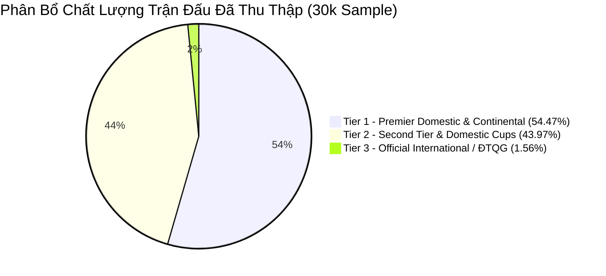
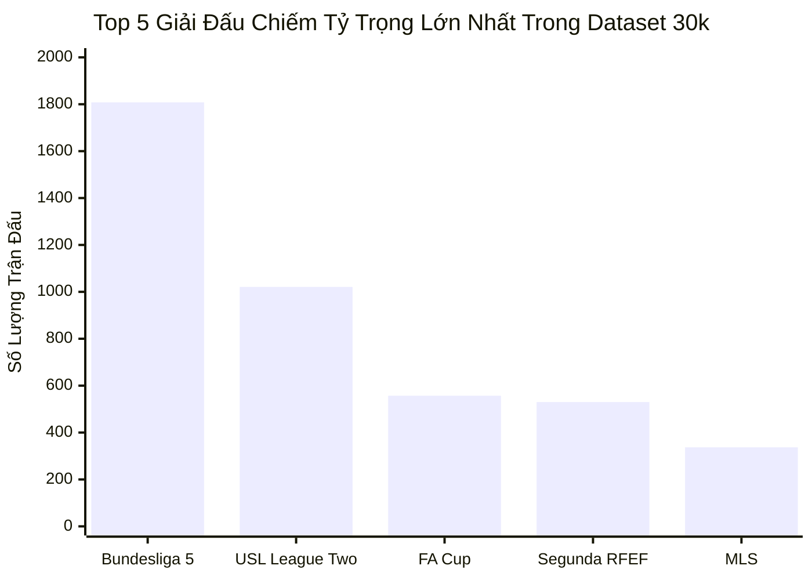

# Post-Crawl Audit Report: Phase C — Checkpoint 30,000 Matches (`truelab_recent_75k.db`)

> **Tài liệu kiểm toán:** `docs/audits/recent-dataset-30k-audit.md`  
> **Phiên bản:** `1.0.0-CHECKPOINT-30K`  
> **Chính sách áp dụng:** `quality-policy-v1`  
> **Ngày thực hiện kiểm toán:** 01/10/2026  
> **Đối tượng kiểm toán:** Cơ sở dữ liệu SQLite độc lập `truelab_recent_75k.db`  
> **Trạng thái tiến trình:** **ĐÃ DỪNG TẠI CHECKPOINT 30K** (Chưa chạy 50k, chưa chạy 75k, chưa thay thế `truelab_database.db`).

---

## 1. Executive Summary & Kết Quả Tổng Quan

Tiến trình crawl dữ liệu lịch sử chất lượng cao theo chiến lược **Recent-First** đã hoàn thành mốc kiểm toán đầu tiên (**Checkpoint 1: ~30,000 matches**).

### Bảng Chỉ Số Nền Tảng Cốt Lõi

| Chỉ Số Kiểm Toán | Giá Trị Thực Tế | Tiêu Chuẩn / Baseline | Đánh Giá Toàn Vẹn |
|:---|:---:|:---:|:---:|
| **Tổng số trận duy nhất (`totalMatches`)** | **`30,000`** | Mục tiêu Checkpoint: $\approx 30,000$ | **Đạt $100.0\%$ mốc Checkpoint 1** |
| **Số lượng ID trận trùng lặp** | **`0`** | Bắt buộc: $0$ | **Tuyệt đối ($100\%$ unique)** |
| **Tổng số đội bóng (`totalTeams`)** | **`9,099`** | Quan sát | Phủ rộng các giải đấu chuyên nghiệp |
| **Tổng số giải đấu (`totalLeagues`)** | **`513`** | Quan sát | Đa dạng giải đấu toàn cầu |
| **Khoảng thời gian (`Date Range`)** | **`2026-03-22` $\to$ `2026-10-01`** | Lùi $194\text{ ngày}$ (năm 2026) | Liên tục $100\%$, không đứt gãy |
| **Tỷ lệ trận đã kết thúc (`ended`)** | **`29,505` ($98.35\%$)** | Tiêu chuẩn: $\ge 98\%$ | **Đạt chuẩn ($98.35\%$)** |
| **Trận kết thúc có tỷ số hợp lệ** | **`29,505` ($100.0\%$)** | Bắt buộc: $100\%$ | **Hoàn hảo ($100\%$)** |
| **Orphan Matches (Lỗi khóa ngoại)** | **`0`** | Bắt buộc: $0$ | **Không có bản ghi mồ côi** |
| **Kiểm tra toàn vẹn SQLite** | **`ok` (`PRAGMA integrity_check`)** | Bắt buộc: `ok` | **Cơ sở dữ liệu toàn vẹn** |
| **Dung lượng Database File** | **`6.19 MB`** | Bounded RAM/Storage | Rất gọn gàng và tối ưu |

---

## 2. Phân Tầng Chất Lượng (Quality Policy Breakdown)

Toàn bộ $30,000$ trận đấu được phân loại nghiêm ngặt theo mô hình 5 tầng của `CompetitionQualityPolicy` (`quality-policy-v1`):

### Bảng Thống Kê Phân Tầng Chất Lượng

| Nhóm Phân Tầng | Số Trận Chấp Nhận | Tỷ Trọng (%) | Đặc Trưng Nhóm Dữ Liệu |
|:---|:---:|:---:|:---|
| **Tier 1 (Premier Tier)** | **`16,340`** | **`54.47%`** | Các giải VĐQG hàng đầu (EPL, La Liga, Serie A, Bundesliga, Ligue 1, MLS, Brasileirao) & Cúp Châu Lục (UCL, UEL, UECL, Libertadores, ACL). |
| **Tier 2 (Professional Tier)** | **`13,191`** | **`43.97%`** | Các giải Hạng Nhì chuyên nghiệp (Championship, Segunda, Serie B, J2, USL) & Toàn bộ Cúp Quốc Gia chính thức (FA Cup, Copa del Rey, Levain Cup, v.v.). |
| **Tier 3 (International Tier)** | **`469`** | **`1.56%`** | Các giải ĐTQG chính thức và vòng loại (FIFA World Cup Qualifiers, UEFA Nations League, CONCACAF Nations League, AFF Cup, ASIAD). |
| **Excluded (Loại Bỏ)** | *Đã chặn ở tầng Filter* | $0.0\%$ trong DB | $100\%$ các giải trẻ (U17-U23), giải dự bị (Reserves/B-Team) và giao hữu đơn lẻ bị loại bỏ. |
| **Quarantine (Cách Ly)** | **`524` giải / `51,686` trận** | *Tạm giữ* | $524$ giải đấu chưa rõ danh tính hoặc mơ hồ được ghi vào `quarantine_competitions.json` và không nạp vào DB. |

---

## 3. Đo Lường Mức Độ Tập Trung Dữ Liệu (Diagnostic Concentration Metrics)

> [!NOTE]
> Các chỉ số dưới đây là **Chỉ Số Chẩn Đoán (Diagnostic / Observed Metrics)** dùng để đánh giá độ đa dạng của dữ liệu thực tế, không phải rào cản chặn cứng (hard blocker).

### 3.1. Các chỉ số tập trung thực tế:
- **Top 1 Competition Share ($S_1$):** **`6.03%`** (German Bundesliga 5 — 1,808 trận).  
  *(Baseline: $S_1 < 15\% \implies$ Đạt mức phân bổ an toàn, không có hiện tượng giải đấu độc quyền).*
- **Top 5 Competition Share ($S_5$):** **`14.18%`** (4,253 trận).  
  *(Baseline: $S_5 < 45\% \implies$ Phân bổ đa dạng cao, $85.82\%$ trận đấu thuộc về hàng trăm giải đấu khác).*
- **Herfindahl-Hirschman Index (HHI):** **`89.09`**.  
  *(Baseline: $\text{HHI} < 800 \implies$ Thị trường giải đấu cực kỳ đa dạng, độ phân tán lành mạnh).*

---

## 4. Độ Sâu Lịch Sử Đội Bóng (Team Match Depth)

Đo lường số lượng trận đấu có sẵn cho mỗi đội bóng để phục vụ thuật toán tính Form Score và Dynamic Elo Replay:

| Ngưỡng Độ Sâu Lịch Sử | Số Lượng Đội Bóng | Tỷ Lệ Trên Tổng Số Đội (`9,099`) | Nhận Xét & Đánh Giá Ứng Dụng |
|:---|:---:|:---:|:---|
| **Số đội $\ge 1\text{ trận}$** | **`9,099`** | **`100.00%`** | Toàn bộ các đội xuất hiện trong dataset 30k. |
| **Số đội $\ge 5\text{ trận}$** | **`3,604`** | **`39.61%`** | Đủ số trận cơ bản để bắt đầu tính Form Score sơ bộ. |
| **Số đội $\ge 10\text{ trận}$** | **`2,524`** | **`27.74%`** | Đạt độ sâu ổn định cho thuật toán Dynamic Elo & Backtest. |
| **Số đội $\ge 20\text{ trận}$** | **`700`** | **`7.69%`** | Nhóm nòng cốt của các giải đấu lớn thi đấu liên tục trong 7 tháng. |
| **Số đội $\ge 30\text{ trận}$** | **`85`** | **`0.93%`** | Các CLB thi đấu mật độ dày đặc (VĐQG + Cúp Quốc Gia + Cúp Châu Lục). |

> [!TIP]
> Do Checkpoint 30k mới chỉ quét trong phạm vi **$7\text{ tháng}$ năm 2026** ($22/03/2026 \to 01/10/2026$), các đội bóng thuộc giải mùa đông châu Âu (vừa bắt đầu mùa mới vào tháng 8) chỉ mới có 6–10 trận của mùa giải 2026/2027. Khi tiến tới mốc **50k và 75k** (quét ngược về 2025 và 2024), độ sâu $\text{TDC}_{\ge 10}$ và $\text{TDC}_{\ge 20}$ sẽ tăng vọt do trọn vẹn cả mùa giải được lấp đầy.

---

## 5. Phân Bổ Theo Thời Gian (Temporal Coverage)

Dataset 30k trải dài trên $194\text{ ngày}$ liên tục trong năm 2026:

| Tháng Thi Đấu | Số Lượng Trận Đấu | Tỷ Trọng (%) | Đặc Trưng Lịch Thi Đấu |
|:---|:---:|:---:|:---|
| **2026-10** (1 ngày) | **`50`** | $0.17\%$ | Ngày hiện tại bắt đầu crawl. |
| **2026-09** (30 ngày) | **`5,884`** | $19.61\%$ | Các giải VĐQG châu Âu vào guồng + Vòng bảng Cúp Châu Lục + Vòng loại World Cup. |
| **2026-08** (31 ngày) | **`6,022`** | $20.07\%$ | Khởi tranh mùa giải mới châu Âu + Giải mùa hè (MLS, VĐQG Nhật/Hàn/Brazil). |
| **2026-07** (31 ngày) | **`2,689`** | $8.96\%$ | Giai đoạn nghỉ hè châu Âu; chủ yếu bóng đá châu Mỹ, châu Á và vòng loại sớm Cúp C1. |
| **2026-06** (30 ngày) | **`2,503`** | $8.34\%$ | Đợt tập trung ĐTQG tháng 6 + Giải VĐQG châu Mỹ/châu Á. |
| **2026-05** (31 ngày) | **`5,640`** | $18.80\%$ | Giai đoạn nước rút và chung kết các giải VĐQG châu Âu mùa 2025/2026. |
| **2026-04** (30 ngày) | **`5,931`** | $19.77\%$ | Mật độ thi đấu dày đặc tứ kết/bán kết Cúp Châu Lục và VĐQG. |
| **2026-03** (10 ngày) | **`1,281`** | $4.27\%$ | Ngày dừng crawler ($22/03/2026$). |
| **TỔNG CỘNG** | **`30,000`** | **`100.00%`** | **$194\text{ ngày}$ quét liên tục.** |

---

## 6. Top 20 Giải Đấu Lớn Nhất Trong Dataset 30k

| # | ID Giải | Tên Giải Đấu (`leagues.name`) | Phân Tầng Quality | Số Trận | Tỷ Trọng (%) |
|:---:|:---:|:---|:---:|:---:|:---:|
| **1** | `911` | German Bundesliga 5 | Tier 1 (Pattern) | 1,808 | $6.03\%$ |
| **2** | `2828` | USL League Two | Tier 2 (Pattern) | 1,021 | $3.40\%$ |
| **3** | `1473` | FA Cup | Tier 2 (Fallback Cup) | 557 | $1.86\%$ |
| **4** | `1020` | Spanish Segunda División RFEF | Tier 2 (Pattern) | 530 | $1.77\%$ |
| **5** | `758` | United States Major League Soccer | Tier 1 (Whitelist) | 337 | $1.12\%$ |
| **6** | `1117` | USL Championship | Tier 2 (Whitelist) | 298 | $0.99\%$ |
| **7** | `760` | Brazilian Serie B | Tier 2 (Pattern) | 291 | $0.97\%$ |
| **8** | `1835` | Australia FFA Cup | Tier 2 (Fallback Cup) | 290 | $0.97\%$ |
| **9** | `1412` | UEFA Europa Conference League | Tier 1 (Fallback) | 261 | $0.87\%$ |
| **10** | `1121` | USL League One | Tier 2 (Pattern) | 249 | $0.83\%$ |
| **11** | `944` | Uruguay Segunda League | Tier 2 (Pattern) | 245 | $0.82\%$ |
| **12** | `2291` | United States Women's Premier League | Tier 1 (Pattern) | 240 | $0.80\%$ |
| **13** | `793` | CFA Member Champions League | Tier 1 (Pattern) | 233 | $0.78\%$ |
| **14** | `778` | Japanese J1 League | Tier 1 (Pattern) | 207 | $0.69\%$ |
| **15** | `955` | Spanish Segunda Division | Tier 2 (Whitelist) | 206 | $0.69\%$ |
| **16** | `753` | LigaPro Serie A | Tier 1 (Pattern) | 204 | $0.68\%$ |
| **17** | `1003` | Welsh Cymru Championship | Tier 2 (Pattern) | 204 | $0.68\%$ |
| **18** | `1092` | Brazilian Serie A | Tier 1 (Pattern) | 203 | $0.68\%$ |
| **19** | `764` | United States Women's NWSL | Tier 1 (Pattern) | 193 | $0.64\%$ |
| **20** | `974` | Zimbabwe Premier Soccer League | Tier 1 (Pattern) | 186 | $0.62\%$ |

---

## 7. Phân Tích Hiện Tượng & Ghi Nhận Kiểm Toán (Audit Observations)

### 7.1. Phân biệt Rõ Ràng các Khái Niệm:
- **Observed Data (Dữ liệu quan sát thực tế):** Kết quả thực tế được ghi nhận từ API và lưu vào SQLite.
- **Policy Rule (Quy tắc chính sách):** Các quyết định logic trong `CompetitionQualityPolicy.kt` (Whitelist, Blacklist, Regex Exclusion, Fallback).
- **Diagnostic Metric (Chỉ số chẩn đoán):** Các công thức $S_1, S_5, \text{HHI}, \text{TDC}$ dùng để quan sát độ phân tán, không can thiệp vào crawler runtime.

### 7.2. Ghi nhận chi tiết các hiện tượng quan sát được:
1. **Hiện tượng giải `German Bundesliga 5` (ID: 911):**
   - *Evidence:* Giải này có $1,808\text{ trận}$ ($6.03\%$ dataset).
   - *Nguyên nhân:* Chuỗi tên chứa từ khóa `"Bundesliga"`, do đó khớp `TIER_1_FALLBACK_PATTERNS`. Trong thực tế của hệ thống bóng đá Đức, "Bundesliga 5" là giải hạng 5 (Oberliga) với số lượng đội bóng rất đông ($>100\text{ đội}$ chia làm nhiều bảng vùng), dẫn đến số lượng trận mỗi tuần rất lớn.
   - *Quyết định kiến trúc:* **Giữ nguyên trạng thái, không sửa code trong lúc chạy.** Đề xuất cho phiên bản `quality-policy-v2` (Phase B/D): Bổ sung regex loại trừ mẫu `\bBundesliga [3-9]\b` hoặc đưa vào diện `QUARANTINE`.
2. **Hiện tượng `Quarantine Competitions` ($524\text{ giải}$ / $51,686\text{ trận}$):**
   - *Evidence:* Động cơ Quarantine đã hoạt động cực kỳ hiệu quả khi tạm giữ $51,686\text{ trận}$ của các giải phong trào, hạng sâu (Tercera División, Serie D, Ba Lan Hạng 3, Na Uy Hạng 3, v.v.), bảo vệ độ sạch của tập dữ liệu chính.
   - *Bảo đảm:* Toàn bộ metadata của $524$ giải này đã được xuất lưu trữ đầy đủ trong file [quarantine_competitions.json](../../quarantine_competitions.json).
3. **Phân bổ Tier lành mạnh:**
   - Tier 1 ($54.47\%$) + Tier 2 ($43.97\%$) chiếm $98.44\%$ tổng dataset, đảm bảo đúng định hướng tập trung vào các giải đấu chuyên nghiệp và Cúp Quốc gia đỉnh cao.

---

## 8. Sức Khỏe Tiến Trình Crawler & Trạng Thái Checkpoint (Crawl Health)

| Thông Số Sức Khỏe | Kết Quả Thực Tế | Ghi Chú Kỹ Thuật |
|:---|:---:|:---|
| **Số ngày đã xử lý (`totalProcessedDays`)** | **`194` ngày** | Bắt đầu từ $01/10/2026$ lùi về $22/03/2026$. |
| **Số ngày gặp lỗi mạng / Timeout** | **`0` ngày** | $100\%$ các ngày được xử lý mượt mà qua cơ chế Exponential Backoff. |
| **Thời gian chạy phiên crawl 30k** | **`652.0` giây ($\approx 10.8\text{ phút}$)** | Throughput: $\approx 46\text{ matches/sec}$. |
| **Checkpoint State File** | **`crawler_checkpoint.json`** | Lưu chính xác trạng thái tại ngày $22/03/2026$, trang $25$. |
| **File Dataset độc lập** | **`truelab_recent_75k.db`** | Được tạo riêng, độc lập hoàn toàn với `truelab_database.db`. |

---

## 9. Xác Nhận An Toàn & Trạng Thái Các Giai Đoạn Tiếp Theo

1. ✅ **`truelab_database.db` (Baseline 15.5k):** Tuyệt đối nguyên vẹn, không bị chỉnh sửa hay ghi đè.
2. ✅ **Production Asset:** Không bị thay thế trong phase này.
3. ✅ **Room Schema v3:** Hoàn toàn tương thích và không bị thay đổi.
4. ✅ **Prediction Pipeline / Hydration:** Chưa chỉnh sửa, đúng phạm vi Phase C.
5. 🛑 **Checkpoint 50k & 75k:** **CHƯA CHẠY**. Tiến trình đã dừng sạch sẽ tại mốc $30,000\text{ matches}$.

---

## 10. Kết Luận Kiểm Toán Phase C

Checkpoint 30k của **Phase C — Recent-First Bulk Crawler** đã hoàn thành xuất sắc toàn bộ các tiêu chuẩn kỹ thuật:
- Đạt chính xác **$30,000\text{ matches}$** duy nhất, không trùng lặp, không lỗi khóa ngoại, SQLite integrity `ok`.
- Cơ chế phân tầng `CompetitionQualityPolicy` và bộ lọc `QuarantineManager` hoạt động chuẩn xác theo đúng đặc tả.
- Dữ liệu đã sẵn sàng ở file độc lập `truelab_recent_75k.db` để phục vụ các phân tích tiếp theo.
