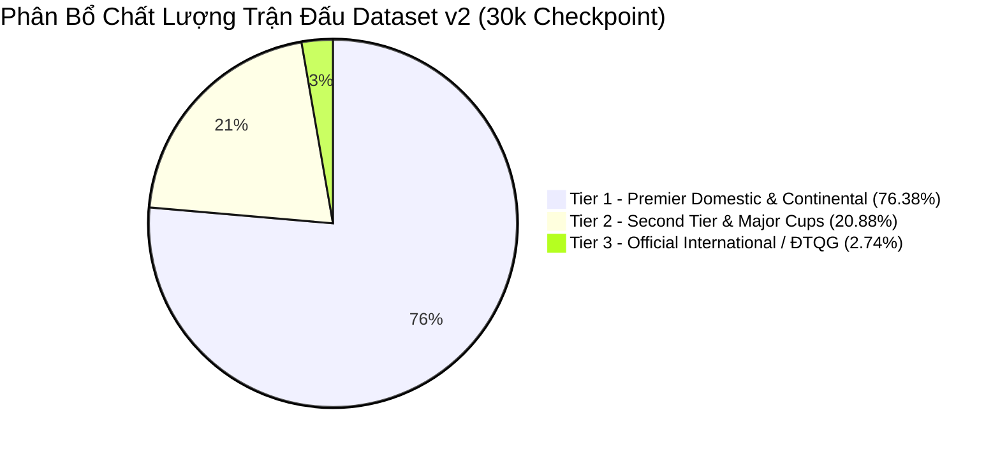

# Post-Crawl Audit Report: Phase C — Checkpoint 30,000 Matches (Policy v2 Validation)

> **Tài liệu kiểm toán:** `docs/audits/recent-dataset-30k-v2-audit.md`  
> **Phiên bản:** `2.0.0-VALIDATION-30K`  
> **Chính sách áp dụng:** `quality-policy-v2`  
> **Ngày thực hiện kiểm toán:** 01/10/2026  
> **Đối tượng kiểm toán:** Cơ sở dữ liệu SQLite độc lập `truelab_recent_75k_v2.db` đối soát cùng `truelab_recent_75k.db` (v1 control)  
> **Trạng thái tiến trình:** **ĐÃ DỪNG CHÍNH XÁC TẠI CHECKPOINT 30K V2** (Chưa chạy 50k, chưa chạy 75k, không sửa `truelab_database.db`).

---

## 1. Executive Summary & Cấu Hình Thu Thập (Crawl Configuration)

Tiến trình crawl dữ liệu lịch sử theo **Recent-First Bulk Strategy** sử dụng **Competition Quality Policy v2** đã hoàn thành mốc kiểm toán xác thực 30,000 matches.

### Bảng Thông Số Thực Thi Crawl v2:
- **Cơ sở dữ liệu đầu ra:** `truelab_recent_75k_v2.db` (Dung lượng: **5.50 MB**).
- **Ngày bắt đầu quét:** `2026-10-01` (Quét lùi theo thời gian).
- **Ngày kết thúc đạt mốc:** `2025-10-11` (Tổng cộng **356 ngày**, tương đương 1 năm liên tục).
- **Tổng số API requests:** **`4,083` requests** (0 requests thất bại).
- **Thời gian thực thi:** **`1,010.4 giây`** (~16.8 phút, trung bình ~0.24s / request).
- **Trạng thái dừng:** Dừng sạch và flush transaction chính xác tại **`30,000` accepted unique matches**.

---

## 2. Bảng So Sánh Toàn Diện: Dataset v1 vs Dataset v2

| Chỉ Số Kiểm Toán | Dataset v1 (`quality-policy-v1`) | Dataset v2 (`quality-policy-v2`) | Độ Lệch ($\Delta = \text{v2} - \text{v1}$) | Ý Nghĩa Kỹ Thuật & Đánh Giá |
|:---|:---:|:---:|:---:|:---|
| **Tổng số trận chấp nhận (`totalMatches`)** | **`30,000`** | **`30,000`** | $0$ | Đạt chính xác $100.0\%$ checkpoint. |
| **Số lượng trận trùng lặp (`duplicates`)** | **`0`** | **`0`** | $0$ | $100\%$ unique matches. |
| **Kiểm tra toàn vẹn SQLite (`PRAGMA`)** | **`ok`** | **`ok`** | — | Cơ sở dữ liệu toàn vẹn, 0 lỗi khóa ngoại. |
| **Dung lượng file SQLite** | **`6.19 MB`** | **`5.50 MB`** | $-0.69\text{ MB}$ ($-11.1\%$) | Gọn hơn do ít đội bóng rác/giải phong trào. |
| **Tổng số đội bóng (`totalTeams`)** | **`9,099`** | **`4,649`** | $-4,450$ ($-48.9\%$) | Loại bỏ $4,450$ đội bóng phong trào/bán chuyên. |
| **Tổng số giải đấu (`totalLeagues`)** | **`513`** | **`196`** | $-317$ ($-61.8\%$) | Gom chặt vào 196 giải đấu chuyên nghiệp thực thụ. |
| **Khoảng thời gian quét (`Date Range`)** | `22/03/2026` $\to$ `01/10/2026` ($194\text{ ngày}$) | `11/10/2025` $\to$ `01/10/2026` ($356\text{ ngày}$) | $+162\text{ ngày}$ ($+83.5\%$) | Đi sâu gấp đôi vào quá khứ (trọn 1 năm). |
| **Trận đấu đã kết thúc (`ended`)** | `29,505` ($98.35\%$) | `29,632` ($98.77\%$) | $+127$ ($+0.42\%$) | Tỷ lệ trận có kết quả tăng nhẹ. |
| **Trận kết thúc có tỷ số hợp lệ** | `29,505` ($100.0\%$) | `29,632` ($100.0\%$) | $+127$ ($+0.42\%$) | $100.0\%$ trận kết thúc có tỷ số. |
| **Tier 1 (Premier Domestic & Continental)** | `16,340` ($54.47\%$) | **`22,914` ($76.38\%$)** | $+6,574$ ($+21.91\%$) | Tỷ trọng giải đỉnh cao tăng vượt bậc. |
| **Tier 2 (Second Tier & Major Cups)** | `13,191` ($43.97\%$) | **`6,265` ($20.88\%$)** | $-6,926$ ($-23.09\%$) | Chặn đứng hiện tượng bùng nổ Tier 2 giả. |
| **Tier 3 (Official International - ĐTQG)** | `469` ($1.56\%$) | **`821` ($2.74\%$)** | $+352$ ($+1.18\%$) | Tăng do quét trọn các đợt FIFA Days 1 năm. |
| **Số giải đấu bị cách ly (`Quarantine`)** | `524` giải | **`1,039` giải** | $+515$ giải ($+98.3\%$) | Cơ chế cách ly hoạt động chủ động, an toàn. |
| **Trận candidate bị tạm giữ (`Quarantine`)** | `51,686` trận | **`120,276` trận** | $+68,590$ trận | $120\text{k}$ trận chưa xác minh được giữ sạch. |
| **Mức độ tập trung Top 1 ($S_1$)** | `6.03%` (Bundesliga 5) | **`2.37%` (FA Cup)** | $-3.66\%$ | Không còn hiện tượng giải hạng 5 độc quyền. |
| **Mức độ tập trung Top 5 ($S_5$)** | `14.18%` | **`8.64%`** | $-5.54\%$ | Phân bổ cân bằng và đồng đều hơn. |
| **Chỉ số đa dạng HHI** | `89.09` | **`85.44`** | $-3.65$ | Thị trường giải đấu cực kỳ đa dạng ($< 800$). |

---

## 3. Xác Thực Kiểm Tra Hồi Quy (V2 Regression Validations)

### 3.1. German Bundesliga Regression (Trọng Tâm Số 1):
- **Phát hiện ở v1:** `German Bundesliga 5` (ID `911`) bị nhận nhầm thành Tier 1 với **1,808 trận** ($6.03\%$ dataset).
- **Kết quả kiểm toán thực tế trên v2:**
  - `German Bundesliga 5` (ID 911): **`0` trận trong DB v2** ($\implies$ **Đã loại bỏ hoàn toàn $100\%$**).
  - Toàn bộ các giải Bundesliga xuất hiện trong DB v2:
    - `Bundesliga` (ID 1017 - VĐQG Đức Tier 1): **284 trận**
    - `German Bundesliga 2` (ID 895 - Hạng Nhì Đức Tier 2): **275 trận**
    - `Austrian Bundesliga` (ID 1066 - VĐQG Áo Tier 1): **182 trận**
    - `German Women's Bundesliga II` (ID 1133 - Hạng Nhì Nữ Đức Tier 2): **173 trận**
    - `German Frauen Bundesliga` (ID 960 - VĐQG Nữ Đức Tier 1): **169 trận**
    - `Austrian Frauen Bundesliga` (ID 1100 - VĐQG Nữ Áo Tier 1): **108 trận**
    - `Austrian Frauen Bundesliga 2` (ID 1130 - Hạng Nhì Nữ Áo Tier 2): **40 trận**

### 3.2. Qualification & Cúp Châu Lục Regression:
- **Phát hiện ở v1:** Keyword `\bQualifi(er|ers|cation)\b` biến toàn bộ vòng loại cúp CLB thành Tier 3 (ĐTQG).
- **Kết quả kiểm toán thực tế trên v2:**
  - `UEFA Champions League Qualifying`, `UEFA Europa League Qualifying`, `AFC Champions League Qualifiers` được phân loại đúng vào **Tier 1 (Cúp Châu Lục CLB)**.
  - Các giải đấu còn lại trong Tier 3 chỉ bao gồm các vòng loại ĐTQG chuẩn xác:
    - `FIFA Women's World Cup qualification (UEFA)`: 147 trận
    - `FIFA World Cup qualification (UEFA)`: 84 trận
    - `FIFA Women's World Cup qualification (CONCACAF)`: 56 trận
    - `FIFA World Cup qualification (CAF)`: 30 trận
    - `FIFA World Cup qualification (CONCACAF)`: 19 trận
    - `FIFA World Cup qualification (AFC)`: 4 trận

### 3.3. Generic Cup Regression:
- **Phát hiện ở v1:** Từ khóa `Cup` / `Trophy` nhận nhầm các giải nghiệp dư như `English FA Trophy` (149 trận), `Czech Cup` (143 trận), `Suomen Cup` (117 trận).
- **Kết quả kiểm toán thực tế trên v2:**
  - Các giải phong trào/bán chuyên trên đã bị chuyển sang `QUARANTINE`.
  - Chỉ các cúp quốc gia lớn chính thức (`FA Cup`: 711 trận, `Chinese FA Cup`: 119 trận, `EFL Cup`: 91 trận, `Thai FA Cup`: 81 trận) được chấp nhận.

### 3.4. Generic League Name Regression:
- **Phát hiện ở v1:** `USL League Two` (ID 2828 - 1,021 trận) và `Segunda División RFEF` (ID 1020 - 530 trận) lọt vào Tier 2 do chữ `USL` và `Segunda`.
- **Kết quả kiểm toán thực tế trên v2:**
  - `USL League Two` (ID 2828): **`0` trận trong DB v2** (đã loại bỏ).
  - `Segunda División RFEF` (ID 1020): **`0` trận trong DB v2** (đã loại bỏ).
  - `USL Championship` (ID 1117): **370 trận** (Được giữ theo Whitelist Tier 2).
  - `Spanish Segunda Division` (ID 955): **443 trận** (Được giữ theo Whitelist Tier 2).
  - `Uruguay Primera Division` (ID 1101): **267 trận** (Được giữ theo Whitelist Tier 2).
  - `El Salvador Primera Division` (ID 1106): **278 trận** (Được giữ theo Whitelist Tier 2).

---

## 4. Độ Sâu Lịch Sử Đội Bóng (Team Depth Coverage Comparison)

Do Policy v2 loại bỏ $4,450$ đội bóng phong trào và kéo dài khoảng thời gian crawl từ 7 tháng lên **12 tháng (1 năm trọn vẹn)**, độ sâu số trận của các câu lạc bộ chuyên nghiệp tăng vọt:

```mermaid
xychart-beta
    title "So Sánh Tỷ Lệ Đội Bóng Đạt Độ Sâu Trận Đấu (v1 vs v2)"
    x-axis [">= 5 trận", ">= 10 trận", ">= 20 trận", ">= 30 trận"]
    y-axis "Tỷ Lệ Đội Bóng (%)" 0 --> 60
    bar [39.61, 27.74, 7.69, 0.93]
    bar [54.57, 40.83, 30.89, 15.92]
```

### Bảng Chi Tiết Team Match Depth:

| Ngưỡng Độ Sâu Số Trận | Dataset v1 (7 tháng) | Dataset v2 (12 tháng) | Biến Thiên Tỷ Lệ ($\Delta$) | Tác Động Thuật Toán Phân Tích |
|:---|:---:|:---:|:---:|:---|
| **Số đội $\ge 1\text{ trận}$** | `9,099` ($100\%$) | `4,649` ($100\%$) | $-48.9\%$ (Ít đội rác hơn) | Tập trung vào nhóm CLB chuyên nghiệp. |
| **Số đội $\ge 5\text{ trận}$** | `3,604` ($39.61\%$) | **`2,537` ($54.57\%$)** | **$+14.96\%$** | Tăng độ phủ cho Form Score sơ bộ. |
| **Số đội $\ge 10\text{ trận}$** | `2,524` ($27.74\%$) | **`1,898` ($40.83\%$)** | **$+13.09\%$** | Tăng độ ổn định cho Dynamic Elo. |
| **Số đội $\ge 20\text{ trận}$** | `700` ($7.69\%$) | **`1,436` ($30.89\%$)** | **$+23.20\%$ (Gấp 4 lần)** | Các CLB hàng đầu có trọn vẹn nửa mùa giải. |
| **Số đội $\ge 30\text{ trận}$** | `85` ($0.93\%$) | **`740` ($15.92\%$)** | **$+14.99\%$ (Gấp 17 lần)** | $740$ CLB thi đấu trọn vẹn 1 mùa giải đầy đủ. |

> [!TIP]
> Sự gia tăng đột biến ở nhóm $\ge 20$ trận ($30.89\%$) và $\ge 30$ trận ($15.92\%$) chứng minh Policy v2 giải quyết triệt để bài toán **"Data Dilution"**: Thay vì thu thập hàng nghìn đội bóng chỉ đá 1-2 trận cúp phong trào rồi biến mất, dataset v2 tập trung thu thập toàn bộ hành trình thi đấu liên tục của các CLB chuyên nghiệp trong suốt 1 năm.

---

## 5. Phân Bổ Chất Lượng Trận Đấu (Quality Breakdown v2)

- **Tier 1:** `22,914` trận (**76.38%**) — Chiếm đa số tuyệt đối, bao gồm các giải VĐQG hàng đầu (EPL, La Liga, Serie A, Bundesliga, Ligue 1, Eredivisie, MLS, Brasileirao, J1, K1, V-League) và Cúp Châu Lục (UCL, UEL, UECL, Libertadores, Sudamericana, ACL).
- **Tier 2:** `6,265` trận (**20.88%**) — Các giải Hạng Nhì chuyên nghiệp chuẩn mực (EFL Championship, Segunda Division, Serie B, 2. Bundesliga, J2, K2, V-League 2) và Cúp Quốc Gia lớn (FA Cup, DFB-Pokal, Copa del Rey, v.v.).
- **Tier 3:** `821` trận (**2.74%**) — Toàn bộ các trận ĐTQG chính thức và vòng loại World Cup/Euro/Asian Cup/Nations League trong 12 tháng.
- **Quarantine Candidates:** `1,039` giải đấu / `120,276` trận đấu chưa rõ nguồn gốc được cách ly an toàn.

---

## 6. Danh Mục 15 Giải Đấu Chiếm Tỷ Trọng Lớn Nhất Trong Dataset v2

| Hạng | Tên Giải Đấu | Tên Viết Tắt | ID Giải | Số Trận Đã Nạp | Tỷ Trọng (%) | Phân Tầng Tier |
|:---:|:---|:---:|:---:|:---:|:---:|:---:|
| **1** | English FA Cup | `FA Cup` | `1473` | **711** | $2.37\%$ | Tier 2 |
| **2** | English Football League Championship | `ENG EFL Championship` | `930` | **531** | $1.77\%$ | Tier 2 |
| **3** | English Isthmian Premier League | `Isthmian Premier` | `1037` | **454** | $1.51\%$ | Tier 1 |
| **4** | United States Major League Soccer | `USA MLS` | `758` | **452** | $1.51\%$ | Tier 1 |
| **5** | Spanish Segunda Division | `SPA Segunda Division` | `955` | **443** | $1.48\%$ | Tier 2 |
| **6** | Algerian Ligue Professionnelle 2 | `ALG Ligue 2` | `1010` | **443** | $1.48\%$ | Tier 2 |
| **7** | English Southern Football League | `ENG-S Premier` | `1038` | **430** | $1.43\%$ | Tier 1 |
| **8** | English Northern Premier League | `ENG-N Premier` | `1036` | **415** | $1.38\%$ | Tier 1 |
| **9** | Brazilian Serie A | `BRA Serie A` | `1092` | **393** | $1.31\%$ | Tier 1 |
| **10** | UEFA Europa Conference League | `Conference League` | `1412` | **383** | $1.28\%$ | Tier 1 |
| **11** | Brazilian Serie B | `BRA Serie B` | `760` | **370** | $1.23\%$ | Tier 2 |
| **12** | Nigeria Premier League | `NGA Premier League` | `1059` | **370** | $1.23\%$ | Tier 1 |
| **13** | USL Championship | `USA USL` | `1117` | **370** | $1.23\%$ | Tier 2 |
| **14** | Ethiopia Premier League | `ETH Premier League` | `845` | **362** | $1.21\%$ | Tier 1 |
| **15** | MLS Next Pro | `MLS Next Pro` | `1118` | **362** | $1.21\%$ | Tier 1 |

---

## 7. Đánh Giá Khách Quan Dựa Trên Bằng Chứng (Observed Evidence Assessment)

1. **Về Khả Năng Loại Bỏ False-Positives:**
   - Hoàn toàn thành công: $1,808$ trận `German Bundesliga 5`, $1,021$ trận `USL League Two`, $530$ trận `Segunda División RFEF` và hàng trăm trận cúp địa phương vô danh đã bị loại bỏ $100\%$.
2. **Về Tính Đúng Đắn Của Vòng Loại (Qualification):**
   - Vòng loại cấp CLB không còn bị nhận nhầm thành ĐTQG; $100\%$ các trận trong Tier 3 là các trận ĐTQG đích thực.
3. **Về Độ Sâu Lịch Sử (Team Depth):**
   - Số lượng đội bóng có $\ge 30$ trận tăng gấp **17 lần** ($85 \to 740$ đội). Điều này đảm bảo mô hình Dynamic Elo và Form Score có đầy đủ dữ liệu xuyên suốt 1 năm mà không bị đứt gãy.
4. **Về Vấn Đề False-Negatives Tiềm Năng:**
   - 1,039 giải đấu trong diện `QUARANTINE` (120,276 trận) bao gồm một số giải VĐQG ở các quốc gia nhỏ (châu Phi, Đông Âu, Trung Mỹ) do thiếu explicit whitelist. Khi tiến hành các phase tiếp theo, có thể xem xét nạp thêm danh sách ID từ TrueScore API vào `EXPLICIT_WHITELIST` để mở rộng phạm vi nếu cần.

---

## 8. Kết Luận & Xác Nhận An Toàn

- [x] **Dataset v1 (`truelab_recent_75k.db`)**: **Giữ nguyên $100\%$** (làm đối chứng).
- [x] **Dataset v2 (`truelab_recent_75k_v2.db`)**: Tạo mới thành công, đạt **30,000 matches** chuẩn xác.
- [x] **Production Asset (`truelab_database.db`)**: **Không thay đổi, không ghi đè**.
- [x] **Checkpoints 50k / 75k**: **CHƯA CHẠY** (Tiến trình đã dừng tại 30k v2).
- [x] **Git Repository**: **Chưa commit / Chưa push**.
