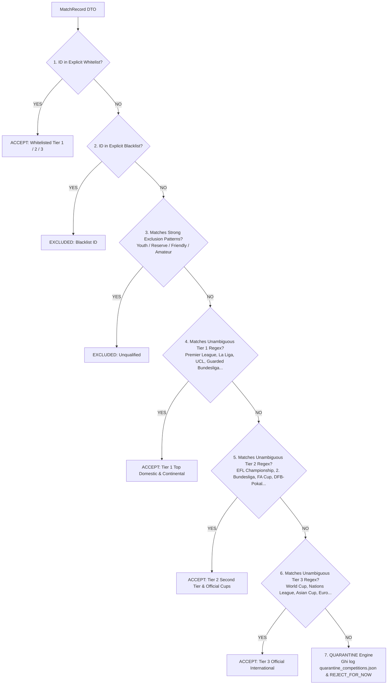

# Competition Quality Policy Specification: Phase B — Phân Tầng & Lọc Chất Lượng Giải Đấu

> **Tài liệu đặc tả kỹ thuật:** `docs/plans/competition-quality-policy-spec.md`  
> **Phiên bản:** `2.0.0-RESOLVED`  
> **Chính sách:** `quality-policy-v2` (Nâng cấp từ `quality-policy-v1` sau kiểm toán Checkpoint 30k)  
> **Ngày cập nhật:** 01/10/2026  
> **Trạng thái:** `IMPLEMENTED & VERIFIED` (Đã cài đặt trong Kotlin, vượt qua 100% unit tests, chưa crawl lại).  
> **Tham chiếu nền tảng:**
> - [recent-dataset-and-hydration-architecture.md](./recent-dataset-and-hydration-architecture.md)
> - [recent-first-crawler-spec.md](./recent-first-crawler-spec.md)
> - [prediction-data-coverage-audit.md](../audits/prediction-data-coverage-audit.md)
> - [recent-dataset-30k-audit.md](../audits/recent-dataset-30k-audit.md)

---

## 1. Executive Summary & Mục Tiêu

### 1.1. Mục tiêu cốt lõi
Khi xây dựng tập dữ liệu mới theo hướng **Recent-First** (từ hiện tại lùi dần về quá khứ), nguy cơ lớn nhất là **"Data Dilution" (Loãng dữ liệu)**:
- Mỗi ngày thi đấu trên thế giới có hàng trăm trận đấu từ các giải phong trào, giải trẻ (U17, U19, U21), giải hạng 4, hạng 5 hoặc giao hữu thử nghiệm đội hình.
- Nếu gom toàn bộ dữ liệu một cách mù quáng chỉ để đạt số lượng, dataset sẽ bị pha loãng bởi dữ liệu có tính biến động cao, thiếu tính chuyên nghiệp và làm sai lệch thuật toán phân tích Form, Elo và Backtest.

**Competition Quality Policy** thiết lập bộ quy tắc phân cấp xác định giải đấu nào được chấp nhận (**Accept**), giải đấu nào bị loại bỏ (**Reject**), và giải đấu nào cần đưa vào diện cách ly để hậu kiểm (**Quarantine**).

### 1.2. Các nguyên tắc thiết kế bất biến
1. **Không ép tỷ lệ cứng nhắc:** Mục tiêu không phải là ép dataset đạt một con số phần trăm lý thuyết, mà là **loại bỏ triệt để dữ liệu rác, tối đa hóa độ phủ các giải chuyên nghiệp và đảm bảo tính tái lập (reproducible)**.
2. **Quy trình đánh giá đa tầng:** Kết hợp `competitionId Whitelist` (Ưu tiên cao nhất) $\to$ `competitionId Blacklist` $\to$ `Strong Exclusion Patterns` $\to$ `Unambiguous Fallback Patterns` $\to$ `Quarantine Engine`.
3. **Explicit ID là Source of Truth:** `competitionId` trong Whitelist/Blacklist luôn là chân lý tối thượng. Regex fallback chỉ đóng vai trò hỗ trợ giải đấu thương hiệu rõ ràng; **Regex tuyệt đối không bao giờ được phép ghi đè (override) Explicit Whitelist**.
4. **Nguyên tắc cốt lõi về Unknown:**
   $$\mathbf{Unknown \ne Accept} \quad \text{và} \quad \mathbf{Unknown \ne Reject}$$
   Các giải đấu chưa xác minh danh tính hoặc khớp keyword danh từ chung mơ hồ phải được chuyển vào **`QUARANTINE`**, không auto-accept làm loãng dữ liệu và không auto-reject làm mất giải tiềm năng.

---

## 2. Lịch Sử Phiên Bản & Kiểm Toán Thực Tế (v1 $\to$ v2 Evolution)

### 2.1. Đợt Kiểm Toán Checkpoint 30k trên `quality-policy-v1`:
Ở giai đoạn crawl thử nghiệm đầu tiên (**Checkpoint 1: 30,000 matches** ghi vào `truelab_recent_75k.db`), hệ thống đã ghi nhận các chỉ số cơ bản:
- Tổng số trận: `30,000` (100% unique, 0 duplicate, 0 orphan).
- Tier 1: `16,340` ($54.47\%$)
- Tier 2: `13,191` ($43.97\%$)
- Tier 3: `469` ($1.56\%$)
- Quarantine: `524` giải / `51,686` trận.

### 2.2. Các Lỗi Nhận Nhầm (False-Positives) Phát Hiện Ở Policy v1:
Qua đối soát chi tiết giữa dữ liệu thực tế và TrueScore API:
1. **Lỗi `German Bundesliga 5` (ID 911):**
   - *Nguyên nhân:* Regex v1 `\bBundesliga\b` nhận toàn bộ giải có chữ Bundesliga $\implies$ giải Hạng 5 Đức (Oberliga) bị đẩy nhầm vào **Tier 1** với 1,808 trận ($6.03\%$ dataset).
2. **Lỗi `Qualification` biến Vòng loại Cúp CLB thành Đội Tuyển Quốc Gia:**
   - *Nguyên nhân:* Regex v1 trong Tier 3 có `\bQualifi(er|ers|cation)\b` và đặt trước Tier 1 $\implies$ `UEFA Champions League Qualifying`, `UEFA Europa League Qualifying`, `AFC Champions League Qualifiers` bị gắn nhãn sai thành **Tier 3 (ĐTQG)** thay vì Tier 1 CLB!
3. **Lỗi Danh từ chung `Cup` bùng nổ Tier 2:**
   - *Nguyên nhân:* Regex v1 `\bCup\b`, `\bTrophy\b`, `\bTaça\b`, `\bPokal\b` tự động nhận toàn bộ giải cúp địa phương, cúp bang vô danh vào **Tier 2** (chiếm ~44% dataset).
4. **Lỗi `Primera Division`, `Super League`, `Pro League`:**
   - *Nguyên nhân:* Regex `Primera Division` auto-accept Tier 1 xung đột trực tiếp với Explicit Whitelist (nơi Uruguay và El Salvador Primera Division được định nghĩa là Tier 2). Các giải `Malawi Super League`, `Kosovo Super League` cũng bị nhận nhầm.
5. **Lỗi `USL` và `Segunda`:*
   - *Nguyên nhân:* Regex `USL` và `Segunda` khiến `USL League Two` (Hạng 4 bán chuyên) và `Segunda RFEF` (Hạng 4 TBN) lọt vào Tier 2.

---

## 3. Kiến Trúc Phân Cấp Đánh Giá: Policy v2

---

## 4. Chi Tiết Danh Mục Quy Tắc: Policy v2

### 4.1. Bước 1 — Explicit Whitelist (Source of Truth Tuyệt Đối):
- **Tier 1:** `927` (Premier League), `954` (La Liga), `999` (Serie A), `1017` (Bundesliga), `1065` (Ligue 1), `1054` (Eredivisie), `758` (MLS), `761` (Liga MX), `1398` (UEFA Champions League), `1411` (UEFA Europa League).
- **Tier 2:** `930` (EFL Championship), `955` (Segunda Division), `1007` (Serie B), `1809` (J.League Levain Cup), `1117` (USL Championship), `1101` (Uruguay Primera Division), `1106` (El Salvador Primera Division).
- **Tier 3:** `2239057` (FIFA ASEAN Cup), `2484` (CONCACAF Nations League), `1756` (OCA Women's Asian Games).

### 4.2. Bước 2 — Explicit Blacklist (Loại Bỏ Vĩnh Viễn):
- `820` (International Friendly), `1103` (International Club Friendly), `1379` (Chinese FA U-20), `2292` (Colombian U19), `2510` (Myanmar U20), `1253` (Uruguay Reserve League), `1122` (Guatemala Division 4), `2108` (Mizoram Premier League).

### 4.3. Bước 3 — Strong Exclusion Patterns (100% EXCLUDED):
- **Giải trẻ:** `\bU-?1[5-9]\b`, `\bU-?2[0-3]\b`, `\bYouth\b`, `\bJunior\b`, `\bCadete\b`, `\bJuvenil\b`, `\bPrimavera\b`, `\bSub-?1[5-9]\b`, `\bSub-?2[0-3]\b`.
- **Giải dự bị:** `\bReserves?\b`, `\bB-Team\b`, `\bDevelopment League\b`, `\bSub-?\d+\b`.
- **Giao hữu:** `\bFriendly\b`, `\bAmistoso\b`, `\bExhibition\b`, `\bClub Friendly\b`, `\bInternational Friendly\b`.
- **Phong trào / Nghiệp dư sâu:** `\bDivision [4-9]\b`, `\b5th League\b`, `\bAmateur\b`, `\bRegional League\b`.

### 4.4. Bước 4 — Unambiguous Accepted Fallback Patterns:

#### A. Tier 1 Fallback Patterns (Chỉ các thương hiệu không gây mơ hồ):
- `UEFA Champions League`, `Champions League`, `UEFA Europa League`, `Europa League`, `(UEFA )?Conference League`.
- `Copa Libertadores`, `Copa Sudamericana`, `AFC Champions League`, `CAF Champions League`, `CONCACAF Champions`.
- `Premier League`, `La Liga`, `Serie A`, `Ligue 1`, `Eredivisie`, `Major League Soccer`, `MLS`, `Brasileir[aã]o`, `Liga MX`.
- `J1 League`, `K League 1`, `V-League 1`, `V\.League 1`.
- `NWSL`, `Women's Super League`, `Frauen-Bundesliga`, `Liga F`, `Premiere Ligue`, `Women's Champions League`.
- **Guarded Bundesliga:** Chỉ match khi có từ khóa `Bundesliga` và **KHÔNG** chứa các hậu tố/tiền tố giải hạng thấp (`2. Bundesliga`, `Bundesliga 2`, `Bundesliga 3`, `Bundesliga 4`, `Bundesliga 5` $\dots$).

#### B. Tier 2 Fallback Patterns (Chỉ giải hạng 2 danh tiếng & cúp QG lớn):
- `EFL Championship`, `Serie B`, `Ligue 2`, `2. Bundesliga`, `Bundesliga 2`.
- `J2 League`, `K League 2`, `V-League 2`, `V\.League 2`, `Superettan`, `Eerste Divisie`.
- **Major Official Domestic Cups:** `FA Cup`, `Copa del Rey`, `DFB-Pokal`, `Coupe de France`, `Coppa Italia`, `EFL Cup`, `Carabao Cup`.

#### C. Tier 3 Fallback Patterns (Chỉ ĐTQG chính thức, loại bỏ generic Qualification):
- `(FIFA\s+)?World Cup`, `UEFA Nations League`, `CONCACAF Nations League`, `(AFC\s+)?Asian Cup`, `Copa America`.
- `(FIFA\s+)?ASEAN (Championship|Cup)`, `AFF (Championship|Cup)`, `Asian Games`, `Olympic(s)? Football`.
- `UEFA (European Championship|Euro)`, `Euro(pean)? Championship`, `(CAF\s+)?Africa Cup of Nations`, `AFCON`, `(CONCACAF\s+)?Gold Cup`.

### 4.5. Bước 5 — Danh Sách Generic Patterns ĐÃ CHUYỂN SANG QUARANTINE (Không Auto-Accept):
Toàn bộ các pattern danh từ chung sau **không còn được auto-accept**:
- `Qualifi(er|ers|cation)` (loại khỏi Tier 3 để tránh nuốt vòng loại cúp CLB).
- `Cup`, `Trophy`, `Taça`, `Pokal`, `Super Cup`, `Supercup`, `Supercopa`, `Shield`.
- `Primera Division`, `Super League`, `Pro League`, `Premiership`, `A-League`.
- `Championship` (generic), `USL` (generic), `Segunda` (generic), `Liga Nacional`, `Liga 2`, `League One`, `League Two`.

---

## 5. Bảng So Sánh Quyết Định Phân Loại: Policy v1 vs Policy v2

| Tên Giải Đấu Kiểm Thử | Phân Loại Policy v1 (Cũ) | Phân Loại Policy v2 (Mới) | Đánh Giá Cải Tiến |
|:---|:---:|:---:|:---|
| **German Bundesliga 5** | ❌ `Tier 1` (Sai lệch nghiêm trọng) | ✅ `QUARANTINE` | Chặn đứng 1,808 trận hạng 5 lọt vào Tier 1. |
| **UEFA Champions League Qualifying** | ❌ `Tier 3` (Nhận nhầm thành ĐTQG) | ✅ `Tier 1` | Phân loại đúng vòng loại cúp CLB đỉnh cao. |
| **UEFA Europa League Qualifying** | ❌ `Tier 3` (Nhận nhầm thành ĐTQG) | ✅ `Tier 1` | Phân loại đúng vòng loại cúp CLB. |
| **AFC Champions League Qualifiers** | ❌ `Tier 3` (Nhận nhầm thành ĐTQG) | ✅ `Tier 1` | Phân loại đúng vòng loại cúp CLB châu Á. |
| **FIFA World Cup Asian Qualifiers** | `Tier 3` | ✅ `Tier 3` | Khớp `World Cup` $\to$ ĐTQG chuẩn xác. |
| **Mizoram Governor Cup** | ❌ `Tier 2` (Lọt lưới do chữ Cup) | ✅ `QUARANTINE` | Cách ly giải cúp địa phương yếu. |
| **FA Trophy** | ❌ `Tier 2` (Lọt lưới do chữ Trophy) | ✅ `QUARANTINE` | Cách ly giải bán chuyên hạng 5–8 Anh. |
| **Bolivia Primera Division (Chưa whitelist)** | ❌ `Tier 1` (Nhận nhầm Primera Division) | ✅ `QUARANTINE` | Không tự đôn lên Tier 1 khi chưa kiểm chứng. |
| **Uruguay Primera Division (ID 1101)** | `Tier 2` | ✅ `Tier 2` | Explicit Whitelist giữ vững chân lý. |
| **USL League Two** | ❌ `Tier 2` (Lọt lưới do chữ USL) | ✅ `QUARANTINE` | Chặn giải Hạng 4 bán chuyên Mỹ. |
| **Segunda RFEF** | ❌ `Tier 2` (Lọt lưới do chữ Segunda) | ✅ `QUARANTINE` | Chặn giải Hạng 4 TBN. |
| **German Bundesliga / Bundesliga** | `Tier 1` | ✅ `Tier 1` | VĐQG Đức chính thức giữ vững Tier 1. |
| **2. Bundesliga / 2.Bundesliga** | `Tier 2` | ✅ `Tier 2` | Hạng Nhì Đức giữ vững Tier 2. |
| **English FA Cup / Copa del Rey** | `Tier 2` | ✅ `Tier 2` | Cúp quốc gia lớn giữ vững Tier 2. |

---

## 6. Bộ Chỉ Số Chẩn Đoán Dữ Liệu (Diagnostic Metrics)

Các chỉ số chẩn đoán phục vụ giám sát sức khỏe dataset (không phải hard blocker):
1. **Top-1 Competition Share ($S_1$):** Baseline quan sát $S_1 < 15\%$.
2. **Top-5 Competition Share ($S_5$):** Baseline quan sát $S_5 < 45\%$.
3. **Herfindahl-Hirschman Index (HHI):** Baseline quan sát $\text{HHI} < 800$.
4. **Team Depth Coverage ($\text{TDC}_{\ge 10}$):** Tỷ lệ đội có $\ge 10$ trận lịch sử.

---

## 7. Khuyến Nghị Cho Phase Tiếp Theo

1. **Giữ Nguyên Artifact 30k v1:** Không xóa hoặc ghi đè `truelab_recent_75k.db` hiện tại.
2. **Sẵn Sàng Cho Re-crawl 30k v2:** Khi người dùng phê duyệt, crawler có thể chạy lại với `quality-policy-v2` để tạo dataset 30k chuẩn xác cao trước khi mở rộng lên 50k và 75k.
3. **Không Thay Đổi Production Asset:** Không copy vào `app/src/main/assets/database/truelab_database.db` cho đến khi toàn bộ pipeline crawl và hydration hoàn tất.
