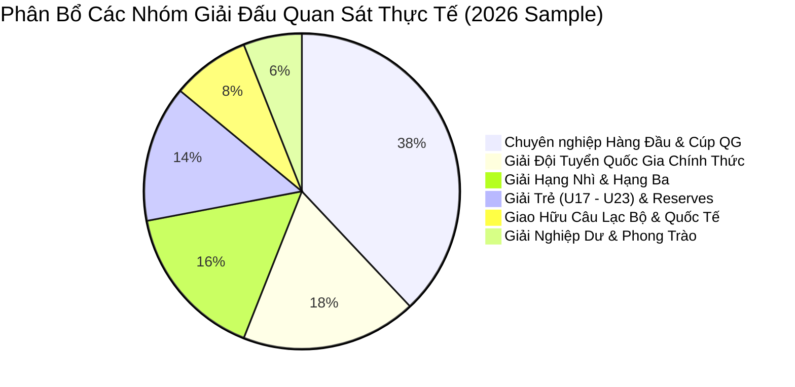
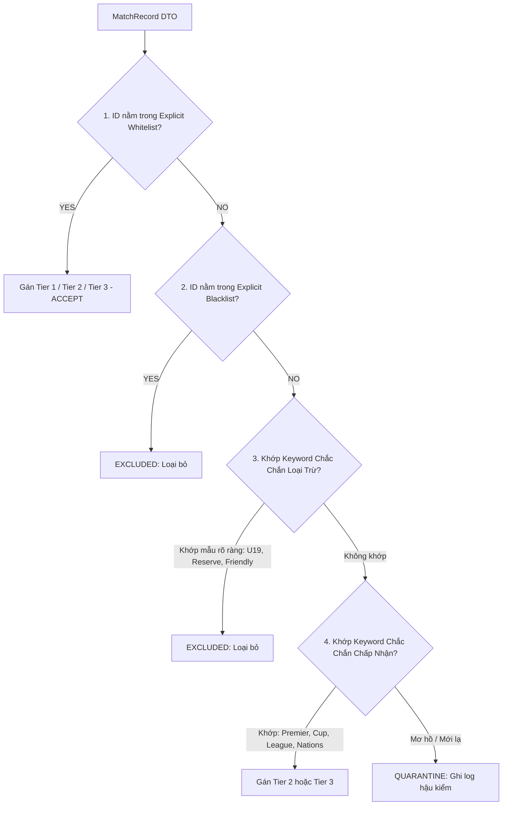
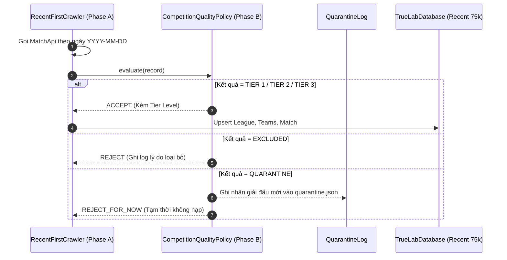

# Competition Quality Policy Specification: Phase B — Phân Tầng & Lọc Chất Lượng Giải Đấu

> **Tài liệu đặc tả kỹ thuật:** `docs/plans/competition-quality-policy-spec.md`  
> **Phiên bản:** `1.1.0-RESOLVED`  
> **Chính sách:** `quality-policy-v1`  
> **Ngày cập nhật:** 01/10/2026  
> **Trạng thái:** `SPECIFICATION ONLY` (Không sửa code, không crawl thật, không migrate DB, không commit/push).  
> **Tham chiếu nền tảng:**
> - [recent-dataset-and-hydration-architecture.md](./recent-dataset-and-hydration-architecture.md)
> - [recent-first-crawler-spec.md](./recent-first-crawler-spec.md)
> - [prediction-data-coverage-audit.md](../audits/prediction-data-coverage-audit.md)

---

## 1. Executive Summary & Mục Tiêu

### 1.1. Mục tiêu cốt lõi
Khi xây dựng tập dữ liệu mới $75,000\text{ matches}$ theo hướng **Recent-First** (từ hiện tại lùi dần về quá khứ), nguy cơ lớn nhất là **"Data Dilution" (Loãng dữ liệu)**:
- Mỗi ngày thi đấu trên thế giới có hàng trăm trận đấu từ các giải phong trào, giải trẻ (U17, U19, U21), giải hạng 4, hạng 5 hoặc giao hữu thử nghiệm đội hình.
- Nếu gom toàn bộ dữ liệu một cách mù quáng chỉ để đạt số lượng $75\text{k}$, dataset sẽ bị pha loãng bởi dữ liệu có tính biến động cao, thiếu tính chuyên nghiệp và làm sai lệch thuật toán phân tích Form, Elo và Backtest.

**Competition Quality Policy (`quality-policy-v1`)** thiết lập bộ quy tắc xác định giải đấu nào được chấp nhận (**Accept**), giải đấu nào bị loại bỏ (**Reject**), và giải đấu nào cần đưa vào diện cách ly để hậu kiểm (**Quarantine**).

### 1.2. Các nguyên tắc thiết kế bất biến
1. **Không ép tỷ lệ cứng nhắc:** Mục tiêu không phải là ép dataset đạt một con số phần trăm lý thuyết, mà là **loại bỏ triệt để dữ liệu rác, tối đa hóa độ phủ các giải chuyên nghiệp và đảm bảo tính tái lập (reproducible)**.
2. **Quy trình đánh giá đa tầng:** Kết hợp `competitionId Whitelist` (Ưu tiên cao nhất) $\to$ `competitionId Blacklist` $\to$ `Metadata Check` $\to$ `Normalized Name Matching` $\to$ `Quarantine Engine`.
3. **Explicit ID là Source of Truth:** `competitionId` trong Whitelist/Blacklist luôn là chân lý tối thượng. Regex/Name matching chỉ đóng vai trò phân loại sơ bộ; **Regex tuyệt đối không bao giờ được phép ghi đè (override) Explicit Whitelist**.
4. **Không loại bỏ nhầm do Pattern yếu:** Các mẫu regex mơ hồ hoặc không chắc chắn (ví dụ: `II`) phải chuyển sang **`QUARANTINE`** để con người xem xét, tuyệt đối không được tự động `EXCLUDED`.

---

## 2. Kiểm Toán Metadata Giải Đấu Thực Tế (Available Metadata Audit)

Dựa trên việc kiểm toán trực tiếp DTO và cơ sở dữ liệu `truelab_database.db`:

| Trường Metadata | Nguồn Dữ Liệu | Đã Có Trong DTO | Đã Có Trong Room | Độ Tin Cậy Phân Loại |
|:---|:---|:---:|:---:|:---:|
| `competitionId` | `MatchRecord.competition_id` / `MatchRecord.competition.id` | **CÓ** (`Int`) | **CÓ** (`matches.leagueId`) | **Tuyệt đối (100%)** — Khóa định danh chuẩn. |
| `competitionName` | `MatchRecord.competition.name` | **CÓ** (`String`) | **CÓ** (`leagues.name`) | **Rất cao** — Tên chính thức của giải đấu. |
| `competitionShortName` | `MatchRecord.competition.short_name` | **CÓ** (`String?`) | **CÓ** (`leagues.shortName`) | **Cao** — Viết tắt chuẩn hóa (EPL, UCL, v.v.). |
| `competitionLogo` | `MatchRecord.competition.logo` | **CÓ** (`String?`) | **CÓ** (`leagues.logo`) | Hỗ trợ hiển thị UI. |
| `countryId` / `country` | `CompetitionItemDto.country_id` | **CÓ** trong Competition API | `leagues.country` | **Trung bình** (Daily Match DTO không trả trực tiếp). |
| `categoryId` / `category` | `CompetitionItemDto.category_id` | **CÓ** trong Competition API | `leagues.category` | **Trung bình** (Chỉ có khi gọi Competition List). |
| `gender` / `youth` | Không có field riêng lẻ | *KHÔNG CÓ* | *KHÔNG CÓ* | **Phải suy diễn ở cấp độ Policy qua tên giải và tên đội bóng**. Không xây dựng bộ phân loại gender phức tạp. |

---

## 3. Phân Tích Dữ Liệu Thực Tế (Observed Competition Distribution)

Kết quả kiểm toán trên các giải đấu thực tế xuất hiện trong các ngày gần đây (2026):



### 3.1. Các nhóm quan sát thực tế:
1. **Giải Đội tuyển Quốc gia chính thức (Giá trị cao nhất cho ĐTQG):**
   - `FIFA ASEAN Cup` (ID: `2239057`)
   - `CONCACAF Nations League` (ID: `2484`)
   - `OCA Women's Asian Games` (ID: `1756`)
2. **Giải Chuyên nghiệp Quốc gia & Cúp chính thức:**
   - `United States Major League Soccer` (ID: `758`)
   - `Mexico Liga MX` (ID: `761`)
   - `J.League Yamazaki Biscuit Levain Cup` (ID: `1809`)
   - `Uruguay Primera Division` (ID: `1101`)
   - `El Salvador Primera Division` (ID: `1106`)
3. **Giải Trẻ & Reserves (Nguy cơ loãng dữ liệu cao):**
   - `Chinese Football Association U-20 League` (ID: `1379`)
   - `Colombian U19 League` (ID: `2292`)
   - `Myanmar U20 League` (ID: `2510`)
   - `HK U22L` (ID: `1242`)
   - `Uruguay Reserve League` (ID: `1253`)
4. **Giải Giao hữu không chính thức (Tính biến động cao):**
   - `International Friendly` (ID: `820`)
   - `International Club Friendly` (ID: `1103`)

---

## 4. Định Nghĩa Các Phân Tầng Chất Lượng (Tier Definitions)

Hệ thống phân chia toàn bộ các giải đấu thành **5 nhóm (4 Tiers + 1 Quarantine)**:

```text
┌─────────────────────────────────────────────────────────────────────────────────┐
│                        COMPETITION QUALITY TIERS (v1)                           │
├───────────────────┬─────────────────────────────────────────────────────────────┤
│ TIER 1            │ • Các giải VĐQG hàng đầu thế giới (EPL, La Liga, Serie A,   │
│ (Premier Tier)    │   Bundesliga, Ligue 1, Eredivisie, Brasileirao, MLS, v.v. - │
│                   │   nhóm ưu tiên, không giới hạn cứng số lượng 15 giải).      │
│                   │ • Cúp Châu Lục Cấp CLB (UEFA Champions League, Europa League│
│                   │   AFC Champions League, Copa Libertadores).                 │
│                   │ • Giải Bóng đá Nữ Chuyên nghiệp Đỉnh cao (NWSL, Women's UCL)│
├───────────────────┼─────────────────────────────────────────────────────────────┤
│ TIER 2            │ • Các giải Hạng Nhất / Hạng Nhì chuyên nghiệp (Championship,│
│ (Professional)    │   Segunda, Serie B, 2. Bundesliga, J2 League, K League 2).  │
│                   │ • Toàn bộ các Cúp Quốc Gia chính thức (FA Cup, Copa del Rey,│
│                   │   DFB-Pokal, J.League Cup - chấp nhận toàn bộ các vòng).    │
├───────────────────┼─────────────────────────────────────────────────────────────┤
│ TIER 3            │ • Toàn bộ các giải Đội Tuyển Quốc Gia Chính Thức & Vòng Loại│
│ (International)   │   (FIFA World Cup, Asian Cup, Euro, Nations League,         │
│                   │   FIFA ASEAN Cup, Copa America, ASIAD Nam & Nữ).            │
├───────────────────┼─────────────────────────────────────────────────────────────┤
│ EXCLUDED          │ • Toàn bộ Giải Trẻ (U15, U17, U18, U19, U20, U21, U22, U23)│
│ (Rejected)        │ • Toàn bộ Giải Dự Bị (Reserves, B-Teams, Development League)│
│                   │ • Toàn bộ Giao Hữu (International Friendly, Club Friendly). │
│                   │ • Giải Nghiệp Dư / Phong Trào Hạng Sâu.                     │
├───────────────────┼─────────────────────────────────────────────────────────────┤
│ QUARANTINE        │ • Các giải đấu mới xuất hiện lần đầu trên API, chưa nằm trong│
│ (Review Needed)   │   Whitelist/Blacklist hoặc khớp pattern yếu/mơ hồ ──►        │
│                   │   Ghi nhận log & Tạm giữ kiểm toán, không auto-reject.      │
└───────────────────┴─────────────────────────────────────────────────────────────┘
```

---

## 5. Chiến Lược Whitelist Đa Tầng (Multi-Level Whitelist Strategy)

### 5.1. Thứ tự ưu tiên đánh giá (Evaluation Hierarchy)



### 5.2. Nhóm Explicit Whitelist Ban Đầu (Verified Baseline IDs):
1. **Tier 1 IDs đã xác minh:**
   - `927`: English Premier League
   - `954`: Spanish La Liga
   - `999`: Italian Serie A
   - `1017`: German Bundesliga
   - `1065`: French Ligue 1
   - `1054`: Dutch Eredivisie
   - `758`: United States Major League Soccer (MLS)
   - `761`: Mexico Liga MX
   - `1398`: UEFA Champions League
   - `1411`: UEFA Europa League
2. **Tier 2 IDs đã xác minh:**
   - `930`: EFL Championship
   - `955`: Segunda Division
   - `1007`: Serie B
   - `1809`: J.League Yamazaki Biscuit Levain Cup
   - `1117`: USL Championship
   - `1101`: Uruguay Primera Division
   - `1106`: El Salvador Primera Division
3. **Tier 3 IDs đã xác minh (ĐTQG):**
   - `2239057`: FIFA ASEAN Cup (AFF Cup)
   - `2484`: CONCACAF Nations League
   - `1756`: OCA Women's Asian Games (Chính thức)

---

## 6. Chiến Lược Blacklist & Các Quy Tắc Chống Nhiễu

### 6.1. Explicit Blacklist IDs đã xác minh:
- `820`: International Friendly (Giao hữu quốc tế vô thưởng vô phạt)
- `1103`: International Club Friendly (Giao hữu CLB tiền mùa giải)
- `1379`: Chinese Football Association U-20 League (Giải trẻ)
- `2292`: Colombian U19 League (Giải trẻ)
- `2510`: Myanmar U20 League (Giải trẻ)
- `1253`: Uruguay Reserve League (Giải dự bị)
- `1122`: Guatemala Division 4 (Hạng 4 nghiệp dư)
- `2108`: Indian Mizoram Premier League (Giải phong trào bang)

### 6.2. Keyword Blacklist Patterns (Chắc Chắn Loại Trừ):
Các giải đấu hoặc đội bóng có tên chứa các mẫu sau (và không nằm trong Whitelist) sẽ bị loại bỏ:
- **Giải trẻ:** `\bU-?1[5-9]\b`, `\bU-?2[0-3]\b`, `\bYouth\b`, `\bJunior\b`, `\bCadete\b`, `\bJuvenil\b`, `\bPrimavera\b`
- **Giải dự bị:** `\bReserve(s)?\b`, `\bTeam B\b`, `\bSub-?\d+\b`
- **Giao hữu:** `\bFriendly\b`, `\bAmistoso\b`, `\bExhibition\b`, `\bClub Friendly\b`
- **Hạng phong trào sâu:** `\bDivision [4-9]\b`, `\b5th League\b`, `\bAmateur\b`, `\bRegional League\b`

### 6.3. Xử lý các Pattern yếu / Mơ hồ:
- Các pattern ngắn hoặc đa nghĩa (như `\bII\b` hoặc số la mã, có thể là tên viết tắt của một giải đấu chính thức hoặc tên đội bóng) **tuyệt đối không được gán thẳng vào Blacklist**.
- Khi gặp pattern yếu mà không có trong Whitelist $\to$ **Tự động chuyển vào diện `QUARANTINE`** để chuyên gia duyệt, tránh loại nhầm giải hợp lệ.

---

## 7. Chính Sách Xử Lý Giải Đấu Chưa Phân Loại (Unknown / Quarantine Strategy)

Một nguyên tắc kiến trúc cực kỳ quan trọng:  
$$\mathbf{Unknown \ne Accept} \quad \text{và} \quad \mathbf{Unknown \ne Reject}$$

### 7.1. Quy trình Quarantine Engine:
1. Khi Crawler gặp một `competitionId` mới chưa từng nằm trong Whitelist hoặc Blacklist:
   - Tạm thời xếp vào trạng thái **`QUARANTINE`**.
   - Ghi thông tin chi tiết vào file log: `quarantine_competitions.json` (gồm: `id`, `name`, `shortName`, `sampleMatchCount`, `firstObservedDate`).
2. **Quyết định tại Runtime:**
   - Trong quá trình chạy tự động: Các trận đấu thuộc giải `QUARANTINE` **tạm thời KHÔNG nạp vào Bulk Dataset** để bảo vệ độ sạch của dữ liệu.
   - Báo cáo kiểm toán cuối đợt sẽ liệt kê danh sách `QUARANTINE` để lập trình viên/chuyên gia duyệt và bổ sung vào Whitelist/Blacklist của phiên bản tiếp theo (`quality-policy-v2`).

---

## 8. Chính Sách Cho Đội Tuyển Quốc Gia (National Teams Policy)

Các trận đấu Đội tuyển Quốc gia có ý nghĩa phân tích rất lớn cho người dùng Việt Nam và quốc tế. Policy quy định:

### 8.1. Các giải đấu ĐTQG ĐƯỢC CHẤP NHẬN (Tier 3):
- **Giải đấu Đỉnh cao:** FIFA World Cup, UEFA European Championship (Euro), AFC Asian Cup, Copa America, Africa Cup of Nations, CONCACAF Gold Cup.
- **Vòng loại Chính thức:** FIFA World Cup Qualifiers (mọi khu vực châu Á, châu Âu, Nam Mỹ, v.v.), AFC Asian Cup Qualifiers, UEFA Euro Qualifiers.
- **Giải đấu Liên đoàn / Khu vực Chính thức:** UEFA Nations League, CONCACAF Nations League, FIFA ASEAN Cup (AFF Mitsubishi Electric Cup / ASEAN Championship), Asian Games (ASIAD), Olympic Football Tournament.

### 8.2. Các trận ĐTQG BỊ LOẠI BỎ:
- Trận giao hữu đơn lẻ không thuộc hệ thống giải chính thức (`International Friendly`).
- Các giải giao hữu thử nghiệm mang tính chất tập dượt không tính điểm FIFA Ranking.

---

## 9. Chính Sách Cho Bóng Đá Nữ, Cúp Quốc Gia, Giải Trẻ & Đội Dự Bị

| Nhóm Giải | Chính Sách | Cơ Sở Lý Luận & Quy Tắc Áp Dụng |
|:---|:---:|:---|
| **Bóng Đá Nam Chuyên Nghiệp** | **CHẤP NHẬN (Tier 1/2)** | Nền tảng phân tích chính của hệ thống. |
| **Bóng Đá Nữ Chuyên Nghiệp** | **CHẤP NHẬN (Tier 1/3 nếu chính thức)** | Các giải đấu chuyên nghiệp hàng đầu (NWSL, Women's Champions League, World Cup Nữ, ASIAD Nữ) có dữ liệu chất lượng cao $\to$ Chấp nhận. Các giải trẻ/dự bị nữ vẫn bị EXCLUDED theo quy tắc chung. Không tạo gender classifier phức tạp do API thiếu field chuyên biệt. |
| **Toàn Bộ Cúp Quốc Gia Chính Thức** | **CHẤP NHẬN (Tier 2 toàn bộ)** | Giữ lại toàn bộ các vòng đấu chính thức (FA Cup, Copa del Rey, DFB-Pokal, J.League Cup). Không loại bỏ các vòng đấu sớm vì metadata hiện tại không có trường `round/stage` đủ tin cậy để làm bộ lọc an toàn. |
| **Giải Trẻ (U15 - U23)** | **LOẠI BỎ (100% EXCLUDED)** | Đội hình thay đổi liên tục theo lứa tuổi; không có tính kế thừa lịch sử để tính Elo dài hạn; biến động phong độ cực lớn làm hỏng mô hình Backtest. |
| **Đội Dự Bị (Reserves / B-Teams)** | **LOẠI BỎ (100% EXCLUDED)** | Thường xuyên luân chuyển cầu thủ từ đội 1 xuống thử nghiệm; không phản ánh thực lực ổn định. |
| **Bóng Đá Phong Trào / Nghiệp Dư** | **LOẠI BỎ (100% EXCLUDED)** | Thiếu tính chuyên nghiệp, dữ liệu thống kê bàn thắng và thẻ phạt thiếu tin cậy. |

---

## 10. Bộ Chỉ Số Chẩn Đoán & Giám Sát Độ Tập Trung Dữ Liệu (Diagnostic Metrics)

Để phát hiện sớm hiện tượng thiên lệch hoặc loãng dữ liệu trong quá trình crawl lùi $75\text{k}$, hệ thống xây dựng **4 Chỉ Số Chẩn Đoán (Diagnostic / Observed Metrics)**:

### 10.1. Các chỉ số đo lường (Chỉ để quan sát, không phải hard acceptance gates):
1. **Top-1 Competition Share ($S_1$):** Tỷ lệ phần trăm số trận của giải đấu chiếm nhiều nhất trên tổng dataset.
   $$\text{Observed Baseline}: S_1 \approx 8\% \to 15\%$$
2. **Top-5 Competition Share ($S_5$):** Tỷ lệ phần trăm số trận của 5 giải đấu lớn nhất cộng lại.
   $$\text{Observed Baseline}: S_5 \approx 30\% \to 45\%$$
3. **Herfindahl-Hirschman Index (HHI):** Đo lường mức độ đa dạng của các giải đấu:
   $$\text{HHI} = \sum_{i=1}^{M} \left( \frac{\text{Matches}_i}{\text{Total Matches}} \times 100 \right)^2$$
   $$\text{Observed Baseline}: \text{HHI} < 800 \quad (\text{Thị trường giải đấu phân bổ đa dạng, không độc quyền})$$
4. **Team Depth Coverage ($\text{TDC}_{\ge 10}$):** Tỷ lệ các đội bóng có ít nhất $10$ trận lịch sử trong dataset:
   $$\text{Observed Baseline}: \text{TDC}_{\ge 10} \ge 60\%$$

> [!IMPORTANT]
> **Phân biệt Rõ Ràng:** Các con số trên là **Chỉ số Chẩn đoán (Diagnostic Metrics)** dùng để xuất báo cáo và giám sát sức khỏe của dataset, **tuyệt đối không dùng làm rào cản chặn cứng (hard blocker)** tiến trình chạy của Crawler.

---

## 11. Phiên Bản Hóa Chính Sách & Tính Tái Lập (Policy Versioning)

Mỗi dataset tạo ra phải gắn liền với phiên bản policy tương ứng trong bảng `dataset_metadata`:

```kotlin
data class DatasetMetadata(
    val key: String = "PRIMARY_DATASET",
    val policyVersion: String = "quality-policy-v1",
    val crawlStartDate: String, // Ví dụ: "2026-10-01"
    val crawlEndDate: String,   // Thời điểm dừng crawl (khi đạt 75k)
    val totalMatches: Int,
    val totalTeams: Int,
    val totalLeagues: Int,
    val tierBreakdown: Map<String, Int>,
    val schemaVersion: Int = 3
)
```

Điều này đảm bảo khi nghiệm thu đồ án, nhóm phát triển có thể khẳng định chính xác:  
*"Dataset 75,000 matches được tạo ra hoàn toàn tự động và có thể tái lập 100% bằng Quality Policy v1 từ ngày bắt đầu lùi về ngày kết thúc."*

---

## 12. Tương Tác Với Recent-First Crawler (Phase A Interaction)



---

## 13. Ma Trận Tiêu Chuẩn Nghiệm Thu Cho Phase B (Acceptance Criteria)

| # | Tiêu Chuẩn Nghiệm Thu | Kết Quả Kỳ Vọng |
|:---:|:---|:---:|
| **1** | **Bảo vệ tính toàn vẹn** | Giữ nguyên $100\%$ `recent-first-crawler-spec.md`, không sửa đè tài liệu cũ |
| **2** | **Định nghĩa Tier minh bạch** | Phân tầng rõ ràng 3 Tiers chấp nhận + 1 Excluded + 1 Quarantine |
| **3** | **Chiến lược ĐTQG** | Giữ lại các giải đấu chính thức (FIFA, ASEAN Cup, Nations League); loại giao hữu đơn lẻ |
| **4** | **Chiến lược Giải Trẻ & Dự Bị** | $100\%$ giải trẻ và giải dự bị bị loại bỏ qua ID Blacklist & Regex Filter |
| **5** | **Cơ chế Cúp Quốc Gia** | Chấp nhận toàn bộ các vòng đấu của Cúp Quốc gia chính thức |
| **6** | **Cơ chế Quarantine** | Các giải đấu mới chưa từng biết được ghi log riêng, không nhận bừa cũng không xóa bừa |
| **7** | **Chỉ số Chẩn đoán Loãng Dữ Liệu** | Thiết lập công thức đo lường $S_1$, $S_5$, $\text{HHI}$ và Team Depth dưới dạng Diagnostic Metrics |
| **8** | **Tính Tái Lập (Versioning)** | Gắn nhãn `quality-policy-v1` vào metadata để phục vụ báo cáo khoa học đồ án |

---

## 14. Các Quyết Định Đã Chốt & Đề Xuất Cho Phase A

### 14.1. Các Quyết Định Đã Chốt (Resolved Decisions):
1. **Bóng Đá Nam Chuyên Nghiệp:** **ACCEPT** toàn bộ các giải VĐQG và Cúp chính thức.
2. **Bóng Đá Nữ Chuyên Nghiệp:** **ACCEPT** nếu là giải đấu chính thức/chuyên nghiệp hàng đầu; các giải trẻ/dự bị nữ vẫn **EXCLUDED**. Không xây dựng classifier gender phức tạp vì thiếu metadata field.
3. **Cúp Quốc Gia Chính Thức:** **ACCEPT** toàn bộ các vòng đấu của Cúp Quốc gia chính thức (FA Cup, Copa del Rey, v.v.), không loại vòng sớm do thiếu metadata `round/stage`.
4. **Đội Tuyển Quốc Gia:** **ACCEPT** Tier 3 toàn bộ giải chính thức và vòng loại; **EXCLUDED** các trận giao hữu đơn lẻ (`International Friendly`).
5. **Giải Trẻ (U15 - U23) & Dự Bị (Reserves/B-Teams):** **EXCLUDED 100%**.
6. **Giải Đấu Chưa Biết (Unknown):** **QUARANTINE**, không auto-accept cũng không auto-reject.
7. **Source of Truth:** Explicit `competitionId` Whitelist/Blacklist là chân lý tối thượng; Regex chỉ là fallback và **không bao giờ được override Whitelist**.
8. **Chỉ số Giám sát ($S_1, S_5, \text{HHI}, \text{TDC}$):** Là **Diagnostic Metrics**, không phải hard acceptance gates.
9. **Recent-First:** Là chiến lược crawl lùi theo thời gian, không hard-code dataset phải dừng ở năm cố định.

### 14.2. Đề xuất điều chỉnh cho Phase A Crawler Spec (Recommended Changes):
- Trong `recent-first-crawler-spec.md`, khuyến nghị cập nhật `CompetitionQualityPolicy` để bổ sung nhánh trả về `QualityTier.QUARANTINE` và tự động xuất file `quarantine_competitions.json` sau mỗi mốc checkpoint (30k, 50k, 75k).

---

## 15. Phase B Review Notes (Ghi Chú Đợt Soát Xét Phase B)

- **Ngày soát xét:** 01/10/2026.
- **Trạng thái:** Đã giải quyết triệt để toàn bộ 13 quyết định thiết kế cốt lõi.
- **Hiện trạng Open Decisions:** **0 Open Decisions còn tồn đọng.** Toàn bộ quy tắc phân tầng, whitelist, blacklist, quarantine và metric chẩn đoán đã được chốt hoàn toàn sẵn sàng cho Phase C (Data Generation & Validation).
