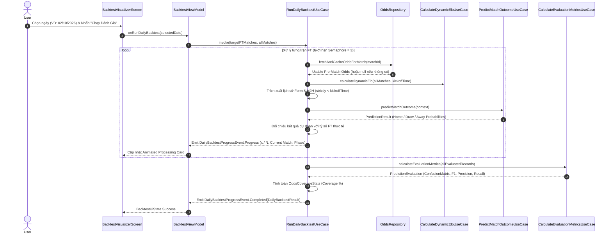

# Implementation Plan: Daily Backtest Evaluation Engine

## 1. Objective

Chuyển đổi kiến trúc Backtest từ cơ chế "Offline Batch 30k Matches" sang quy trình **"Daily / On-Demand Backtest Evaluation"**. 
Tính năng cho phép người dùng chọn một ngày cụ thể, truy vấn toàn bộ các trận đấu đã kết thúc (Full-Time - FT) trong ngày đó (~20 đến ~100 trận), tự động hydrate tỷ lệ cược (Odds) on-demand, tái hiện bối cảnh trước trận (Pre-Match Temporal Context), chạy trực tiếp **Prediction Pipeline 6 Signals** hiện tại và đối chiếu với kết quả thực tế để tính toán các chỉ số đánh giá hiệu năng (Accuracy, Confusion Matrix 3x3, Precision, Recall, F1 và Odds Coverage %).

---

## 2. Current Problem / Motivation

1. **Thiếu hụt dữ liệu Odds lịch sử trong dataset 30k**:
   - Dataset ban đầu không có tỷ lệ cược (Odds = 0 trong offline database).
   - Cơ chế nạp Odds hiện tại hoạt động theo mô hình on-demand (tải khi người dùng xem trận đấu).
   - Backtest cũ trên toàn bộ 30k matches chỉ chạy 5 signals (bỏ qua Odds), khiến kết quả đánh giá không phản ánh đúng Prediction Pipeline thực tế mà người dùng trải nghiệm.
2. **Áp lực bộ nhớ và UI/State**:
   - Tải và giữ ~30k bản ghi trong bộ nhớ cùng lúc gây lãng phí tài nguyên và tạo độ trễ UI không cần thiết.
3. **Trải nghiệm người dùng (UX) chưa tối ưu**:
   - Màn hình hiển thị loading spinner chung chung thay vì phản ánh một quy trình phân tích và đối soát dữ liệu sống động theo thời gian thực.
4. **Mục tiêu mới**:
   - Tái định vị Backtest thành công cụ **Đánh giá theo ngày (Daily Evaluation)** cho các trận FT, tận dụng tối đa cơ chế On-Demand Odds Ingestion và tái sử dụng 100% logic của Prediction pipeline.

---

## 3. Current Architecture Audit

### 3.1. Các thành phần Backtest hiện tại
- **Domain Layer**:
  - [`BacktestPredictionUseCase.kt`](../../core/domain/src/main/kotlin/dev/anhquocs/truelab/core/domain/evaluation/usecase/BacktestPredictionUseCase.kt): Tích lũy trạng thái thời gian trên toàn bộ danh sách trận truyền vào.
  - [`CalculateEvaluationMetricsUseCase.kt`](../../core/domain/src/main/kotlin/dev/anhquocs/truelab/core/domain/evaluation/usecase/CalculateEvaluationMetricsUseCase.kt): Tính toán ma trận nhầm lẫn 3x3, Accuracy, Macro Precision/Recall/F1.
  - [`EvaluationModels.kt`](../../core/domain/src/main/kotlin/dev/anhquocs/truelab/core/domain/evaluation/model/EvaluationModels.kt): Chứa các data class `PredictionBacktestResult`, `BacktestMatchRecord`, `ConfusionMatrix`.
- **Presentation Layer**:
  - [`BacktestViewModel.kt`](../../app/src/main/kotlin/dev/anhquocs/truelab/feature/backtest/presentation/viewmodel/BacktestViewModel.kt): Điều phối tải 30k trận từ `MatchRepository` và `OddsRepository.getLatestEuropeanOddsMap()`.
  - [`BacktestVisualizerScreen.kt`](../../app/src/main/kotlin/dev/anhquocs/truelab/feature/backtest/presentation/BacktestVisualizerScreen.kt): Giao diện trực quan hóa kết quả.
  - [`BacktestUiMapper.kt`](../../app/src/main/kotlin/dev/anhquocs/truelab/feature/backtest/presentation/mapper/BacktestUiMapper.kt): Map Domain Models sang UI Records.

### 3.2. Các thành phần Prediction có thể tái sử dụng trực tiếp
- [`PredictMatchOutcomeUseCase.kt`](../../core/domain/src/main/kotlin/dev/anhquocs/truelab/core/domain/prediction/usecase/PredictMatchOutcomeUseCase.kt): Điều phối 6 Signal Transformers và `DefaultWeightedScorer`.
- **6 Signal Transformers**: `FormSignalTransformer`, `EloSignalTransformer`, `GoalsSignalTransformer`, `OddsSignalTransformer`, `H2hSignalTransformer`, `HomeAdvantageSignalTransformer`.
- [`PreMatchOddsSelector.kt`](../../core/domain/src/main/kotlin/dev/anhquocs/truelab/core/domain/odds/usecase/PreMatchOddsSelector.kt): Lọc kèo Châu Âu (1X2) `instant`/`initial` trước giờ bóng lăn (`changeTime < kickoff`).
- [`CalculateDynamicEloUseCase.kt`](../../core/domain/src/main/kotlin/dev/anhquocs/truelab/core/domain/team/usecase/CalculateDynamicEloUseCase.kt): Tính toán điểm Elo động của 2 đội tại thời điểm trước trận đấu.

### 3.3. Dữ liệu Odds và Cache
- [`OddsRepository.fetchAndCacheOddsForMatch(matchId)`](../../core/data/src/main/kotlin/dev/anhquocs/truelab/core/data/repository/OddsRepositoryImpl.kt): Gọi API on-demand, lưu vào Room DB (Schema v4) với cơ chế `Mutex` chống gọi trùng lặp.
- [`OddsDao.kt`](../../core/data/src/main/kotlin/dev/anhquocs/truelab/core/data/local/database/dao/OddsDao.kt): Truy vấn danh sách odds theo `matchId`.

### 3.4. Lọc ngày và danh sách trận FT
- [`MatchRepository.getPredictableMatchesFiltered`](../../core/data/src/main/kotlin/dev/anhquocs/truelab/core/data/repository/MatchRepositoryImpl.kt) và [`DateTimeFormatterUtils.kt`](../../core/ui/src/main/kotlin/dev/anhquocs/truelab/core/ui/utils/DateTimeFormatterUtils.kt): Hỗ trợ truy vấn trận đấu đã kết thúc (`isEnded = true` / `FINISHED`) theo khoảng thời gian UTC của ngày Local (UTC+7).

---

## 4. Proposed Architecture

Kiến trúc mới giữ Backtest là một tính năng/tab độc lập trên HomeScreen, nhưng tái sử dụng toàn bộ Prediction Pipeline và cơ chế On-Demand Odds:

```
                                [BacktestVisualizerScreen] (Compose UI)
                                            │
                                            ▼
                                   [BacktestViewModel]
                         (Quản lý Date Selection, Progress, Result State)
                                            │
                                            ▼
                                [RunDailyBacktestUseCase]
                            (Flow<DailyBacktestProgressEvent>)
                                            │
                     ┌──────────────────────┴──────────────────────┐
                     │                                             │
           (1. On-Demand Odds)                           (2. Temporal Context)
                     │                                             │
              [OddsRepository]                            [CalculateDynamicEloUseCase]
        (Room Cache + Network On-Demand)                 [MatchRepository / History]
                     │                                             │
                     └──────────────────────┬──────────────────────┘
                                            │
                                            ▼
                              [PredictMatchOutcomeUseCase]
                              (Reuses 6-signal pipeline)
                                            │
                                            ▼
                            [Evaluate: Predicted vs Actual FT]
                                            │
                                            ▼
                          [CalculateEvaluationMetricsUseCase]
                          (Accuracy, Confusion Matrix, Macro F1)
```

---

## 5. Data Flow



---

## 6. Temporal Integrity / Anti-Leakage Rules

Để đảm bảo tính hợp lệ về mặt học thuật và thực tiễn, việc đánh giá một trận đấu có thời điểm bắt đầu $T$ phải tuân thủ nghiêm ngặt:
1. **Lịch sử trận đấu (Recent Form, Goals, H2H)**: Chỉ truy vấn các trận đã kết thúc trước thời điểm $T$ (`isEnded == true && startTimeDate < T`).
2. **Elo Rating**: Điểm Elo của hai đội được tính toán tuần tự dựa trên các trận đấu diễn ra trước $T$ (`CalculateDynamicEloUseCase`).
3. **Tỷ lệ cược (Odds)**: Chỉ sử dụng các bản ghi Odds được tạo hoặc thay đổi trước thời điểm $T$ (`changeTime < T`) thuộc các giai đoạn `instant` hoặc `initial`.
4. **Kết quả Full-Time thực tế**: Tỷ số `homeScore` và `awayScore` của trận đấu target chỉ được đọc ở bước **Evaluation** sau khi `PredictionResult` đã được tính toán độc lập hoàn tất.

---

## 7. Odds Hydration & Coverage

- **Không giả định có 100% Odds**:
  - Với mỗi trận đấu FT, hệ thống kiểm tra Room DB; nếu chưa có, gọi API lấy Odds và lưu vào Room.
  - Nếu API không có Odds hoặc không có bản ghi nào trước kickoff, `latestOdds = null`.
  - Khi `latestOdds = null`, `OddsSignalTransformer` tự động gán trọng số 0.0 và `WeightedScorer` phân bổ trọng số còn lại cho 5 signals khác theo cơ chế missing-signal có sẵn.
- **Thống kê độ phủ (Odds Coverage)**:
  - Ghi nhận rõ ràng: `totalMatches`, `matchesWithUsableOdds`, `matchesWithoutOdds`, `coveragePercentage`.
  - Không gán nhãn "Full 6-signal" cho toàn bộ đợt đánh giá nếu có các trận thiếu Odds.

---

## 8. Concurrency Strategy

- Số lượng trận FT trong một ngày thường dao động từ 20 đến 100 trận.
- **Cơ chế kiểm soát Concurrency**:
  - Sử dụng `kotlinx.coroutines.sync.Semaphore(permits = 3)` để giới hạn tối đa 3 tác vụ nạp Odds và tính toán đồng thời.
  - Ngăn ngừa tình trạng nghẽn I/O Database SQLite và tránh chạm ngưỡng Rate Limit của API.
  - Tiến độ (Progress) được tính dựa trên số trận đã hoàn thành đánh giá thực tế ($x / N$), không dựa trên số lượng request HTTP.

---

## 9. Domain Models

```kotlin
// dev.anhquocs.truelab.core.domain.evaluation.model

/**
 * Thống kê mức độ phủ tỷ lệ cược pre-match trong tập đánh giá.
 */
data class OddsCoverageStats(
    val totalMatches: Int,
    val matchesWithUsableOdds: Int,
    val matchesWithoutOdds: Int,
    val coveragePercentage: Double // Ví dụ: 88.6%
)

/**
 * Các giai đoạn xử lý cho từng trận đấu.
 */
enum class EvaluationPhase {
    HYDRATING_ODDS,
    PREPARING_CONTEXT,
    PREDICTING,
    EVALUATING
}

/**
 * Sự kiện tiến độ trả về theo thời gian thực.
 */
sealed interface DailyBacktestProgressEvent {
    data class Progress(
        val completedCount: Int,
        val totalCount: Int,
        val currentMatchName: String,
        val currentPhase: EvaluationPhase
    ) : DailyBacktestProgressEvent

    data class Completed(
        val result: DailyBacktestResult
    ) : DailyBacktestProgressEvent
}

/**
 * Kết quả đánh giá Backtest theo ngày.
 */
data class DailyBacktestResult(
    val evaluationDate: String,
    val totalMatches: Int,
    val correctMatches: Int,
    val accuracy: Double,
    val oddsCoverage: OddsCoverageStats,
    val evaluationResult: PredictionEvaluation,
    val records: List<BacktestMatchRecord>
)
```

---

## 10. ViewModel State Machine

```kotlin
// dev.anhquocs.truelab.feature.backtest.presentation.model

sealed interface BacktestUiState {
    /** Trạng thái chờ, hiển thị số trận FT có sẵn trong ngày được chọn */
    data class Idle(
        val selectedDate: String,
        val availableFtMatchesCount: Int
    ) : BacktestUiState

    /** Đang chạy phân tích batch */
    data class Running(
        val selectedDate: String,
        val completedMatches: Int,
        val totalMatches: Int,
        val progressPercent: Float,
        val currentMatchName: String,
        val currentPhase: EvaluationPhase
    ) : BacktestUiState

    /** Đánh giá hoàn tất thành công */
    data class Success(
        val selectedDate: String,
        val overview: BacktestOverviewUiRecord,
        val oddsCoverage: OddsCoverageUiRecord,
        val confusionMatrix: ConfusionMatrixUiRecord,
        val classMetrics: List<ClassMetricUiRecord>,
        val matchRecords: List<BacktestMatchUiRecord>,
        val activeFilter: BacktestFilter = BacktestFilter.ALL
    ) : BacktestUiState

    /** Ngày được chọn không có trận đấu FT nào */
    data class Empty(
        val selectedDate: String,
        val message: UiText
    ) : BacktestUiState

    /** Lỗi trong quá trình thực thi */
    data class Error(
        val message: UiText
    ) : BacktestUiState
}
```

---

## 11. UI / UX Flow

1. **Header Date Picker**:
   - Cho phép duyệt ngày: `[ < ] [ 02/10/2026 ] [ > ] [ Hôm nay ]`.
   - Hiển thị số trận FT tìm thấy trong ngày đó.
2. **Nút "Bắt đầu Đánh giá" (Start Evaluation)**:
   - Kích hoạt tiến trình đánh giá trên tập trận của ngày.
3. **Animated Processing Card** (khi `Running`):
   - Progress Bar động: `[████████░░░░░░░░] 34% (12 / 35 trận)`
   - Thông tin trận đấu đang xử lý: `Đan Mạch vs Bồ Đào Nha`
   - Checklist trạng thái:
     - `✓ Dữ liệu lịch sử`
     - `✓ Tỷ lệ cược (Odds)`
     - `✓ Dự đoán mô hình`
     - `→ Đối soát kết quả FT`
   - Hỗ trợ nút **"Hủy" (Cancel)** để hủy Coroutine Job an toàn.
4. **Bảng Kết Quả Đánh Giá** (khi `Success`):
   - **Thẻ Tổng Quan (Overview Card)**: Accuracy (%), Số trận đúng / Tổng số, Macro F1.
   - **Thẻ Độ Phủ Odds (Odds Coverage Card)**: % trận có Odds tiền trận, tỷ lệ dùng 6-signals vs 5-signals.
   - **Ma Trận Nhầm Lẫn (Confusion Matrix Heatmap)**: 3x3 (Home, Draw, Away) với màu sắc trực quan.
   - **Chỉ số theo lớp (Class Metrics Breakdown)**: Precision, Recall, F1 cho từng nhãn.
   - **Danh sách từng trận (Match Records List)**:
     - Filter Chips: `Tất cả (35)` | `Đúng (24)` | `Sai (11)`.
     - Từng Card trận: Tên 2 đội, Tỷ số FT thực tế, Dự đoán của mô hình (Home/Draw/Away kèm % xác suất), Ký hiệu Đúng/Sai (`✓` / `✗`), Icon thể hiện trận có Odds hay không.

---

## 12. Metrics & Evaluation

- **Accuracy**: $\frac{\text{Tổng số trận dự đoán đúng}}{\text{Tổng số trận đánh giá}}$
- **Confusion Matrix (3x3)**:
  - Rows: Actual Outcome ($H, D, A$)
  - Columns: Predicted Outcome ($H, D, A$)
- **Per-Class Metrics**:
  - $Precision_c = \frac{TP_c}{TP_c + FP_c}$
  - $Recall_c = \frac{TP_c}{TP_c + FN_c}$
  - $F1_c = 2 \cdot \frac{Precision_c \cdot Recall_c}{Precision_c + Recall_c}$
- **Macro-Averaged F1**: Trung bình cộng $F1$ của 3 nhãn $H, D, A$.
- **Odds Coverage**: $\frac{\text{Số trận có Odds hợp lệ}}{\text{Tổng số trận}} \times 100\%$

---

## 13. Testing Strategy

### 13.1. Unit Tests (core:domain)
- `RunDailyBacktestUseCaseTest`:
  - Test trường hợp danh sách rỗng $\rightarrow$ Trả về kết quả rỗng hợp lệ.
  - Test trường hợp 100% trận có Odds $\rightarrow$ Odds coverage = 100.0%.
  - Test trường hợp 50% trận có Odds $\rightarrow$ Kiểm tra xử lý missing signal không crash, coverage = 50.0%.
  - Test xác nhận Temporal Integrity: Không có data leakage sau kickoff.
- `CalculateEvaluationMetricsUseCaseTest`: Kiểm tra độ chính xác của Confusion Matrix và Macro F1.

### 13.2. ViewModel Tests (app)
- `BacktestViewModelTest`:
  - Test luồng trạng thái: `Idle` $\rightarrow$ `Running` $\rightarrow$ `Success`.
  - Test lọc trận theo Filter Chips (`ALL`, `CORRECT_ONLY`, `INCORRECT_ONLY`).
  - Test hủy tác vụ (Cancel Job) đưa State về `Idle`.

### 13.3. UI / Compose Tests (core:ui & app)
- Kiểm tra hiển thị Animated Processing Card khi ở state `Running`.
- Kiểm tra render Heatmap Confusion Matrix và danh sách trận khi ở state `Success`.

---

## 14. Implementation Steps

| Bước | Module | Nhiệm vụ chi tiết |
| :--- | :--- | :--- |
| **B1** | `:core:domain` | Tạo mới các models: `OddsCoverageStats`, `DailyBacktestProgressEvent`, `DailyBacktestResult`. |
| **B2** | `:core:domain` | Triển khai `RunDailyBacktestUseCase` tích hợp Semaphore (concurrency = 3), tái sử dụng `PredictMatchOutcomeUseCase`, `PreMatchOddsSelector`, `CalculateDynamicEloUseCase` và emit Flow progress. |
| **B3** | `:app` | Đăng ký `RunDailyBacktestUseCase` trong `DomainUseCaseModule`. |
| **B4** | `:app` | Cập nhật `BacktestUiState`, `BacktestUiMapper` để hỗ trợ `OddsCoverageUiRecord` và các phase xử lý. |
| **B5** | `:app` | Refactor `BacktestViewModel` sang mô hình Daily Selection & On-Demand Evaluation. |
| **B6** | `:app` | Cập nhật `BacktestVisualizerScreen` và các component: thêm Date Header, Animated Processing Card, Odds Coverage Card. |
| **B7** | `:core:domain` & `:app` | Viết Unit Test cho UseCase và ViewModel. |
| **B8** | Build & Verification | Chạy `./gradlew testDebugUnitTest` và `./gradlew assembleDebug` xác nhận build thành công. |

---

## 15. Non-Goals / Out of Scope

1. **Không thay thế Algorithm Benchmark**:
   - Feature Algorithm Benchmark đánh giá hiệu năng thuật toán thuần (Search, Sort, Stats trên tập $1K, 10K, 30K, 50K$) vẫn hoạt động độc lập.
2. **Không tự ý điều chỉnh trọng số / mô hình Prediction**:
   - Không can thiệp sửa đổi baseline draw hoặc trọng số để "làm đẹp" ma trận nhầm lẫn. Đánh giá trung thực mô hình hiện tại.
3. **Không lưu trữ vĩnh viễn (Persistence) kết quả Backtest**:
   - Kết quả đánh giá được lưu in-memory trong UI State của ViewModel trong phiên sử dụng; không tạo bảng lưu lịch sử backtest trong Room ở phase này.

---

## 16. Acceptance Criteria

- [ ] Người dùng có thể chọn bất kỳ ngày nào trong quá khứ và xem số trận FT có sẵn.
- [ ] Bấm "Đánh giá" khởi chạy tiến trình mượt mà với Animated Processing Card thể hiện đúng tiến độ $x / N$ và tên trận hiện tại.
- [ ] Quá trình đánh giá tự động nạp Odds on-demand và áp dụng đúng quy tắc chống Temporal Data Leakage.
- [ ] Hiển thị đầy đủ Accuracy, Ma trận nhầm lẫn 3x3, Macro F1, và Tỷ lệ phủ Odds.
- [ ] Cho phép lọc danh sách trận theo "Tất cả", "Đúng", "Sai".
- [ ] Có thể hủy (Cancel) tiến trình đang chạy mà không gây crash app.
- [ ] 100% Unit tests liên quan pass và ứng dụng build thành công không có warning/error.

---

## 17. Risks & Mitigations

| Rủi ro tiềm ẩn | Mức độ | Biện pháp giảm thiểu |
| :--- | :---: | :--- |
| **Rate limit API Odds khi gọi liên tiếp** | Trung bình | Sử dụng Semaphore giới hạn 3 concurrent requests kết hợp Mutex cache trong Room. |
| **Block UI Thread khi tính toán lịch sử** | Thấp | Toàn bộ UseCase được bọc trong `Dispatchers.Default` và `Dispatchers.IO`. |
| **Ngày chọn không có trận FT nào** | Thấp | Hiển thị state `BacktestUiState.Empty` với nút chuyển nhanh sang ngày khác. |
| **Temporal Data Leakage** | Cao | Lọc nghiêm ngặt `startTimeDate < kickoff` và `odds.changeTime < kickoff` ở cấp UseCase. |
