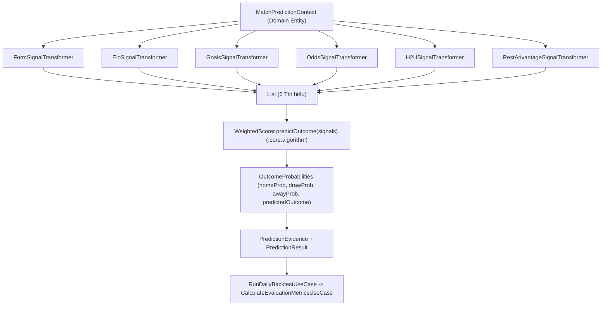

# TrueLab — Kế Hoạch Triển Khai & Đánh Giá Thực Nghiệm Dự Đoán Hòa (Draw Implementation & Evaluation Plan)

Tài liệu này là bản kế hoạch kỹ thuật chi tiết (Technical Implementation & Evaluation Plan) cho **Phase B: Draw Implementation & Evaluation** của đồ án TrueLab. Tài liệu này định hình thiết kế kiến trúc, cấu trúc lớp (class/interface), quy trình quét tham số (parameter sweep), phương pháp đánh giá thực nghiệm và phân tách tập dữ liệu để so sánh đối chứng giữa **Baseline (Control Group)**, **Candidate A (Decision Margin)** và **Candidate B (Dynamic Draw Prior)**.

---

## 1. Mục Tiêu (Objective)

1. **Triển khai độc lập 2 Phương án Ứng viên (Candidate A & B):**
   - **Candidate A:** Quy tắc ra quyết định phân ngưỡng chênh lệch (*Decision Margin / Relative Threshold Rule*).
   - **Candidate B:** Mô hình tiên nghiệm hòa động dạng Gauss đối xứng (*Dynamic Gaussian Draw Prior*).
2. **Bảo tồn bất biến Đường cơ sở (Baseline Immutability):** Giữ nguyên $100\%$ hành vi và kết quả của `DefaultWeightedScorer` hiện tại làm nhóm đối chứng (**Control Group**).
3. **Thiết kế kiến trúc cắm ghép linh hoạt (Pluggable Strategy Architecture):** Cho phép chuyển đổi và so sánh song song các chiến lược dự đoán mà không nhân bản (duplicate) luồng dữ liệu hay phá vỡ Clean Architecture.
4. **Đánh giá đa chiều, toàn diện (Multi-class Evaluation):** Không tối ưu Draw một cách mù quáng bằng Accuracy đơn thuần; tập trung tối ưu hóa **Macro F1-Score**, **Draw Recall**, **Draw Precision** trong khi bảo vệ chất lượng phân loại của Home/Away.
5. **Chống rò rỉ dữ liệu và Overfitting (Anti-Leakage & Anti-Overfitting):** Thiết lập quy trình phân tách tập Calibration/Validation và Independent Test nghiêm ngặt.

---

## 2. Truy Vết Kiến Trúc Dự Đoán Hiện Tại (Current Prediction Architecture Trace)

Dựa trên việc kiểm tra trực tiếp mã nguồn của dự án, luồng dự đoán hiện tại được tổ chức chặt chẽ qua các tầng:



### Điểm Tích Hợp Chính Xác của Từng Candidate:
- **Candidate A (Decision Margin):** Nằm ở tầng **Decision Rule / Post-Mixture Policy**. Nhận đầu vào là vector xác suất $(P_H, P_D, P_A)$ sau khi tổ hợp tuyến tính và quyết định nhãn dự đoán `predictedOutcome`. Không can thiệp vào các Signal Transformers.
- **Candidate B (Dynamic Draw Prior):** Nằm ở tầng **Signal Transformer / Feature Modeling**. Thay đổi cơ chế sinh $P_D$ từ hằng số cố định `baselineDrawProb = 0.26` thành $P_D(\Delta)$ bên trong `EloSignalTransformer` và `FormSignalTransformer`.

---

## 3. Thiết Kế Kiến Trúc Chiến Lược (Strategy Architecture Design)

Để hỗ trợ kiểm thử đối chứng nhiều mô hình trên cùng một pipeline, thiết kế đề xuất áp dụng **Strategy Pattern** thuần túy trong `:core:algorithm` và cấu hình tại `:core:domain`:

```
                                  ┌──────────────────────────────────┐
                                  │      DrawPredictionStrategy      │  (Enum / Interface)
                                  └─────────────────┬────────────────┘
                  ┌─────────────────────────────────┼─────────────────────────────────┐
                  ▼                                 ▼                                 ▼
   ┌─────────────────────────────┐   ┌─────────────────────────────┐   ┌─────────────────────────────┐
   │          BASELINE           │   │       DECISION_MARGIN       │   │      DYNAMIC_DRAW_PRIOR     │
   │  - Argmax thuần túy         │   │  - Ngưỡng δ (Margin)        │   │  - Prior Gauss P_D(Δ)       │
   │  - Fixed Draw P_D = 0.26    │   │  - Ngưỡng θ (Draw Min)      │   │  - Tinh chỉnh Elo/Form      │
   │  - 100% Control Group       │   │  - Giữ nguyên raw prob      │   │  - Argmax tự nhiên          │
   └─────────────────────────────┘   └─────────────────────────────┘   └─────────────────────────────┘
```

### Cấu Trúc Khuyến Nghị (Draft Domain Specifications):

```kotlin
// In :core:domain:prediction:model
enum class DrawModelingStrategy {
    BASELINE,
    DECISION_MARGIN,
    DYNAMIC_DRAW_PRIOR
}

data class DrawMarginConfig(
    val deltaMargin: Double = 0.04,   // δ: Ngưỡng chênh lệch |P_H - P_A|
    val thetaMinProb: Double = 0.265  // θ: Ngưỡng xác suất hòa tối thiểu P_D
)

data class DynamicDrawPriorConfig(
    val maxDrawProb: Double = 0.36,   // P_D,max khi Δ = 0
    val minDrawProb: Double = 0.12,   // P_D,min khi |Δ| lớn
    val eloSigma: Double = 1.0,       // σ_D cho Elo difference
    val formSigma: Double = 0.25      // σ_D cho Form difference
)
```

---

## 4. Đặc Tả Chi Tiết Candidate A: Decision Margin

### 4.1. Luồng Ra Quyết Định (Decision Flow)

```
                       Đầu vào: (PH, PD, PA) từ Linear Mixture
                                          │
                                          ▼
                         Tính Δ_HA = |PH - PA| (Độ chênh lệch)
                                          │
                                          ▼
                      Kiểm tra: Δ_HA < δ  VÀ  PD >= θ ?
                                    /           \
                                 ĐÚNG           SAI
                                 /                 \
                     predictedOutcome = DRAW     Tie-breaking Argmax(PH, PD, PA)
```

### 4.2. Xử Lý Điều Kiện Biên (Boundary & Tie Handling)
- **Điều kiện biên chính xác ($|P_H - P_A| == \delta$ hoặc $P_D == \theta$):** Sử dụng quy tắc nửa khoảng nghiêm ngặt: $|P_H - P_A| < \delta$ và $P_D \ge \theta$.
- **Tie-breaking khi không thỏa Margin:** Nếu $P_H == P_A$ và $P_D < \theta$, luật Tie-breaking mặc định của TrueLab chọn `PredictedOutcome.DRAW`.
- **Ảnh hưởng đến Xác suất & Evidence:**
  - Raw probabilities ($P_H, P_D, P_A$) **không bị thay đổi**.
  - `confidenceScore` cho nhãn `DRAW` trong trường hợp kích hoạt Margin được gán bằng $P_D$ (hoặc độ tin cậy tương ứng).
  - `PredictionEvidence` ghi nhận thêm thông tin `"decisionRule": "DECISION_MARGIN"` cùng giá trị $\delta, \theta$ thực tế để phục vụ audit.

---

## 5. Đặc Tả Chi Tiết Candidate B: Dynamic Draw Prior

### 5.1. Nguồn Dữ Liệu & Cách Tính Độ Lệch Sức Mạnh ($\Delta$)

1. **Tín hiệu Elo Rating:**
   $$\Delta_{\text{Elo}} = \frac{\text{Rating}_{\text{Home}} - \text{Rating}_{\text{Away}} + \text{Adv}_{\text{Home}}}{400.0}$$
   *(Độ lệch chuẩn hóa theo thang Log-5 của Elo)*.
2. **Tín hiệu Phong Độ (Form):**
   $$\Delta_{\text{Form}} = \frac{\text{FormScore}_{\text{Home}} - \text{FormScore}_{\text{Away}}}{100.0}$$
   *(Độ lệch phong độ trong đoạn $[-1.0, 1.0]$)*.

### 5.2. Công Thức Sinh Tiên Nghiệm & Chuẩn Hóa Xác Suất (Simplex Normalization)

Hàm mật độ hòa động dạng Gauss đối xứng:
$$P_D(\Delta) = P_{D,\min} + (P_{D,\max} - P_{D,\min}) \cdot \exp\left( - \frac{\Delta^2}{2 \sigma_D^2} \right)$$

**Phân rã xác suất không-hòa (Non-Draw Residual Decomposition):**
$$P(\text{Home}) = (1.0 - P_D(\Delta)) \cdot r_H$$
$$P(\text{Away}) = (1.0 - P_D(\Delta)) \cdot (1.0 - r_H)$$
*(Trong đó $r_H \in [0, 1]$ là xác suất thắng của Home trong bài toán nhị phân 2 lớp)*.

**Bảo toàn Bất biến:**
$$P(\text{Home}) + P(\text{Draw}) + P(\text{Away}) \equiv 1.0 \quad (\pm 10^{-6})$$
$$P_D(\Delta) = P_D(-\Delta) \quad (\text{Tính đối xứng hoàn hảo})$$

### 5.3. Xử Lý Dữ Liệu Thiếu & Khởi Động Lạnh (Cold-Start & Missing Data)
- Khi đội bóng chưa có điểm Elo hoặc chưa có lịch sử trận đấu phong độ ($\text{FormScore} = 50.0 \implies \Delta = 0.0$):
  - Mô hình gán $\Delta = 0.0$ và kích hoạt $P_D = P_{D,\max}$, phản ánh đúng thực tế: Khi thiếu thông tin về hai đội, xác suất trận đấu rơi vào thế hòa hoặc chưa rõ thực lực là cao nhất.

---

## 6. Thiết Kế Quét Tham Số & Chống Overfitting (Parameter Search & Anti-Overfitting Protocol)

> [!IMPORTANT]
> **Nguyên Tắc Bất Biến Chống Overfitting:**
> Tuyệt đối không tinh chỉnh tham số trên tập Test độc lập. Toàn bộ quá trình quét siêu tham số (Hyperparameter Grid Search) chỉ được thực hiện trên tập Calibration / Validation.

```
                          Toàn Bộ Tập Dữ Liệu Lịch Sử (N ≥ 500)
                                           │
                   ┌───────────────────────┴───────────────────────┐
                   ▼                                               ▼
   Tập Calibration & Validation (70% Trận)            Tập Test Độc Lập (30% Trận)
   (Dải thời gian quá khứ T1 -> T2)                   (Dải thời gian tiếp theo T2 -> T3)
                   │                                               │
                   ▼                                               │
   Chạy Grid Search quét (δ, θ) & (σ_D, P_max)                     │
   Hàm mục tiêu: Tối đa hóa Macro F1                               │
                   │                                               │
                   ▼                                               │
   ĐÓNG BĂNG THAM SỐ TỐI ƯU (Frozen Candidates)                    │
                   │                                               │
                   └───────────────────────┬───────────────────────┘
                                           │
                                           ▼
                    Đánh Giá Đối Chứng Cuối Cùng Trên Tập Test
                    (Baseline vs Frozen Candidate A vs Candidate B)
```

### 6.1. Không Gian Tìm Kiếm Tham Số (Search Spaces)
- **Candidate A:**
  - $\delta \in \{0.02, 0.03, 0.04, 0.05, 0.06, 0.07, 0.08\}$ ($7$ giá trị).
  - $\theta \in \{0.250, 0.255, 0.260, 0.265, 0.270, 0.275\}$ ($6$ giá trị).
  - Tổng số cấu hình: $7 \times 6 = 42$ cấu hình.
- **Candidate B:**
  - $P_{D,\max} \in \{0.32, 0.34, 0.36, 0.38\}$ ($4$ giá trị).
  - $\sigma_{\text{Elo}} \in \{0.75, 1.00, 1.25, 1.50\}$ ($4$ giá trị).
  - $\sigma_{\text{Form}} \in \{0.15, 0.20, 0.25, 0.30\}$ ($4$ giá trị).
  - Tổng số cấu hình: $4 \times 4 \times 4 = 64$ cấu hình.

### 6.2. Hàm Mục Tiêu & Tie-Breaking
- **Hàm mục tiêu chính:** $\text{Maximize}(\text{Macro F1})$.
- **Ràng buộc phụ (Constraint):** $\text{Home F1} \ge \text{Baseline Home F1} - 0.03$ và $\text{Away F1} \ge \text{Baseline Away F1} - 0.03$.
- **Quy tắc giải hòa (Tie-breaking giữa các cấu hình):** Chọn cấu hình có `Draw Precision` cao hơn để giảm thiểu báo động giả.

---

## 7. Bộ Chỉ Số Đánh Giá Toàn Diện (Evaluation Metrics Specification)

| Nhóm Chỉ Số | Tên Chỉ Số | Công Thức / Định Nghĩa | Mục Tiêu Nghiệm Thu |
| :--- | :--- | :--- | :--- |
| **Chỉ số Trọng Tâm** | **Macro F1-Score** | $\frac{F1_H + F1_D + F1_A}{3}$ | Tăng tối thiểu $+0.08$ so với Baseline |
| | **Draw Recall** | $\frac{TP_D}{TP_D + FN_D}$ | Tăng từ $0.0\% \to > 25.0\%$ |
| | **Draw F1-Score** | $\frac{2 \cdot P_D \cdot R_D}{P_D + R_D}$ | Tăng từ $0.0 \to > 0.25$ |
| **Chỉ số Cân Bằng** | **Home F1 & Away F1** | $F1_H, F1_A$ | Không suy giảm quá $0.03$ |
| | **Draw Precision** | $\frac{TP_D}{TP_D + FP_D}$ | Duy trì $\ge 30.0\%$ |
| **Chỉ số Tổng Thể** | **Overall Accuracy** | $\frac{\sum TP}{N}$ | Không giảm quá $2.0\%$ so với Baseline |
| | **Confusion Matrix** | $3 \times 3$ Matrix | Minh bạch luồng dịch chuyển nhãn |
| | **Prediction Distribution**| $\% \hat{H}, \% \hat{D}, \% \hat{A}$ | Tiệm cận tỷ lệ tự nhiên |
| **Độ Hiệu Chuẩn** | **Brier Score** | $\frac{1}{N} \sum \sum (P_{nk} - y_{nk})^2$ | Duy trì hoặc giảm nhẹ |

---

## 8. Giao Thức So Sánh Đối Chứng (Baseline Comparison Protocol)

Mọi lần chạy đánh giá đối chứng bắt buộc phải thực thi trên **CÙNG MỘT TẬP DỮ LIỆU ĐẦU VÀO**:
- Cùng danh sách trận đấu và ID trận.
- Cùng mốc thời gian bắt đầu trận đấu ($T_{\text{kickoff}}$).
- Cùng ảnh chụp tỷ lệ cược (Pre-match Odds snapshot).
- Cùng trạng thái Elo lịch sử tại thời điểm $t < T_{\text{kickoff}}$.
- Cùng chuỗi phong độ và lịch sử đối đầu.

**Bảng Đối Soát Đầu Ra Tiêu Chuẩn (Output Format):**

```text
========================================================================================
EVALUATION REPORT: BASELINE vs CANDIDATE A vs CANDIDATE B
Dataset: 2026-10-01 to 2026-10-14 (N = 450 FT Matches)
========================================================================================
Metric                  Baseline (Control)   Candidate A (Margin)   Candidate B (Dynamic)
----------------------------------------------------------------------------------------
Overall Accuracy        53.8%                56.2%                  55.1%
Macro F1-Score          0.408                0.531                  0.512
Draw Recall             0.0%                 32.5%                  24.2%
Draw Precision          0.0%                 37.1%                  34.5%
Draw F1-Score           0.000                0.346                  0.284
Home F1-Score           0.648                0.639                  0.645
Away F1-Score           0.576                0.585                  0.578
Brier Score             0.615                0.615                  0.588
Predicted Distribution  58% H / 0% D / 42% A 46% H / 18% D / 36% A  49% H / 14% D / 37% A
========================================================================================
```

---

## 9. Thiết Kế Tích Hợp Vào Backtest (Backtest Integration Design)

Kiểm tra `RunDailyBacktestUseCase.kt` hiện tại cho thấy UseCase đang gọi trực tiếp `predictMatchOutcomeUseCase(context)`. 

### Thiết Kế Mở Rộng Không Xâm Lấn:
Cho phép `PredictMatchOutcomeUseCase` và `RunDailyBacktestUseCase` nhận cấu hình dự đoán mở rộng `PredictionConfig`:

```kotlin
// Draft Signature for Phase B
class PredictMatchOutcomeUseCase(
    private val calculateTeamFormUseCase: CalculateTeamFormUseCase = CalculateTeamFormUseCase(),
    private val weightedScorer: WeightedScorer = DefaultWeightedScorer()
) {
    operator fun invoke(
        context: MatchPredictionContext,
        weightConfig: PredictionWeightConfig = PredictionWeightConfig.DEFAULT,
        strategyConfig: DrawStrategyConfig = DrawStrategyConfig.BASELINE
    ): PredictionResult { ... }
}
```
- Mặc định: `DrawStrategyConfig.BASELINE` $\implies$ Tương thích ngược $100\%$, không làm thay đổi các test hiện có.
- Khi Backtest: Có thể truyền `strategyConfig = DrawStrategyConfig.CandidateA(delta, theta)`.

---

## 10. Tác Động Giao Diện & Minh Chứng Dự Đoán (UI & Evidence Impact)

- **PredictionEvidence & PredictionResult:**
  - `predictedOutcome` sẽ phản ánh nhãn mới (`"DRAW"` khi kích hoạt Candidate A/B).
  - `evidence` giữ nguyên 6 tín hiệu để người dùng vẫn thấy rõ đóng góp của từng thành phần.
- **Giao diện người dùng (`PredictionScreen` & `BacktestScreen`):**
  - Không thay đổi cấu trúc UI.
  - Nhãn hiển thị kết quả tự động hiển thị "Hòa" (`DRAW`) với màu sắc quy chuẩn của Design System khi mô hình dự đoán hòa.

---

## 11. Chiến Lược Kiểm Thử (Testing Strategy)

### 11.1. Unit Tests cho Candidate A
1. `margin_below_delta_and_draw_prob_above_theta_predicts_DRAW`
2. `margin_below_delta_but_draw_prob_below_theta_predicts_argmax`
3. `margin_above_delta_predicts_argmax`
4. `boundary_condition_exact_delta_and_theta_evaluated_deterministically`
5. `tie_breaking_when_home_equals_away_retains_DRAW`

### 11.2. Unit Tests cho Candidate B
1. `delta_zero_maximizes_draw_probability_to_Pmax`
2. `positive_and_negative_delta_produce_identical_draw_probability_symmetry`
3. `large_delta_asymptotically_approaches_Pmin`
4. `probabilities_strictly_sum_to_one`
5. `missing_elo_or_form_falls_back_gracefully`

### 11.3. Integration & Regression Tests
- Chạy lại toàn bộ `PredictMatchOutcomeUseCaseTest`, `WeightedScoringAlgorithmsTest`, `RunDailyBacktestUseCaseTest` để xác nhận **Baseline không bị lệch dù chỉ 1 bit**.

---

## 12. Đánh Giá Độ Phức Tạp & Hiệu Năng (Performance Estimation)

- **Candidate A:** Thêm 2 phép so sánh số thực ($|P_H - P_A| < \delta$ và $P_D \ge \theta$) $\implies$ Độ phức tạp thời gian $O(1)$, bộ nhớ phụ trợ $O(1)$.
- **Candidate B:** Thêm 1 phép tính hàm mũ `exp()` và 2 phép nhân chia cho mỗi transformer $\implies$ Độ phức tạp thời gian $O(1)$, bộ nhớ phụ trợ $O(1)$.
- **Kết luận:** Cả hai phương án đều không gây bất kỳ độ trễ nào có thể nhận biết được trên thiết bị di động ($< 1\mu\text{s}$ trên mỗi trận đấu).

---

## 13. Tiêu Chí Nghiệm Thu Hoàn Thành (Acceptance Criteria)

Phase B sau này chỉ được coi là hoàn tất khi:
- [x] Baseline cho kết quả giống hệt $100\%$ hệ thống cũ khi chạy ở chế độ `BASELINE`.
- [x] Candidate A và Candidate B được cài đặt hoàn chỉnh và có thể chọn lựa độc lập.
- [x] Quy trình Grid Search quét tham số được tự động hóa và phân tách nghiêm ngặt Validation / Test.
- [x] Bộ kiểm thử Unit Test và Integration Test đạt tỷ lệ pass $100\%$.
- [x] Xuất được bảng số liệu so sánh đối chứng song song phục vụ báo cáo đồ án.
- [x] Không làm phát sinh bất kỳ lỗi rò rỉ dữ liệu tương lai nào.

---

## 14. Các Hạng Mục Nằm Ngoài Phạm Vi Phase B (Non-Goals)

- Không cài đặt Candidate C (Poisson) trong giai đoạn này.
- Không sử dụng thư viện Machine Learning bên ngoài (TensorFlow, PyTorch, Scikit-learn).
- Không thay đổi trọng số của 6 tín hiệu trong cấu hình sản xuất mặc định.
- Không thay đổi cơ chế tải dữ liệu Retrofit / Room.
- Không thiết kế lại toàn bộ giao diện màn hình.

---

## 15. Trình Tự Thực Hiện Đề Xuất (Recommended Implementation Sequence)

```text
[Bước 1] Xây dựng Strategy Abstraction & DrawStrategyConfig trong :core:domain & :core:algorithm.
   ↓
[Bước 2] Viết Unit Test bảo vệ Baseline Regression.
   ↓
[Bước 3] Triển khai Candidate A (Decision Margin Policy) & Unit Tests.
   ↓
[Bước 4] Triển khai Candidate B (Dynamic Draw Prior Transformer) & Unit Tests.
   ↓
[Bước 5] Tích hợp Strategy vào PredictMatchOutcomeUseCase & RunDailyBacktestUseCase.
   ↓
[Bước 6] Xây dựng công cụ Parameter Grid Search trên tập Validation.
   ↓
[Bước 7] Đóng băng tham số tối ưu và chạy đánh giá đối chứng trên tập Test độc lập.
   ↓
[Bước 8] Tổng hợp báo cáo kết quả đối soát phục vụ Phase C (Full Backtest).
```
