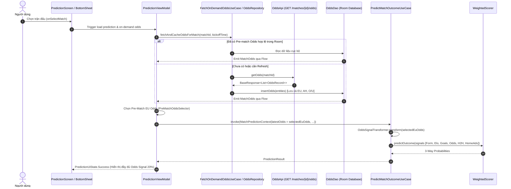

# Kế hoạch Triển khai: Prediction On-Demand Odds Hydration

## 1. Tổng quan & Vấn đề (Overview & Problem Statement)

### 1.1. Hiện trạng
Trong hệ thống phân tích và dự đoán của TrueLab:
- Mô hình đánh giá trọng số `WeightedScorer` phân bổ trọng số **20%** cho tín hiệu xác suất thị trường `1X2 Odds` (`OddsSignalTransformer`).
- Khi tính toán dự đoán cho một trận đấu, `PredictionViewModel` đọc dữ liệu tỷ lệ kèo từ `oddsRepository.getMatchOdds(matchId)`.
- Tuy nhiên, API danh sách trận theo ngày (`GET /sport/v1.0/matches?date=...`) **không trả kèm dữ liệu Odds**.
- TrueLab hiện tại chỉ đồng bộ danh sách trận đấu và thông tin đội bóng trong daily sync, **không chủ động lấy dữ liệu Odds theo từng trận**, dẫn đến:
  - Database Room thường xuyên không có bản ghi Odds cho các trận đấu mới hoặc sắp diễn ra.
  - Tín hiệu `1X2 Odds` bị fallback về trạng thái `Unavailable` (weight = 0.0).
  - Giao diện `PredictionBottomSheet` hiển thị dòng thông báo: `"1X2 Odds (20%) → Chưa có dữ liệu"`.

### 1.2. Định hướng giải pháp: On-Demand Odds Hydration
- **Tuyệt đối không** crawl bulk Odds cho toàn bộ 30,000 trận trong dataset lịch sử.
- Triển khai cơ chế **On-Demand Hydration**: Chỉ khi người dùng thực sự chọn một trận đấu để xem phân tích dự đoán trên màn hình `PredictionScreen`, hệ thống mới kích hoạt lấy dữ liệu Odds của trận đấu đó từ endpoint chuyên biệt `GET /sport/v1.0/matches/{matchId}/odds`.
- Chọn lọc chính xác tỷ lệ kèo **trước giờ bóng lăn (Pre-Match Odds)**, kiên quyết loại bỏ live odds / in-play odds, sau đó đưa vào Room và nạp trực tiếp vào pipeline `PredictMatchOutcomeUseCase`.

---

## 2. Kết quả Khảo sát TrueScore (TrueScore Read-Only Audit Findings)

Từ phân tích kiến trúc dữ liệu Odds của hệ thống upstream TrueScore:

1. **Hệ thống Multi-Market Odds**:
   - `eu`: Kèo Châu Âu 1X2 (Home Win, Draw, Away Win).
   - `asia` hoặc `as`: Kèo Châu Á (Asian Handicap - Handicap, Over, Under).
   - `bs`: Kèo Tổng số bàn thắng (Over/Under - Over, Under).
2. **Endpoint chuyên biệt**:
   - URL: `GET /sport/v1.0/matches/{matchId}/odds`
   - Phương thức trả về đồng thời danh sách các bản ghi `OddsRecord` thuộc nhiều loại kèo khác nhau (`eu`, `asia`, `bs`) từ các đơn vị cung cấp dữ liệu tỷ lệ (`CompanyInfo`).
3. **Phân loại giai đoạn thị trường (`market_phase`)**:
   - `initial`: Tỷ lệ mở kèo ban đầu trước trận.
   - `immediate` (hoặc rỗng): Tỷ lệ cập nhật gần nhất trước trận.
   - `rolling_ball` / `in_play`: Tỷ lệ biến động trong trận (Live Odds) $\rightarrow$ **CẤM** sử dụng cho mô hình dự đoán Pre-Match.
4. **Mốc thời gian thay đổi (`change_time`)**:
   - `change_time` biểu diễn timestamp giây UTC của thời điểm ghi nhận tỷ lệ kèo.
   - Pre-match invariant: $\text{change\_time} < \text{match.startTimeDateEpochSeconds}$.

---

## 3. Khảo sát Hiện trạng Mã nguồn TrueLab (Current Codebase Audit)

Qua rà soát chi tiết toàn bộ các thành phần liên quan đến Odds trong mã nguồn TrueLab:

| Thành phần | Lớp / File thực tế | Trạng thái hiện tại |
| :--- | :--- | :--- |
| **Room Entity** | [`OddsEntity.kt`](../../core/data/src/main/kotlin/dev/anhquocs/truelab/core/data/odds/local/entity/OddsEntity.kt) | Đã có đầy đủ: `id`, `matchId`, `companyId`, `companyName`, `oddsType`, `handicap`, `over`, `under`, `homeWin`, `draw`, `awayWin`, `changeTime`, `marketPhase`. Unique index: `[matchId, companyId, oddsType, changeTime]`. |
| **Room DAO** | [`OddsDao.kt`](../../core/data/src/main/kotlin/dev/anhquocs/truelab/core/data/odds/local/dao/OddsDao.kt) | Đã có: `insertOdds`, `getOddsHistory`, `getLatestOddsForMatch`, `getLatestPreMatchEuropeanOddsForAllMatches`. |
| **Retrofit API** | [`OddsApi.kt`](../../core/data/src/main/kotlin/dev/anhquocs/truelab/core/data/odds/remote/api/OddsApi.kt) | Đã có sẵn method `getOdds(@Path("matchId") matchId: Long): BaseResponse<List<OddsRecord>>`. |
| **Remote DTO** | [`OddsDto.kt`](../../core/data/src/main/kotlin/dev/anhquocs/truelab/core/data/odds/remote/dto/OddsDto.kt) | Đã có: `OddsRecord`, `CompanyInfo`, `OddsHistoryResponse`. |
| **Data Mappers** | [`RoomMappers.kt`](../../core/data/src/main/kotlin/dev/anhquocs/truelab/core/data/local/mapper/RoomMappers.kt) | Đã có: `OddsRecord.toEntity(matchId)` và `OddsEntity.toDomain()`. |
| **Repository Layer** | [`OddsRepository.kt`](../../core/domain/src/main/kotlin/dev/anhquocs/truelab/core/domain/odds/repository/OddsRepository.kt) [`OddsRepositoryImpl.kt`](../../core/data/src/main/kotlin/dev/anhquocs/truelab/core/data/odds/repository/OddsRepositoryImpl.kt) | Hiện tại chỉ đọc từ `OddsDao`, **chưa có** hàm fetch on-demand từ `OddsApi` và lưu vào Room. |
| **Domain Models** | [`Odds.kt`](../../core/domain/src/main/kotlin/dev/anhquocs/truelab/core/domain/odds/model/Odds.kt) | Đã có: `MatchOdds`, `OddsRecordItem`, `ImpliedProbability`, hàm `calculateImpliedProbability()`. |
| **Signal Transformer**| [`OddsSignalTransformer.kt`](../../core/domain/src/main/kotlin/dev/anhquocs/truelab/core/domain/prediction/transformer/OddsSignalTransformer.kt)| Đã có: `transform(oddsItem, config)` tính toán phân phối xác suất ngầm định từ tỷ lệ kèo 1X2. |
| **Prediction UseCase**| [`PredictMatchOutcomeUseCase.kt`](../../core/domain/src/main/kotlin/dev/anhquocs/truelab/core/domain/prediction/usecase/PredictMatchOutcomeUseCase.kt)| Nhận `context.latestOdds`, chuyển thành `oddsSignal` (trọng số 20%) và tổng hợp qua `WeightedScorer`. |
| **Presentation VM** | [`PredictionViewModel.kt`](../../app/src/main/kotlin/dev/anhquocs/truelab/feature/prediction/presentation/viewmodel/PredictionViewModel.kt)| Đang lắng nghe `oddsRepository.getMatchOdds(selectedMatch.id)` qua Flow, nhưng chưa kích hoạt fetch từ API khi chưa có dữ liệu. |

---

## 4. Kiến trúc Đề xuất (Proposed Architecture & Data Flow)

### 4.1. Sơ đồ Luồng Dữ liệu On-Demand

### 4.2. Nguyên tắc Phân định Trách nhiệm (Separation of Concerns)
- **Presentation (`PredictionViewModel`)**: Điều phối trạng thái giao diện, bắt sự kiện chọn trận và kích hoạt Coroutine fetch On-Demand. Tuyệt đối không gọi Retrofit API trực tiếp.
- **Domain (`FetchOnDemandOddsUseCase` / `PreMatchOddsSelector`)**: Xác định nghiệp vụ chọn lọc bản ghi Odds hợp lệ trước giờ thi đấu (`changeTime < kickoff`, loại trừ live/in-play phase).
- **Data (`OddsRepositoryImpl` / `DataSyncEngine`)**: Quản lý mạng (Retrofit `OddsApi`), xử lý lỗi mạng / retry / timeout, và ghi vào CSDL cục bộ (Room `OddsDao`).

---

## 5. Chiến lược Chọn lọc Kèo Trước Trận (Pre-Match Odds Selection Strategy)

Để đảm bảo không có rò rỉ dữ liệu trong trận (**Zero Data Leakage**):

### 5.1. Bộ lọc Bất biến (Temporal & Phase Invariants)
Một bản ghi `OddsRecordItem` được coi là **Pre-Match Odds hợp lệ** khi và chỉ khi thỏa mãn đồng thời các điều kiện:
1. **Loại kèo**: `oddsType.equals("eu", ignoreCase = true)`.
2. **Thời điểm biến động**: $\text{changeTime} < \text{kickoffTimestampSeconds}$.
3. **Pha thị trường**: `marketPhase` **không** thuộc tập cấm `["rolling_ball", "in_play", "live", "running"]`.
4. **Dữ liệu tỷ lệ hợp lệ**: `homeWin > 1.0`, `draw > 1.0`, `awayWin > 1.0`.

### 5.2. Thứ tự Ưu tiên Snapshot (Selection Preference)
Khi một trận đấu có nhiều bản ghi Odds từ nhiều đơn vị cung cấp dữ liệu hoặc nhiều thời điểm khác nhau trước trận:
1. **Ưu tiên giai đoạn**: `marketPhase == "immediate"` hoặc `marketPhase.isNullOrBlank()` (snapshot sát giờ bóng lăn nhất) $>$ `marketPhase == "initial"` (kèo mở ban đầu).
2. **Ưu tiên thời gian**: Bản ghi có `changeTime` lớn nhất (gần kickoff nhất nhưng vẫn $< \text{kickoff}$).
3. **Ưu tiên nguồn dữ liệu**: Đơn vị cung cấp dữ liệu chuẩn hóa quốc tế (Bet365, Crown, 10Bet) nếu có nhiều nguồn cùng thời điểm.

---

## 6. Nền tảng Đa Thị trường (Multi-Market Data Foundation)

### 6.1. Ingestion toàn bộ Multi-Market
Khi gọi endpoint `GET /sport/v1.0/matches/{matchId}/odds`, response trả về tất cả các market (`eu`, `asia`, `bs`).
- **Lưu trữ**: `OddsRepositoryImpl` sẽ parse và lưu **toàn bộ** các bản ghi (`eu`, `asia`, `bs`) vào bảng `odds` của Room DB thông qua `OddsDao.insertOdds(...)`.
- Điều này chuẩn bị sẵn nền tảng dữ liệu cho các phase phát triển tiếp theo (Odds Signal Expansion) mà không cần crawl lại.

### 6.2. Phạm vi Tính toán Dự đoán (Scoring Scope)
- **Trong Phase này**: Chỉ trích xuất kèo `eu` (1X2) nạp vào `OddsSignalTransformer` để tính xác suất 3 chiều cho `WeightedScorer`.
- Kèo Châu Á (`asia`) và Kèo Tổng số bàn thắng (`bs`) được chuẩn hóa và lưu trữ an toàn trong Room, **tuyệt đối chưa đưa vào công thức tính điểm của `WeightedScorer`** trong phase này nhằm giữ nguyên tính nhất quán của mô hình 6 tín hiệu hiện tại.

---

## 7. Quản lý Bộ nhớ đệm, Đồng thời & Khả năng Phục hồi (Cache, Concurrency & Resilience)

1. **Kiểm tra Cache trước khi gọi mạng**:
   - Nếu trong Room đã có bản ghi `eu` pre-match hợp lệ $\rightarrow$ Tái sử dụng ngay, không kích hoạt HTTP request thừa.
   - Nếu chưa có $\rightarrow$ Dispatch một Coroutine nền để fetch từ `OddsApi`.
2. **Xử lý Huỷ bỏ (Cancellation Handling)**:
   - Khi người dùng chuyển đổi nhanh giữa các trận đấu (nhấp liên tục vào nhiều thẻ trận), `Job` fetch odds của trận cũ sẽ bị cancel tự động thông qua `Job.cancel()` hoặc `flatMapLatest` trong ViewModel.
3. **Xử lý Lỗi Mạng & Trực quan hóa Trạng thái**:
   - Nếu request Odds bị lỗi mạng (timeout, HTTP 404/500, no internet) $\rightarrow$ Không làm crash ứng dụng, fallback an toàn về `Odds Unavailable` (weight = 0.0) và phân phối lại 100% trọng số cho 5 tín hiệu còn lại (`Form`, `Elo`, `Goals`, `H2H`, `HomeAdvantage`).

---

## 8. Trải nghiệm Giao diện Quá trình Dự đoán (Prediction Process UX)

- **Zero Fake Delay**: Không chèn `delay(1500)` giả lập để tạo hiệu ứng AI ảo.
- **Trực quan hóa Tín hiệu Thật**:
  - Khi đang tải Odds từ mạng: Thể hiện icon nạp hoặc placeholder tinh tế.
  - Khi hoàn thành: Cập nhật ngay tỷ lệ phần trăm phân phối xác suất và hiển thị thẻ bằng chứng `1X2 Odds (20%)` với chi tiết tỷ lệ kèo thị trường (`Home`, `Draw`, `Away`).

---

## 9. Kế hoạch Kiểm thử Code-Level (Test Plan)

> **Lưu ý Bắt buộc**: Kế hoạch kiểm thử hoàn toàn chạy ở mức mã nguồn (`Unit Tests` & `Integration Tests` trên JVM/Gradle). Tuyệt đối **KHÔNG** yêu cầu kiểm thử trên thiết bị vật lý.

### 9.1. Unit Tests
1. `OddsRemoteDtoTest`: Kiểm tra parse JSON từ API thành `OddsRecord` với các trường `company_id`, `odds_type`, `home_win`, `draw`, `away_win`, `handicap`, `over`, `under`, `change_time`, `market_phase`.
2. `OddsMapperTest`: Kiểm tra chuyển đổi `OddsRecord` $\rightarrow$ `OddsEntity` $\rightarrow$ `OddsRecordItem` cho cả 3 loại kèo `eu`, `asia`, `bs`.
3. `PreMatchOddsSelectorTest`:
   - Trận có nhiều snapshot $\rightarrow$ Chọn snapshot sát kickoff nhất.
   - Bản ghi có `change_time >= kickoff` $\rightarrow$ Bị loại bỏ 100%.
   - Bản ghi có `market_phase == "in_play"` hoặc `"rolling_ball"` $\rightarrow$ Bị loại bỏ 100%.
   - Trận không có bản ghi `eu` nào $\rightarrow$ Trả về `null`.
4. `OddsSignalTransformerTest`:
   - Kèo hợp lệ: Tính đúng implied probability sau khi trừ biên lợi nhuận thị trường (market margin).
   - Kèo thiếu (`null`): Trọng số trả về bằng `0.0`, xác suất phân bổ trung tính.
5. `OddsRepositoryOnDemandTest`: Mock `OddsApi` và `OddsDao`, kiểm tra luồng fetch on-demand, caching và fallback.

### 9.2. Integration & Data-Flow Tests
1. `PredictionOnDemandOddsFlowTest`:
   - Kịch bản 1: Chọn trận chưa có Odds $\rightarrow$ API được gọi $\rightarrow$ Room được cập nhật $\rightarrow$ Prediction kết nạp Odds signal 20% thành công.
   - Kịch bản 2: Chọn trận đã có Odds trong Room $\rightarrow$ API không bị gọi lại $\rightarrow$ Prediction sử dụng dữ liệu cache.
   - Kịch bản 3: API trả về rỗng / lỗi $\rightarrow$ Prediction vẫn tính toán thành công với 5 tín hiệu còn lại, không throw Exception.
   - Kịch bản 4: Kèo `asia` và `bs` được lưu trữ nhưng không làm sai lệch kết quả của `WeightedScorer`.

---

## 10. Tiêu chí Chấp nhận (Acceptance Criteria)

- [ ] Kích hoạt on-demand fetch Odds khi người dùng chọn xem dự đoán cho một trận đấu.
- [ ] Không thực hiện bulk crawl Odds cho 30,000 trận trong database lịch sử.
- [ ] Endpoint `/sport/v1.0/matches/{matchId}/odds` được gọi chính xác theo `matchId`.
- [ ] Chỉ chọn lọc Pre-Match Odds (`changeTime < kickoff`, loại bỏ `rolling_ball`/`in_play`).
- [ ] Tỷ lệ 1X2 được chuyển đổi và đưa vào `OddsSignalTransformer` thành công.
- [ ] Trọng số 20% của Odds được giữ nguyên và tính toán chính xác khi có dữ liệu.
- [ ] Ứng dụng xử lý an toàn và mượt mà khi một trận đấu không có dữ liệu Odds.
- [ ] Dữ liệu Kèo Châu Á (AH) và Tổng số bàn thắng (O/U) được lưu trữ vào Room nhưng không làm thay đổi trọng số/kết quả dự đoán.
- [ ] Xử lý chống trùng lặp request và huỷ bỏ coroutine an toàn khi người dùng chuyển đổi trận nhanh.
- [ ] Toàn bộ Unit Tests và Integration Tests vượt qua (100% PASS).
- [ ] Không yêu cầu kiểm thử trên thiết bị vật lý.
- [ ] Không tái tạo/thay đổi database asset ban đầu.
- [ ] Không thay đổi thuật toán dự đoán cốt lõi hay bảng trọng số `PredictionWeightConfig`.
