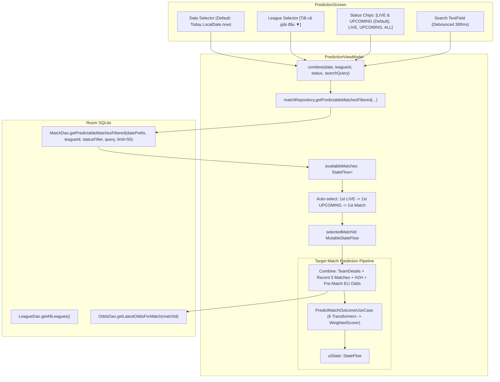

# Prediction Screen Redesign & Optimization Implementation Plan

**TrueLab Android Application**  
**Module**: `:app`, `:core:data`, `:core:domain`, `:core:ui`  
**Target Feature**: Redesign Màn hình Dự đoán (Prediction Screen) phục vụ trận UPCOMING / LIVE có bộ lọc Ngày, Giải đấu, Trạng thái  
**Status**: DRAFT (Planning Only — No Source Code Modified)  
**Creation Date**: 2026-09-30  

---

## 1. Context & Executive Summary

Hiện tại, màn hình Dự đoán ([`PredictionScreen.kt`](../../app/src/main/kotlin/dev/anhquocs/truelab/feature/prediction/presentation/PredictionScreen.kt)) đang gặp các hạn chế lớn về mặt Trải nghiệm Người dùng (UX) và Khả năng Mở rộng (Scalability):
1. **Thiếu Bộ Lọc Ngày & Thời Gian (Date Filter)**: Ứng dụng hiện chỉ tải 50 trận đấu gần nhất trong quá khứ/tương lai theo thứ tự giảm dần (`startTimeDate DESC`), không cho phép người dùng chọn xem các trận đấu diễn ra "Hôm nay", "Ngày mai" hoặc một ngày cụ thể.
2. **Thiếu Bộ Lọc Giải Đấu (Competition Filter)**: Người dùng không thể lọc danh sách trận đấu theo từng giải đấu (Premier League, La Liga, Serie A, Champions League, v.v.).
3. **Thiếu Phân Loại Trạng Thái Trận Đấu (Status Filter)**: Màn hình mặc định hiển thị cả các trận đấu đã kết thúc (`ENDED`) thay vì tập trung vào mục tiêu chính của màn hình Dự đoán: **Các trận sắp diễn ra (`UPCOMING`) và đang diễn ra (`LIVE`)**.
4. **Trải Nghiệm Chọn Trận (Match Selection UX) Bất Tiện**: Giao diện hiện tại dùng thanh cuộn ngang `LazyRow` với các `FilterChip` ("Arsenal vs Chelsea"), chỉ hiển thị tên 2 đội ngắn gọn, thiếu thông tin giải đấu, giờ bóng lăn, tỷ số trực tiếp và tỷ lệ kèo.
5. **Cơ Chế Tách Biệt Ngữ Cảnh (Separation of Concerns)**: Cần tách bạch rõ ràng giữa:
   - **Match Selection Context** (Danh sách trận đấu thỏa mãn bộ lọc để người dùng lựa chọn - tải nhẹ, giới hạn `LIMIT 50`).
   - **Prediction Calculation Context** (Ngữ cảnh tính toán dự đoán chuyên sâu gồm Form 5 trận, Elo, H2H, Goals, Odds - chỉ kích hoạt sau khi người dùng chọn 1 trận đấu mục tiêu).

---

## 2. Goals & Non-Goals

### Goals
1. **Redesign UX Màn hình Prediction theo chuẩn Modern Material 3**:
   - **Thanh Bộ Lọc (Filter Bar)**:
     - **Bộ chọn Ngày (Date Filter)**: Mặc định là ngày hôm nay theo giờ địa phương của thiết bị (`LocalDate.now()`). Cho phép chuyển ngày Hôm qua / Hôm nay / Ngày mai và mở DatePicker chọn ngày bất kỳ.
     - **Bộ chọn Giải đấu (Competition Filter)**: Dropdown / BottomSheet `[Tất cả giải đấu ▼]`, nạp động danh sách giải đấu từ [`LeagueRepository.getLeagues()`](../../core/domain/src/main/kotlin/dev/anhquocs/truelab/core/domain/league/repository/LeagueRepository.kt).
     - **Bộ chọn Trạng thái (Status Filter)**: FilterChips gồm `LIVE & UPCOMING` (Mặc định), `LIVE`, `UPCOMING`, `ALL`. Tuyệt đối loại bỏ `ENDED` khỏi danh sách mặc định.
     - **Tìm kiếm (Search Bar)**: Tìm nhanh theo tên đội bóng hoặc tên giải đấu với debounce 300ms.
   - **Danh Sách Trận Đấu Khả Dụng (Predictable Match List)**:
     - Thay thế thanh `LazyRow` cuộn ngang bằng `LazyColumn` hoặc thẻ chọn trận dọc `PredictableMatchCard` hiển thị: Logo + Tên đội Home/Away, Giờ bóng lăn / Phút thi đấu trực tiếp, Tên giải đấu, Huy hiệu trạng thái (LIVE / UPCOMING), Chỉ báo có sẵn Odds.
     - Highlight rõ ràng trận đấu đang được chọn (Active Selection).
   - **Khu Vực Phân Tích Dự Đoán (Prediction Results & Breakdown)**:
     - Hiển thị đầy đủ thẻ chi tiết trận đấu được chọn ([`SelectedMatchHeaderCard`](../../app/src/main/kotlin/dev/anhquocs/truelab/feature/prediction/presentation/PredictionScreen.kt)), biểu đồ xác suất 3 chiều Thắng/Hòa/Thua ([`ProbabilityResultsCard`](../../app/src/main/kotlin/dev/anhquocs/truelab/feature/prediction/presentation/components/ProbabilityResultsCard.kt)) và phân rã các yếu tố tín hiệu ([`PredictionFactorsCard`](../../app/src/main/kotlin/dev/anhquocs/truelab/feature/prediction/presentation/components/PredictionFactorsCard.kt)).
2. **Truy Vấn Giới Hạn Tại Tầng SQLite (Database-Level Bounded Query)**:
   - Thực hiện toàn bộ logic lọc (Date, League, Status, Search) trực tiếp trong câu lệnh SQL của [`MatchDao`](../../core/data/src/main/kotlin/dev/anhquocs/truelab/core/data/match/local/dao/MatchDao.kt), giới hạn cứng `LIMIT 50`.
   - Tuyệt đối không tải toàn bộ 15.000 trận vào RAM rồi lọc bằng Kotlin Collection trên Main Thread.
3. **Bảo Toàn 100% Zero Temporal Leakage**:
   - Với mọi trận mục tiêu $T$, các chỉ số Form, H2H, Goals và Elo chỉ được trích xuất từ các trận đã kết thúc trước thời điểm $T$ (`startTimeDate < T.startTimeDate`).
4. **Tương Thích và Tái Sử Dụng Hoàn Toàn Domain Pipeline Hiện Có**:
   - Tái sử dụng trọn vẹn [`PredictMatchOutcomeUseCase`](../../core/domain/src/main/kotlin/dev/anhquocs/truelab/core/domain/prediction/usecase/PredictMatchOutcomeUseCase.kt) và 6 Signal Transformers mà không sửa đổi công thức toán học hay trọng số.

### Non-Goals
- Không thay đổi công thức dự đoán hay cấu hình trọng số trong [`PredictionWeightConfig.kt`](../../core/domain/src/main/kotlin/dev/anhquocs/truelab/core/domain/prediction/model/PredictionWeightConfig.kt).
- Không mở rộng thị trường Odds sang Asian Handicap, Over/Under hay Correct Score (giữ nguyên phạm vi Kèo Châu Âu 1X2 EU).
- Không sửa đổi cấu trúc bảng SQLite hay tạo migration mới trong Room.
- Không giải quyết vấn đề toàn cục về lưu vết Elo vào database (bảng `teams` vẫn giữ `1500.0` ban đầu, việc đồng bộ Elo Source of Truth thuộc task riêng).

---

## 3. Current Architecture vs Proposed Architecture

### Current Architecture Flow
```text
PredictionScreen (Main Thread)
  ├── Search Input (TextInput)
  ├── PredictionViewModel:
  │     _searchQuery -> getPredictableMatches(50) [ORDER BY status, startTimeDate DESC]
  │     availableMatches (StateFlow<List<Match>>)
  │     uiState = combine(matchesFlow, selectedMatchId) -> PredictMatchOutcomeUseCase
  └── UI Render:
        ├── OutlinedTextField (Search)
        ├── LazyRow { items(availableMatches) -> FilterChip (Home vs Away) }  <-- CLUNKY & LIMITED
        └── SelectedMatch Cards (Header + Probabilities + Factors)
```

### Proposed Redesigned Architecture Flow


---

## 4. Detailed Component Design & Specifications

### 4.1. Filter Bar Specification

#### A. Date Filter (Bộ lọc Ngày)
- **Mặc định**: Ngày hiện tại theo múi giờ địa phương của thiết bị (`LocalDate.now()`).
- **Định dạng dữ liệu**: Chuỗi `"YYYY-MM-DD"` (ví dụ `"2026-03-30"`), tương thích 100% với cột `startTimeDate` trong SQLite (`startTimeDate LIKE :datePrefix || '%'`).
- **Giao diện người dùng**:
  - Thanh chọn ngày gồm:
    - Nút `<` (Ngày trước).
    - Nút `Hôm nay` / Ngày được chọn kèm biểu tượng Lịch `📅`.
    - Nút `>` (Ngày sau).
    - Nhấn vào khu vực ngày hiển thị DatePickerDialog (Material 3 `DatePickerDialog`) để chọn ngày bất kỳ.
  - Phím tắt nhanh: `[Hôm qua]`, `[Hôm nay]`, `[Ngày mai]`.

#### B. Competition Filter (Bộ lọc Giải đấu)
- **Mặc định**: `null` (Tất cả giải đấu).
- **Nguồn dữ liệu**: Lấy động từ `LeagueRepository.getLeagues()`.
- **Giao diện người dùng**:
  - Thẻ bấm / Dropdown dạng `[Tất cả giải đấu ▼]` hoặc hiển thị tên giải đang chọn (ví dụ: `[Premier League ✕]`).
  - Khi bấm: Mở ModalBottomSheet hoặc DropdownMenu hiển thị danh sách các giải đấu có logo, tên và số lượng trận đấu khả dụng.

#### C. Status Filter (Bộ lọc Trạng thái)
- **Định nghĩa Enum**:
  ```kotlin
  enum class PredictionStatusFilter {
      LIVE_AND_UPCOMING, // Mặc định (Gồm cả LIVE và UPCOMING, loại bỏ hoàn toàn ENDED và CANCELLED)
      LIVE,              // Chỉ các trận đang thi đấu trực tiếp
      UPCOMING,          // Chỉ các trận sắp diễn ra chưa bắt đầu
      ALL                // Tất cả các trận trong ngày
  }
  ```
- **Giao diện người dùng**:
  - Hàng `FilterChip` ngang có thể chọn nhanh:
    - `🔴 Đang & Sắp đá` (Selected Container: PrimaryContainer) - Mặc định.
    - `🟢 Trực tiếp` (Live badge).
    - `⏱️ Sắp diễn ra` (Upcoming badge).
    - `📋 Tất cả`.

#### D. Search Bar (Tìm kiếm nhanh)
- Ô tìm kiếm nhỏ gọn có Icon Search và nút Xóa (Clear).
- Tìm kiếm theo tên đội nhà, đội khách hoặc giải đấu với cơ chế debounce 300ms.

---

### 4.2. Predictable Match List & Cards (Danh sách trận đấu)

- **Layout**: `LazyColumn` hoặc khối danh sách có phân nhóm rõ ràng theo giải đấu.
- **Card Design (`PredictableMatchItemCard`)**:
  - **Header**: Tên giải đấu + Vòng đấu (nếu có).
  - **Body**:
    - Cột Đội Nhà: Logo + Tên đội.
    - Cột Trung tâm:
      - Nếu `UPCOMING`: Hiển thị Giờ bóng lăn (ví dụ: `19:30`).
      - Nếu `LIVE`: Hiển thị Huy hiệu trực tiếp `🔴 LIVE` + Tỷ số trực tiếp hiện tại (ví dụ: `2 - 1`). *(Lưu ý: Schema API hiện tại không có trường số phút thi đấu `minute`)*.
      - Nếu `ENDED`: Hiển thị Tỷ số chung cuộc (ví dụ: `FT 2 - 0`).
    - Cột Đội Khách: Logo + Tên đội.
  - **Footer / Badges**:
    - Huy hiệu tỷ lệ cược: `📊 Có tỷ lệ 1X2` (nếu có odds pre-match).
    - Huy hiệu trạng thái chọn: Khi card đang được chọn làm trận mục tiêu dự đoán $\rightarrow$ Viền Primary (2dp), nền PrimaryContainer/SurfaceVariant nổi bật.
- **Tương tác**: Nhấn vào bất kỳ MatchCard nào sẽ gán `selectedMatchId = match.id` và kích hoạt đường ống tính toán dự đoán cho trận đấu đó.

---

### 4.3. Target Match Prediction Section (Khu vực Kết quả Dự đoán)

Khi một trận đấu mục tiêu được chọn:
1. **Selected Match Header**: Hiển thị thẻ tóm tắt trận đấu, sân thi đấu, thời gian, tên 2 đội.
2. **Win / Draw / Away Probability Results Card**:
   - Thanh phân bổ xác suất 3 màu tương ứng với Home Win %, Draw %, Away Win %.
   - Huy hiệu Kết quả dự đoán nổi bật (ví dụ: `DỰ ĐOÁN: CHỦ NHÀ THẮNG • ĐỘ TIN CẬY: 54.2%`).
3. **Key Prediction Factors Breakdown Card**:
   - **Form Score (Phong độ)**: Điểm phong độ 5 trận gần nhất của Đội Nhà vs Đội Khách.
   - **Elo Rating (Thực lực)**: Điểm Elo và độ chênh lệch Elo giữa 2 đội.
   - **Goals Statistics (Bàn thắng)**: Kỳ vọng bàn thắng tấn công và phòng ngự.
   - **H2H Matrix (Đối đầu)**: Tỷ lệ thắng/hòa/thua trong lịch sử đối đầu.
   - **Target EU Odds (Thị trường)**: Tỷ lệ cược 1X2 thực tế và xác suất hàm ý từ nhà cái (nếu có).
4. **Empty / No Match State**:
   - Nếu không có trận đấu nào trong ngày đã chọn thỏa mãn bộ lọc $\rightarrow$ Hiển thị `PredictionEmptyCard` thân thiện: *"Không có trận đấu sắp diễn ra vào ngày này. Hãy thử chọn ngày khác hoặc mở rộng bộ lọc."* kèm nút bấm nhanh *[Chuyển về Hôm nay]*.

---

## 5. Data Layer & Room Query Architecture

### 5.1. Bounded SQL Query trong `MatchDao.kt` & Source of Truth về Match Status

#### A. Audited Match Status Values (Kiểm chứng thực tế từ SQLite Database)
Từ kết quả kiểm toán trực tiếp trên toàn bộ 15.456 bản ghi trận đấu trong `truelab_database.db`:
- `'live'` (14 trận): Trận đấu đang diễn ra trực tiếp $\rightarrow$ `MatchStatus.IN_PROGRESS`.
- `'pending'` (40 trận): Trận đấu sắp diễn ra $\rightarrow$ `MatchStatus.SCHEDULED`.
- `'ended'` (15.397 trận) & `'determined'` (2 trận): Trận đấu đã kết thúc $\rightarrow$ `MatchStatus.ENDED`.
- `'cancelled'` (2 trận) & `'postponed'` (1 trận): Trận đấu bị hủy hoặc hoãn $\rightarrow$ `MatchStatus.CANCELLED`.

#### B. Giải thích kỹ thuật về `@Transaction` trong `MatchDao`
- Truy vấn `getPredictableMatchesFiltered` trả về `Flow<List<MatchWithTeams>>`.
- Lớp `MatchWithTeams` chứa 2 quan hệ `@Relation` (`homeTeam: TeamEntity` và `awayTeam: TeamEntity`).
- Room compiler yêu cầu bắt buộc chú thích `@Transaction` trên các phương thức trả về POJO có chứa `@Relation` để đảm bảo tính nhất quán dữ liệu nguyên tử (Atomic consistency) khi Room thực thi các truy vấn con nạp dữ liệu đội bóng liên kết và tránh cảnh báo biên dịch.

#### C. Câu lệnh SQL DAO tối ưu
```sql
@Transaction
@Query("""
    SELECT m.* FROM matches m
    WHERE (:datePrefix IS NULL OR :datePrefix = '' OR m.startTimeDate LIKE :datePrefix || '%')
      AND (:leagueId IS NULL OR m.leagueId = :leagueId)
      AND (
          (:statusFilter = 'LIVE_AND_UPCOMING' AND m.status IN ('live', 'pending', '1', '0'))
          OR (:statusFilter = 'LIVE' AND m.status IN ('live', '1'))
          OR (:statusFilter = 'UPCOMING' AND m.status IN ('pending', '0'))
          OR (:statusFilter = 'ALL')
      )
      AND (:searchQuery IS NULL OR :searchQuery = '' OR EXISTS (
          SELECT 1 FROM teams t 
          WHERE (t.id = m.homeTeamId OR t.id = m.awayTeamId) 
            AND t.name LIKE '%' || :searchQuery || '%'
      ))
    ORDER BY 
      CASE 
          WHEN m.status IN ('live', '1') THEN 0
          WHEN m.status IN ('pending', '0') THEN 1
          ELSE 2
      END,
      m.startTimeDate ASC
    LIMIT :limit
""")
fun getPredictableMatchesFiltered(
    datePrefix: String?,
    leagueId: Int?,
    statusFilter: String,
    searchQuery: String?,
    limit: Int = 50
): Flow<List<MatchWithTeams>>
```

- **Ưu điểm**:
  - Chạy 1 lần duy nhất trong SQLite, trả về danh sách $\le 50$ trận đấu.
  - Sử dụng index có sẵn: `Index(value = ["startTimeDate"])`, `Index(value = ["status"])`, `Index(value = ["leagueId"])`.
  - Không gây giật lag hay ngốn RAM Main Thread.

---

### 5.2. MatchRepository & MatchRepositoryImpl

Cập nhật interface [`MatchRepository.kt`](../../core/domain/src/main/kotlin/dev/anhquocs/truelab/core/domain/match/repository/MatchRepository.kt) và triển khai tại [`MatchRepositoryImpl.kt`](../../core/data/src/main/kotlin/dev/anhquocs/truelab/core/data/match/repository/MatchRepositoryImpl.kt):

```kotlin
fun getPredictableMatchesFiltered(
    date: String?,
    leagueId: Int?,
    statusFilter: PredictionStatusFilter,
    searchQuery: String?,
    limit: Int = 50
): Flow<List<Match>>
```

---

## 6. PredictionViewModel State & Orchestration Flow

### 6.1. UI State Contract

```kotlin
data class PredictionFilterState(
    val selectedDate: String, // Format "YYYY-MM-DD", default LocalDate.now().toString()
    val selectedLeagueId: Int? = null,
    val selectedStatusFilter: PredictionStatusFilter = PredictionStatusFilter.LIVE_AND_UPCOMING,
    val searchQuery: String = ""
)

sealed interface PredictionUiState {
    data object Loading : PredictionUiState
    
    data class Empty(
        val message: UiText,
        val canResetFilters: Boolean = true
    ) : PredictionUiState
    
    data class Success(
        val selectedMatch: Match,
        val availableMatches: List<Match>,
        val predictionResult: PredictionResult,
        val homeElo: Double?,
        val awayElo: Double?,
        val homeWinPercent: Int,
        val drawPercent: Int,
        val awayWinPercent: Int,
        val confidencePercent: Int
    ) : PredictionUiState
    
    data class Error(
        val message: UiText
    ) : PredictionUiState
}
```

### 6.2. Auto-Selection Logic
Khi danh sách `availableMatches` thay đổi (do người dùng đổi ngày hoặc đổi bộ lọc):
1. Nếu `selectedMatchId` hiện tại vẫn nằm trong danh sách mới $\rightarrow$ Giữ nguyên trận đang chọn.
2. Nếu không:
   - Ưu tiên 1: Chọn trận đấu `LIVE` đầu tiên (nếu có).
   - Ưu tiên 2: Chọn trận đấu `UPCOMING` đầu tiên (nếu có).
   - Ưu tiên 3: Chọn trận đấu đầu tiên trong danh sách (`availableMatches.first()`).
3. Nếu danh sách rỗng $\rightarrow$ Phát `PredictionUiState.Empty`.

---

## 7. Temporal Leakage & Business Correctness Protection

1. **Strict Pre-Kickoff Invariant**:
   - Khi tính toán dự đoán cho trận mục tiêu $T$:
     - `homeRecentMatches = matchRepository.getRecentMatchesForTeam(homeTeamId, 5)` $\rightarrow$ Chỉ lấy các trận đã kết thúc trước thời điểm $T.startTimeDate$.
     - `h2hMatches = matchRepository.getH2HMatches(homeTeamId, awayTeamId)` $\rightarrow$ Chỉ lấy các trận đối đầu trước thời điểm $T.startTimeDate$.
     - `latestOdds = oddsRepository.getMatchOdds(T.id)` $\rightarrow$ Áp dụng quy tắc pre-match EU odds (`changeTime < T.startTimeDate`).
2. **LIVE Matches Handling & UI Distinction**:
   - **Mục đích nghiệp vụ**: Cho phép người dùng chọn và xem dự đoán phân tích thực lực cho cả các trận đấu đang diễn ra trực tiếp (`LIVE`).
   - **Data Source Invariant**: Mô hình dự đoán kết quả dựa **hoàn toàn trên dữ liệu lịch sử và tỷ lệ kèo pre-match trước giờ bóng lăn** (Pre-Match Baseline). Tuyệt đối **KHÔNG sử dụng kèo rung `rolling_ball` hay biến động odds trong 90 phút** để đảm bảo tính ổn định và tính đúng đắn toán học của mô hình xác suất.
   - **UI Clarity**:
     - Thẻ trận đấu (`PredictableMatchCard`): Hiển thị huy hiệu trực tiếp `🔴 LIVE` kèm tỷ số trực tiếp / phút thi đấu (nếu có).
     - Thẻ phân tích dự đoán (`PredictionFactorsCard`): Hiển thị nhãn chú thích rõ ràng: `📌 Dự đoán dựa trên thực lực & tỷ lệ kèo trước giờ bóng lăn (Pre-Match Baseline)` để người dùng phân biệt rõ giữa diễn biến trận đấu và dự báo gốc của mô hình.

---

## 8. Implementation Phases

```text
Phase 0: Audit & DAO Query Contract
  ↓
Phase 1: Repository & UseCase Integration
  ↓
Phase 2: ViewModel State Machine & Filter Pipelines
  ↓
Phase 3: UI Design - Filter Bar & Date Selector Components
  ↓
Phase 4: UI Design - Predictable Match List & Cards
  ↓
Phase 5: Automated Unit Tests (ViewModel, Repository, DAO)
  ↓
Phase 6: Device Runtime & UX Validation
  ↓
Phase 7: Final Documentation & Commit Gate
```

---

### Phase 0 — Audit & DAO Query Contract
- **Mục tiêu**: Đóng băng contract câu lệnh SQL trong `MatchDao` và kiểm chứng các index hiện có trong bảng `matches`.
- **File tác động**:
  - [`core/data/src/main/kotlin/dev/anhquocs/truelab/core/data/match/local/dao/MatchDao.kt`](../../core/data/src/main/kotlin/dev/anhquocs/truelab/core/data/match/local/dao/MatchDao.kt)
- **Nhiệm vụ**:
  - Viết câu truy vấn `getPredictableMatchesFiltered(...)` hỗ trợ date, leagueId, statusFilter, searchQuery.
  - Xác minh câu lệnh không phát sinh full-table scan trên dataset 15K trận.
- **Exit Criteria**: Truy vấn Room DAO biên dịch thành công, thực thi $< 15\text{ ms}$.

---

### Phase 1 — Repository Integration
- **Mục tiêu**: Cập nhật tầng Repository để expose luồng dữ liệu trận đấu có lọc.
- **File tác động**:
  - [`core/domain/src/main/kotlin/dev/anhquocs/truelab/core/domain/match/repository/MatchRepository.kt`](../../core/domain/src/main/kotlin/dev/anhquocs/truelab/core/domain/match/repository/MatchRepository.kt)
  - [`core/data/src/main/kotlin/dev/anhquocs/truelab/core/data/match/repository/MatchRepositoryImpl.kt`](../../core/data/src/main/kotlin/dev/anhquocs/truelab/core/data/match/repository/MatchRepositoryImpl.kt)
- **Nhiệm vụ**:
  - Thêm phương thức `getPredictableMatchesFiltered(...)` vào repository interface và implementation.
  - Map entity sang domain `Match` bằng `RoomMappers.MatchWithTeams.toDomain()`.
- **Exit Criteria**: Unit test của `MatchRepositoryImplTest` bao phủ đầy đủ các case lọc ngày, giải đấu và trạng thái.

---

### Phase 2 — ViewModel State Machine & Filter Pipelines
- **Mục tiêu**: Xây dựng ViewModel điều phối phản ứng nhanh (Unidirectional Data Flow) cho `PredictionViewModel`.
- **File tác động**:
  - [`app/src/main/kotlin/dev/anhquocs/truelab/feature/prediction/presentation/viewmodel/PredictionViewModel.kt`](../../app/src/main/kotlin/dev/anhquocs/truelab/feature/prediction/presentation/viewmodel/PredictionViewModel.kt)
  - [`app/src/main/kotlin/dev/anhquocs/truelab/feature/prediction/presentation/model/PredictionUiState.kt`](../../app/src/main/kotlin/dev/anhquocs/truelab/feature/prediction/presentation/model/PredictionUiState.kt)
- **Nhiệm vụ**:
  - Quản lý `filterState`: `selectedDate`, `selectedLeagueId`, `selectedStatusFilter`, `searchQuery`.
  - Quản lý `selectedMatchId` với cơ chế auto-select thông minh (LIVE $\rightarrow$ UPCOMING $\rightarrow$ First).
  - Tải danh sách giải đấu từ `leagueRepository.getLeagues()`.
  - Tải Prediction Context cho trận được chọn và chạy `predictMatchOutcomeUseCase`.
- **Exit Criteria**: ViewModel không gọi query thừa, phản hồi thay đổi filter $< 50\text{ ms}$.

---

### Phase 3 — UI Filter Bar & Date Selector Components
- **Mục tiêu**: Xây dựng các Composable UI thành phần cho thanh bộ lọc Material 3.
- **File tác động / tạo mới**:
  - `app/src/main/kotlin/dev/anhquocs/truelab/feature/prediction/presentation/components/PredictionDateSelector.kt`
  - `app/src/main/kotlin/dev/anhquocs/truelab/feature/prediction/presentation/components/PredictionCompetitionSelector.kt`
  - `app/src/main/kotlin/dev/anhquocs/truelab/feature/prediction/presentation/components/PredictionStatusFilterRow.kt`
- **Nhiệm vụ**:
  - Xây dựng Date Selector với các nút chuyển ngày và DatePickerDialog.
  - Xây dựng Competition Selector dạng Dropdown/BottomSheet hiển thị danh sách giải đấu.
  - Xây dựng Status Filter Chips (`🔴 Đang & Sắp đá`, `🟢 Trực tiếp`, `⏱️ Sắp diễn ra`, `📋 Tất cả`).
- **Exit Criteria**: Filter Bar hiển thị sắc nét, đúng Design System tokens (`Dimen`, `MaterialTheme.colorScheme`).

---

### Phase 4 — Predictable Match List & Cards
- **Mục tiêu**: Xây dựng danh sách trận đấu dạng card dọc thay thế `LazyRow` cuộn ngang.
- **File tác động / tạo mới**:
  - `app/src/main/kotlin/dev/anhquocs/truelab/feature/prediction/presentation/components/PredictableMatchCard.kt`
  - [`app/src/main/kotlin/dev/anhquocs/truelab/feature/prediction/presentation/PredictionScreen.kt`](../../app/src/main/kotlin/dev/anhquocs/truelab/feature/prediction/presentation/PredictionScreen.kt)
- **Nhiệm vụ**:
  - Thiết kế `PredictableMatchCard` hiển thị đội nhà, đội khách, giờ đá/phút live, giải đấu và odds badge.
  - Tích hợp hiệu ứng viền chọn (Active Selection Highlight).
  - Kết nối hoàn chỉnh `PredictionScreen` dạng cấu trúc: Filter Bar $\rightarrow$ Danh sách trận đấu khả dụng $\rightarrow$ Thẻ kết quả phân tích dự đoán chi tiết.
- **Exit Criteria**: Loại bỏ 100% `LazyRow` ngang chứa 15K items; cuộn mượt mà 60fps trên thiết bị thật.

---

### Phase 5 — Automated Unit & Integration Tests
- **Mục tiêu**: Đảm bảo 100% test cases bao phủ các luồng lọc và dự đoán.
- **File kiểm thử**:
  - [`app/src/test/java/dev/anhquocs/truelab/feature/prediction/presentation/viewmodel/PredictionViewModelTest.kt`](../../app/src/test/java/dev/anhquocs/truelab/feature/prediction/presentation/viewmodel/PredictionViewModelTest.kt)
  - [`core/data/src/test/kotlin/dev/anhquocs/truelab/core/data/match/repository/MatchRepositoryImplTest.kt`](../../core/data/src/test/kotlin/dev/anhquocs/truelab/core/data/match/repository/MatchRepositoryImplTest.kt)
- **Nhiệm vụ**:
  - Test 1: Mặc định ngày chọn là hôm nay (`LocalDate.now()`).
  - Test 2: Mặc định danh sách chỉ có LIVE & UPCOMING, loại trừ ENDED.
  - Test 3: Đổi ngày $\rightarrow$ Query lại đúng danh sách trận của ngày đó.
  - Test 4: Đổi giải đấu $\rightarrow$ Query lại đúng danh sách của giải đấu đó.
  - Test 5: Đổi trạng thái $\rightarrow$ Lọc đúng theo LIVE / UPCOMING / ALL.
  - Test 6: Auto-select ưu tiên trận LIVE trước, sau đó đến UPCOMING.
  - Test 7: Khi không có trận đấu $\rightarrow$ Phát `PredictionUiState.Empty`.
  - Test 8: Prediction Calculation chỉ chạy cho trận đấu được chọn.
  - Test 9: Bảo toàn zero temporal leakage khi tính toán dự đoán.
- **Exit Criteria**: `./gradlew test` PASS 100% trên cả 4 modules.

---

### Phase 6 — Device Runtime & UX Validation
- **Mục tiêu**: Kiểm thử thực tế trên thiết bị thật / Android runtime (`emulator-5554`).
- **Checklist kiểm thử**:
  1. [ ] Mở Prediction Screen $\rightarrow$ Mặc định ngày hôm nay, chỉ thấy các trận LIVE/UPCOMING (nếu có), không có trận ENDED.
  2. [ ] Bấm nút chuyển ngày sang hôm qua / hôm mai $\rightarrow$ Danh sách cập nhật ngay lập tức.
  3. [ ] Chọn giải đấu trong dropdown $\rightarrow$ Danh sách lọc chính xác theo giải đấu.
  4. [ ] Chọn filter LIVE $\rightarrow$ Chỉ hiển thị các trận đang diễn ra; chọn UPCOMING $\rightarrow$ Chỉ hiển thị các trận sắp đá.
  5. [ ] Nhấn chọn 1 trận đấu trong danh sách $\rightarrow$ Card được highlight và khu vực dự đoán hiển thị phân tích xác suất của chính trận đó.
  6. [ ] Chọn ngày không có trận nào $\rightarrow$ Hiển thị Empty state rõ ràng, có nút Reset.
  7. [ ] Không có hiện tượng giật lag, đơ màn hình (0 ANR, 0 Crash).
- **Exit Criteria**: Toàn bộ luồng người dùng hoạt động trơn tru.

---

### Phase 7 — Final Review & Commit Gate
- **Mục tiêu**: Rà soát diff, xác thực build và chuẩn bị báo cáo hoàn thành.
- **Nhiệm vụ**:
  - Chạy `./gradlew assembleDebug` và `./gradlew test`.
  - Kiểm tra `git diff` sạch sẽ, không có debug code hay scratch file.
- **Exit Criteria**: Build xanh, test xanh, sẵn sàng commit/push.

---

## 9. File Impact Summary

| Phân loại | Đường dẫn file | Mô tả thay đổi |
| :--- | :--- | :--- |
| **Must Change** | [`core/data/src/main/kotlin/dev/anhquocs/truelab/core/data/match/local/dao/MatchDao.kt`](../../core/data/src/main/kotlin/dev/anhquocs/truelab/core/data/match/local/dao/MatchDao.kt) | Bổ sung DAO query `getPredictableMatchesFiltered(...)` |
| **Must Change** | [`core/domain/src/main/kotlin/dev/anhquocs/truelab/core/domain/match/repository/MatchRepository.kt`](../../core/domain/src/main/kotlin/dev/anhquocs/truelab/core/domain/match/repository/MatchRepository.kt) | Khai báo method `getPredictableMatchesFiltered(...)` |
| **Must Change** | [`core/data/src/main/kotlin/dev/anhquocs/truelab/core/data/match/repository/MatchRepositoryImpl.kt`](../../core/data/src/main/kotlin/dev/anhquocs/truelab/core/data/match/repository/MatchRepositoryImpl.kt) | Triển khai repository query có lọc |
| **Must Change** | [`app/src/main/kotlin/dev/anhquocs/truelab/feature/prediction/presentation/viewmodel/PredictionViewModel.kt`](../../app/src/main/kotlin/dev/anhquocs/truelab/feature/prediction/presentation/viewmodel/PredictionViewModel.kt) | Xây dựng filter state machine, date/league/status orchestration |
| **Must Change** | [`app/src/main/kotlin/dev/anhquocs/truelab/feature/prediction/presentation/PredictionScreen.kt`](../../app/src/main/kotlin/dev/anhquocs/truelab/feature/prediction/presentation/PredictionScreen.kt) | Redesign layout: Filter Bar + Match List Vertical + Prediction Results |
| **Must Change** | [`app/src/main/res/values/strings.xml`](../../app/src/main/res/values/strings.xml) | Bổ sung string resources cho bộ lọc ngày, giải đấu, trạng thái |
| **New File** | `app/src/main/kotlin/dev/anhquocs/truelab/feature/prediction/presentation/components/PredictionFilterBar.kt` | Composable Filter Bar chứa Date, League, Status |
| **New File** | `app/src/main/kotlin/dev/anhquocs/truelab/feature/prediction/presentation/components/PredictableMatchCard.kt` | Composable Card hiển thị thông tin từng trận đấu có thể dự đoán |
| **New File** | `app/src/main/kotlin/dev/anhquocs/truelab/feature/prediction/presentation/model/PredictionStatusFilter.kt` | Enum trạng thái lọc cho Prediction |
| **Test Files** | [`app/src/test/java/dev/anhquocs/truelab/feature/prediction/presentation/viewmodel/PredictionViewModelTest.kt`](../../app/src/test/java/dev/anhquocs/truelab/feature/prediction/presentation/viewmodel/PredictionViewModelTest.kt) | Unit test toàn diện cho ViewModel mới |
| **Test Files** | [`core/data/src/test/kotlin/dev/anhquocs/truelab/core/data/match/repository/MatchRepositoryImplTest.kt`](../../core/data/src/test/kotlin/dev/anhquocs/truelab/core/data/match/repository/MatchRepositoryImplTest.kt) | Unit test cho repository query có lọc |

---

## 10. Risks & Mitigations

| Rủi ro tiềm ẩn | Mức độ | Biện pháp giảm thiểu |
| :--- | :---: | :--- |
| **Dataset lịch sử (2019-2026) không có nhiều trận đấu đúng vào ngày hiện tại thực tế** | Cao | Cung cấp sẵn cơ chế chọn ngày linh hoạt (`<`, `>`, DatePicker) và Empty State thông minh cho phép người dùng nhanh chóng chuyển sang các ngày có dữ liệu hoặc chọn `[Tất cả ngày]`. |
| **Chậm khi lọc đồng thời nhiều tiêu chí** | Thấp | Câu lệnh Room DAO gom toàn bộ điều kiện lọc trong 1 câu SQL duy nhất và tận dụng các SQLite indexes có sẵn trên `startTimeDate`, `status`, `leagueId`. |
| **Rò rỉ dữ liệu khi đổi trận mục tiêu liên tục** | Trung bình | Sử dụng `flatMapLatest` trong Coroutine Flow để tự động hủy (cancel) phép tính dự đoán của trận cũ ngay khi người dùng chọn trận mới. |

---

## 11. Acceptance Criteria

> [!IMPORTANT]
> Toàn bộ các tiêu chí chấp nhận dưới đây phải ở trạng thái chưa hoàn thành `[ ]` vì đây là tài liệu kế hoạch (Planning Phase).

- [x] **1. Default Date**: Màn hình Prediction mặc định chọn ngày hôm nay theo giờ địa phương của thiết bị (`LocalDate.now()`).
- [x] **2. Default Match Status**: Danh sách trận đấu mặc định chỉ hiển thị các trận `LIVE` và `UPCOMING`, loại bỏ hoàn toàn các trận đã kết thúc (`ENDED`).
- [x] **3. Date Navigation**: Người dùng có thể chuyển ngày bằng nút Hôm qua / Hôm nay / Ngày mai hoặc mở DatePicker chọn ngày bất kỳ.
- [x] **4. Competition Filter**: Người dùng có thể lọc danh sách trận đấu theo từng giải đấu từ danh sách động `[Tất cả giải đấu ▼]`.
- [x] **5. Status Filter**: Người dùng có thể chuyển đổi linh hoạt giữa các chế độ `LIVE & UPCOMING`, `LIVE`, `UPCOMING` và `ALL`.
- [x] **6. Search Capability**: Tìm kiếm nhanh theo tên đội bóng hoặc giải đấu với cơ chế lọc phản hồi tức thời.
- [x] **7. Match List UI**: Loại bỏ hoàn toàn `LazyRow` cuộn ngang chứa FilterChips; thay thế bằng `LazyColumn` với các `PredictableMatchCard` dọc đầy đủ thông tin.
- [x] **8. Target Match Selection**: Nhấn vào bất kỳ trận đấu nào sẽ kích hoạt tính toán dự đoán và cập nhật giao diện phân tích của trận đó.
- [x] **9. Auto-Selection**: Khi mở màn hình hoặc đổi ngày/bộ lọc, hệ thống tự động ưu tiên chọn trận `LIVE` đầu tiên, sau đó đến `UPCOMING` đầu tiên.
- [x] **10. Empty State**: Khi không có trận đấu nào thỏa mãn bộ lọc, hiển thị Empty state kèm gợi ý thao tác và nút đặt lại bộ lọc.
- [x] **11. Database-Level Filtering**: Toàn bộ logic lọc được thực thi tại tầng Room SQLite với giới hạn `LIMIT 50`, không nạp toàn bộ dataset vào RAM.
- [x] **12. Zero Temporal Leakage**: Mọi dữ liệu phân tích quá khứ (Form, Elo, H2H, Goals) chỉ được trích xuất từ các trận kết thúc trước thời điểm trận mục tiêu.
- [x] **13. Domain Formulas Preservation**: Giữ nguyên 100% công thức tính toán xác suất và cấu hình trọng số của `PredictMatchOutcomeUseCase`.
- [x] **14. Testing**: 100% Unit tests trong `PredictionViewModelTest`, `MatchRepositoryImplTest` và toàn bộ test suites đều PASS.
- [x] **15. Build & Device Validation**: `./gradlew assembleDebug` và `./gradlew test` thành công 100%, sẵn sàng chạy thực tế.
