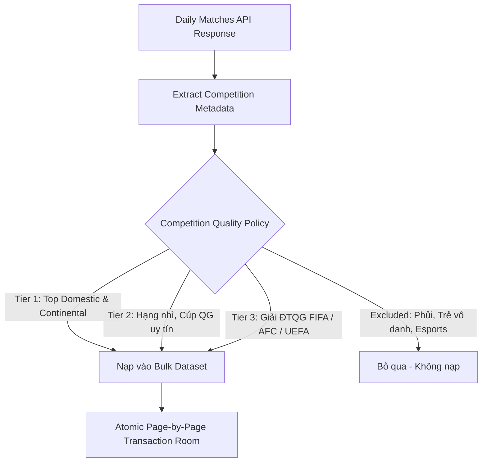
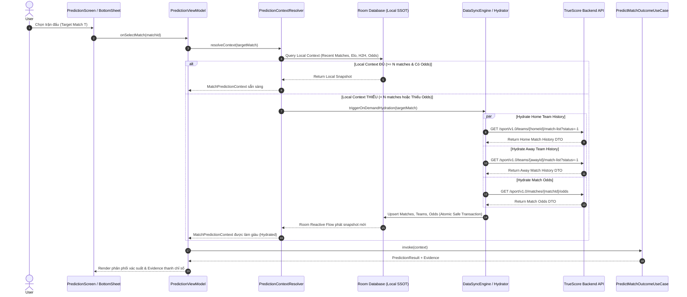
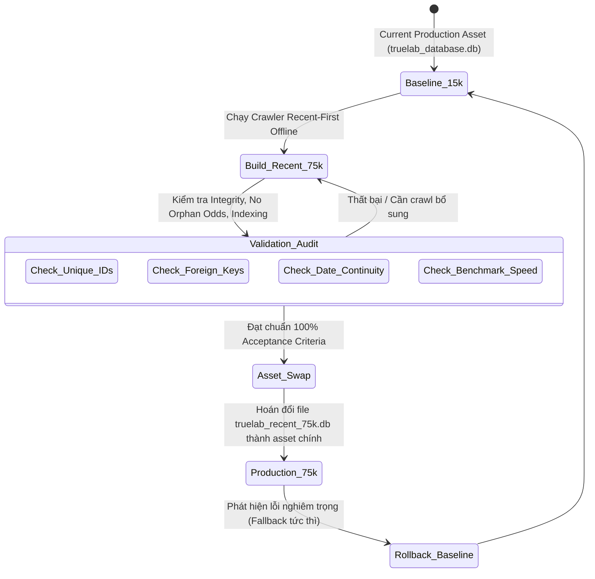

# TrueLab Hybrid Architecture Plan: Recent-First Bulk Dataset & On-Demand Context Hydration

> **Tài liệu đặc tả kiến trúc:** `docs/plans/recent-dataset-and-hydration-architecture.md`  
> **Phiên bản:** `1.0.0-PROPOSED`  
> **Ngày lập:** 01/10/2026  
> **Trạng thái:** `PHASE PLANNING ONLY` (Không sửa code, không migrate DB, không build, không commit/push).  
> **Tham chiếu nền tảng:**
> - [prediction-data-coverage-audit.md](../audits/prediction-data-coverage-audit.md)
> - [historical-match-sync-plan.md](./historical-match-sync-plan.md)
> - [prediction-correctness-plan.md](./prediction-correctness-plan.md)
> - [runtime-scalability-plan.md](./runtime-scalability-plan.md)

---

## 1. Bối Cảnh & Mục Tiêu Kiến Trúc

### 1.1. Bối cảnh
Kết quả kiểm toán tại [prediction-data-coverage-audit.md](../audits/prediction-data-coverage-audit.md) và đối chiếu với hệ thống TrueScore đã làm sáng tỏ:
- Thuật toán dự đoán (`PredictMatchOutcomeUseCase`, `WeightedScorer`, 6 Signal Transformers) **hoàn toàn chính xác theo mô hình toán FR-14**.
- Vấn đề cốt lõi khiến các trận đấu như *Vietnam vs Pakistan* (02/10/2026) hiển thị fallback `40% - 26% - 34%` là do **khoảng trống dữ liệu lịch sử (Data Coverage Gap)** và **thiếu tỷ lệ cược trước trận (Odds Gap)**.
- Dataset hiện tại ($15.5\text{k matches}$) chỉ bao phủ 11 giải CLB châu Âu giai đoạn $2019 \to 06/2024$, hoàn toàn thiếu vắng các giải đấu quốc tế, đội tuyển quốc gia và 2 mùa giải gần nhất ($2024 \to 2026$).

### 1.2. Mục tiêu giải pháp: Mô hình TrueLab Hybrid
TrueLab không thể copy 100% kiến trúc của TrueScore (vì TrueScore là thin client, không duy trì local DB lớn phục vụ Benchmark và Backtest), cũng không thể tiếp tục mở rộng dataset theo chiều sâu quá khứ một cách mù quáng.

TrueLab thiết lập **Kiến trúc Lai 2 Tầng (Hybrid Two-Tier Architecture)**:
1. **TẦNG 1 — RECENT-FIRST BULK DATASET:** Xây dựng tập dữ liệu SQLite quy mô lớn ($30\text{k} \to 50\text{k} \to 75\text{k}$ trận) được crawl tuần tự từ thời điểm hiện tại ngược về quá khứ, có chọn lọc chất lượng giải đấu, đóng vai trò làm nền tảng cho Backtest, Benchmark, Dynamic Elo và thống kê toàn cục.
2. **TẦNG 2 — ON-DEMAND PREDICTION CONTEXT HYDRATION:** Khi người dùng chọn một trận đấu cụ thể trên màn hình Prediction, nếu local DB chưa đủ ngữ cảnh ($\text{Recent Matches} < N$ hoặc thiếu Odds), hệ thống tự động hydrate dữ liệu mục tiêu từ API TrueScore, persist an toàn vào Room, và tái kích hoạt pipeline dự đoán chuẩn.

```text
                                 ┌─────────────────────────────────────────────────────────┐
                                 │                   TRUELAB HYBRID CORE                   │
                                 └────────────────────────────┬────────────────────────────┘
                                                              │
                            ┌─────────────────────────────────┴─────────────────────────────────┐
                            ▼                                                                   ▼
             ┌───────────────────────────────┐                                   ┌───────────────────────────────┐
             │   TẦNG 1: BULK LOCAL DATASET   │                                   │   TẦNG 2: ON-DEMAND CONTEXT   │
             │   (Recent-First / Quality DB) │                                   │          HYDRATION            │
             ├───────────────────────────────┤                                   ├───────────────────────────────┤
             │ • Target: 30k → 50k → 75k     │                                   │ • Kích hoạt khi chọn trận     │
             │ • Direction: Hiện tại → Quá khứ│                                  │ • Kiểm tra độ phủ của 2 teams │
             │ • Quality Policy: Tier 1-2    │                                   │ • Hydrate: Team History (N tr)│
             │ • Công dụng: Benchmark,       │                                   │ • Hydrate: Match Odds (1X2)   │
             │   Backtest, Replay Elo, Stats │                                   │ • Hydrate: H2H trực tiếp      │
             │ • Asset độc lập mới           │                                   │ • Upsert an toàn vào Room     │
             └──────────────┬────────────────┘                                   └───────────────┬───────────────┘
                            │                                                                    │
                            └─────────────────────────────────┬──────────────────────────────────┘
                                                              ▼
                                             ┌───────────────────────────────────┐
                                             │    ROOM DATABASE (Local SSOT)     │
                                             └─────────────────┬─────────────────┘
                                                               ▼
                                             ┌───────────────────────────────────┐
                                             │    PREDICTION PIPELINE (FR-14)    │
                                             │ Form • Elo • Goals • H2H • Odds   │
                                             └─────────────────┬─────────────────┘
                                                               ▼
                                             ┌───────────────────────────────────┐
                                             │    PREDICTION RESULT & EVIDENCE   │
                                             └───────────────────────────────────┘
```

---

## 2. Phân Định Rõ Ràng 3 Trạng Thái Dataset (Dataset States)

Hệ thống phân định nghiêm ngặt 3 trạng thái của dữ liệu để đảm bảo tính bất biến và an toàn:

| Trạng Thái | Định Danh | Quy Mô | Vai Trò & Vị Trí | Vòng Đời & Chính Sách Ghi |
|:---|:---|:---:|:---|:---|
| **A. Baseline Dataset** | `truelab_database.db` | $\approx 15.5\text{k}$ matches | Reference Baseline / Golden Benchmark hiện tại trong `app/src/main/assets/`. | **BẤT BIẾN (Read-Only).** Tuyệt đối không mutate, không migrate phá hủy, dùng làm đối chứng so sánh regression. |
| **B. Recent Bulk Dataset** | `truelab_recent_75k.db` | $30\text{k} \to 50\text{k} \to 75\text{k}$ matches | Dataset offline chất lượng cao, crawl từ hiện tại lùi về quá khứ theo Quality Policy. | **OFFLINE GENERATED.** Được build và xác thực tính toàn vẹn (integrity audit) trước khi hoán đổi thành production asset. |
| **C. Runtime Hydrated Data** | In-App SQLite Room | Cục bộ theo nhu cầu sử dụng | Dữ liệu nạp bổ sung khi user duyệt Prediction hoặc xem chi tiết trận đấu. | **RUNTIME PERSISTENCE.** Ghi vào Room bằng `@Upsert` an toàn, không làm loãng bulk dataset, không cascade delete Odds. |

---

## 3. Thiết Kế Crawler Recent-First & Competition Quality Policy

### 3.1. Nguyên lý Crawl Lùi (Recent-First Crawling)
Thay vì nạp xuôi theo các mùa giải cũ ($2019 \to 2024$), crawler mới hoạt động theo cơ chế ngày lùi:
$$\text{Current Date (Ví dụ: 01/10/2026)} \longrightarrow \text{Date } (D-1) \longrightarrow \text{Date } (D-2) \longrightarrow \dots \longrightarrow \text{Date } (D-k)$$
Crawler dừng lại chính xác khi tổng số trận duy nhất ($\text{unique matchId}$) thỏa mãn các mốc checkpoint: **$30,000 \to 50,000 \to 75,000$ trận**.

### 3.2. Competition Quality Policy (Chính sách lọc giải đấu chống loãng dữ liệu)
Không crawl toàn cầu một cách mù quáng (tránh thu thập hàng chục nghìn trận phong trào, bóng đá phủi, giải trẻ vô danh). Crawler áp dụng bộ lọc phân cấp (Tier-based Filtering):



#### Tiêu chí phân loại trong Quality Policy:
1. **Tier 1 (Priority Highest):**
   - Các giải VĐQG hàng đầu thế giới (Premier League, La Liga, Serie A, Bundesliga, Ligue 1, Eredivisie, Brasileirao, v.v.).
   - Các giải đấu cúp châu lục cấp CLB (UEFA Champions League, Europa League, AFC Champions League, Copa Libertadores).
2. **Tier 2 (Priority High):**
   - Các giải hạng nhì chất lượng (EFL Championship, Segunda Division, Serie B, 2. Bundesliga, v.v.).
   - Các cúp quốc gia chính thức (FA Cup, Copa del Rey, DFB-Pokal, Coppa Italia).
3. **Tier 3 (International & Regional):**
   - Các giải đấu Đội tuyển Quốc gia chính thức: FIFA World Cup, World Cup Qualifiers, UEFA Nations League, AFC Asian Cup, FIFA ASEAN Cup (AFF Cup), Copa America, CONCACAF Nations League.
4. **Excluded List (Loại bỏ):**
   - Các giải đấu trẻ nghiệp dư không tên tuổi, giải bóng đá mini/phủi, các trận giao hữu không rõ nguồn gốc hoặc thiếu thông tin định danh đội bóng.

#### Nguyên tắc kỹ thuật crawler:
- **Phân trang động:** Sử dụng `meta.totalPage` từ API response, tuyệt đối không hardcode số trang.
- **Xử lý trùng lặp:** Deduplicate theo `matchId` duy nhất.
- **An toàn giao dịch:** Commit theo từng trang (Page-by-page transaction) với cơ chế `@Upsert` / `INSERT OR IGNORE` để không tiêu tốn RAM và không làm mất dữ liệu Odds liên quan.
- **Rate Limiting & Resilience:** Duy trì khoảng nghỉ giữa các request HTTP ($150\text{ms} \to 250\text{ms}$) và bọc qua `RetryExecutor` với Exponential Backoff.

---

## 4. Nguyên Tắc Cốt Lõi: Bulk Dataset Không Đảm Bảo Mọi Đội Có Lịch Sử

Một nhận thức kiến trúc mang tính sống còn:  
$$\mathbf{75,000\text{ Matches Bulk Dataset} \ne \text{Mọi Đội Bóng Đều Có Lịch Sử Đầy Đủ}}$$

- Trong bóng đá thế giới có hàng ngàn đội bóng và đội tuyển. Một đội tuyển như *Pakistan* hay *Brunei* có thể chỉ thi đấu $2 - 4$ trận/năm. Kể cả khi có $75\text{k}$ trận lùi trong 3 năm gần nhất, họ vẫn có thể chỉ có $1$ hoặc $2$ trận trong dataset.
- Do đó, **Bulk Dataset không thể thay thế cho cơ chế On-Demand Hydration**.
- Mọi màn hình dự đoán **bắt buộc phải có tầng On-Demand Hydration Fallback** để xử lý triệt để các trường hợp biên (edge cases).

---

## 5. Thiết Kế Luồng On-Demand Prediction Context Hydration

Khi người dùng mở một trận đấu trên màn hình Prediction hoặc kích hoạt Bottom Sheet:



---

## 6. Thiết Kế Chi Tiết: Team History Hydration

### 6.1. Hợp đồng Retrofit API (`TeamApi`)
Khai báo interface mới trong module `:core:data`:
```kotlin
interface TeamApi {
    @GET("/sport/v1.0/teams/{teamId}/match-list")
    suspend fun getTeamMatchList(
        @Path("teamId") teamId: Int,
        @Query("status") status: Int = -1, // -1: Ended matches
        @Query("page") page: Int = 1,
        @Query("page_size") pageSize: Int = 20
    ): BaseResponse<TeamMatchListResponseBase>
}
```

### 6.2. Chính sách ngưỡng kích hoạt & Lưu trữ
- **Ngưỡng kiểm tra (Configurable Threshold):** Hệ thống định nghĩa tham số `minimumRecentMatches = N` (mặc định cấu hình $N = 5 \to 10$ trận kết thúc).
- **Điều kiện kích hoạt:** Khi `localHistory.filter { it.isEnded && it.startTimeDate < targetTime }.size < minimumRecentMatches`.
- **An toàn dữ liệu:**
  - Map `MatchDto` từ Team API sang `MatchEntity` chuẩn.
  - Sử dụng `@Upsert fun upsertMatches(...)` để ghi vào Room.
  - Cập nhật `TeamEntity` nếu có thông tin mới nhưng **giữ nguyên `eloRating`** để bộ tính toán `CalculateDynamicEloUseCase` tự suy diễn theo dòng thời gian.
- **Cache / Anti-Spam Policy:** Không gọi lại API nếu lần fetch gần nhất cho team đó chưa quá thời gian TTL (ví dụ $1\text{ giờ}$).

---

## 7. Thiết Kế Chi Tiết: Head-to-Head (H2H) Hydration

### 7.1. Chiến lược 2 nhánh (Two-Branch H2H Strategy)
1. **Nhánh A — Local H2H (Ưu tiên số 1):**  
   Quét trong bảng `matches` của Room:
   $$\text{HomeId} \in \{A, B\} \land \text{AwayId} \in \{A, B\} \land \text{isEnded} = \text{true} \land \text{startTimeDate} < \text{target.startTimeDate}$$
   Nếu tìm thấy $\ge 1$ trận đối đầu lịch sử trong Room $\to$ Sử dụng trực tiếp dữ liệu local.
2. **Nhánh B — Remote H2H Fallback:**  
   Nếu local tìm thấy $0$ trận, hệ thống kiểm tra khả năng hỗ trợ từ backend endpoint:
   - `GET /sport/v1.0/matches/{matchId}/analysis?type=head2head`
   - `GET /sport/v1.0/matches/{matchId}/analysis-rate?type=head2head`

### 7.2. Ràng buộc toàn vẹn đối với H2H Response
- Nếu API trả về danh sách các trận đối đầu đầy đủ (`homeScore`, `awayScore`, `startTimeDate`, `teams`) $\to$ map thành `MatchEntity` và nạp vào Room.
- Nếu API chỉ trả về con số tổng hợp ($W/D/L$ aggregated counts) $\to$ **CHỈ nạp vào `MatchPredictionContext` (in-memory)** để `H2hSignalTransformer` tính toán, **TUYỆT ĐỐI KHÔNG fake tạo MatchEntity rỗng** vào Room database làm sai lệch dataset lịch sử.

---

## 8. Thiết Kế Chi Tiết: Target Match Odds Hydration

### 8.1. Luồng đồng bộ Odds Mục Tiêu
Tận dụng endpoint đã có trong `OddsApi`:
`GET /sport/v1.0/matches/{matchId}/odds`

```text
Target Match T
       ↓
Kiểm tra Local Odds trong Room (OddsDao.getOddsByMatchId)
       ↓
┌──────────────────────────────────────┐
│ Đã có Pre-Match EU Odds hợp lệ?     │
└──────────────────┬───────────────────┘
         YES       │        NO
          ↓        │        ↓
    Dùng Local     │  Gọi OddsApi.getOdds(matchId)
          │        │        ↓
          │        │  Lọc EU (1X2) & Pre-Match Phase
          │        │        ↓
          │        │  Ghi vào Room (OddsDao.insertOdds)
          │        │        ↓
          └────────┴───────→ Cung cấp cho OddsSignalTransformer
```

### 8.2. Quy tắc nghiệp vụ bắt buộc (Bảo tồn Semantics FR-14)
- **Loại Odds:** Chỉ chấp nhận `oddsType = 'eu'` (European 1X2).
- **Pha thị trường:** Chỉ chấp nhận tỷ lệ trước trận (`marketPhase` là `initial` hoặc `instant` trước giờ bóng lăn).
- **Ràng buộc thời gian:** `changeTime < target.startTimeDate`.
- **Tuyệt đối không sử dụng:** Live Odds (`marketPhase = 'rolling_ball'`) hoặc In-Play Odds làm đầu vào cho mô hình dự đoán xác suất pre-match.

---

## 9. Correctness Gate: Ngăn Chặn Rò Rỉ Dữ Liệu Thời Gian (Temporal Leakage Prevention)

Đây là **Bất Biến Nghiệp Vụ Bắt Buộc (Mandatory Correctness Gate)** của TrueLab:

$$\forall M_{\text{history}} \in \text{PredictionContext}(M_{\text{target}}): \quad \mathbf{M_{\text{history}}.\text{startTimeDate} < M_{\text{target}}.\text{startTimeDate}} \quad \land \quad \mathbf{M_{\text{history}}.\text{id} \ne M_{\text{target}}.\text{id}}$$

### Các rào chắn bảo vệ (Guards):
1. **Strict Kickoff Guard:** Mọi trận đấu được nạp từ On-Demand Hydration khi đưa vào tính Form, Goals, Elo, H2H đều phải qua bộ lọc thời gian nghiêm ngặt so với giờ bắt đầu của trận đang dự đoán.
2. **Outcome Isolation:** Không đưa kết quả, tỷ số hay trạng thái sau giờ kickoff của chính trận đấu mục tiêu vào bất kỳ signal nào.
3. **Odds Time Guard:** Không lấy các biến động odds diễn ra sau khi trận đấu đã bắt đầu.

---

## 10. Kiến Trúc Dynamic Elo: Single Source of Truth

Không tạo thêm bất kỳ class tính toán Elo thứ hai nào. Toàn bộ hệ thống tuân thủ mô hình thống nhất:
- **Thuật toán cốt lõi:** `EloRatingCalculator` trong `:core:algorithm` với tham số $K = 32$, $\text{Initial Elo} = 1500.0$, dự đoán xác suất trước khi cập nhật điểm.
- **Cơ chế tính toán Dynamic Elo:** `CalculateDynamicEloUseCase` chạy replay tuần tự qua danh sách các trận đã kết thúc trước thời điểm $T_{\text{target}}$.
- **Ảnh hưởng của Hydrated Data:** Các trận đấu lịch sử của Vietnam hay Pakistan sau khi được hydrate vào Room sẽ tự động trở thành mắt xích đầu vào hợp lệ cho `CalculateDynamicEloUseCase`, giúp điểm Elo của họ phản ánh đúng phong độ thực chiến thay vì đứng yên ở mốc $1500.0$.
- **Source of Truth:** Điểm Elo hiển thị và dự đoán luôn được tính động (Dynamic Replay) theo ngữ cảnh thời gian, không phụ thuộc vào cột tĩnh `TeamEntity.eloRating`.

---

## 11. Database Lifecycle, Asset Swap & Rollback Strategy



### Chiến lược Hoán Đổi & Dự Phòng (Swap & Rollback):
1. **Giữ nguyên Schema:** Schema Room Database phiên bản 3 giữ nguyên cấu trúc bảng (`matches`, `teams`, `odds`, `leagues`, `seasons`, `season_rankings`, `predictions`, `dataset_metadata`), không tạo schema breaking change.
2. **Quy trình Hoán đổi:** File `truelab_recent_75k.db` sau khi được tạo và kiểm toán đạt $100\%$ chỉ tiêu sẽ được copy vào `app/src/main/assets/database/truelab_database.db`.
3. **Kế hoạch Rollback:** File baseline $15.5\text{k}$ cũ được lưu trữ an toàn trong kho lưu trữ dự phòng. Nếu bản build mới gặp lỗi hồi quy, có thể khôi phục file cũ trong 1 thao tác mà không cần đổi mã nguồn.

---

## 12. Cô Lập Backtest & Tính Tái Lập (Backtest Isolation & Reproducibility)

- **Nguyên tắc cô lập:** Thuật toán Backtest phải luôn mang tính **xác định (deterministic)** và **tái lập được (reproducible)**.
- **Ranh giới dữ liệu:**
  - Backtest Engine chỉ chạy trên tập dữ liệu chuẩn đã được đóng băng (Frozen Bulk Dataset).
  - Các trận đấu được nạp tạm thời từ Runtime On-Demand Hydration khi user bấm xem một trận đấu lẻ **sẽ không làm biến động kết quả Backtest lịch sử**.
  - Tránh tình trạng: Người dùng mở màn hình Prediction $\to$ nạp thêm 5 trận của Vietnam $\to$ quay lại màn hình Backtest thấy tỷ lệ thắng của chiến lược thay đổi ngẫu nhiên.

---

## 13. Hiệu Năng & Quy Chuẩn Mở Rộng (Performance & Scalability)

Tuân thủ nghiêm ngặt các rào chắn đã thiết lập trong [runtime-scalability-plan.md](./runtime-scalability-plan.md):
1. **Không quét toàn bộ bảng 75k trên Main Thread:** Mọi thao tác tính Elo Replay và lọc Context đều thực thi trên `Dispatchers.Default` / `Dispatchers.IO`.
2. **Phân trang & Bounded Query:** UI chỉ tải và hiển thị danh sách trận theo ngày đang chọn ($20 - 100$ trận), không render vô tận $75\text{k}$ trận cùng lúc.
3. **Triệt tiêu N+1:** On-Demand Hydration chỉ chạy đơn lẻ cho đúng 1 trận mục tiêu mà user đang tương tác, không chạy song song cho toàn bộ danh sách trận trên màn hình.
4. **Single Source of Truth:** Flow từ Room Database là nguồn phát duy nhất cho UI State.

---

## 14. Tính Kháng Lỗi & Hoạt Động Ngoại Tuyến (Offline & Failure Resilience)

Hệ thống cung cấp 4 trạng thái minh bạch cho người dùng trên giao diện:

| Trạng Thái Ngữ Cảnh | Điều Kiện Dữ Liệu | Trải Nghiệm Giao Diện (Evidence UI) |
|:---|:---|:---|
| **Full Local Context** | Local DB có đủ $\ge N$ trận & có Odds | Hiển thị đầy đủ 6 thanh tín hiệu xanh, độ tin cậy cao (**High Confidence**). |
| **Hydrated Context** | Vừa hoàn thành kéo API bù đắp thành công | Hiển thị đầy đủ tín hiệu, kèm tag *"Dữ liệu trực tuyến cập nhật"*. |
| **Partial Context** | Mất mạng, chỉ có 1-2 trận lịch sử cũ | Hiển thị các tín hiệu có sẵn, các tín hiệu thiếu được chú thích rõ ràng. |
| **Baseline Prior (Missing)** | Mất mạng hoàn toàn, 0 trận lịch sử, 0 odds | Hiển thị xác suất cơ sở kèm thông báo minh bạch: *"Dữ liệu lịch sử hạn chế - Đang áp dụng mô hình tiên nghiệm (Prior Baseline)"*. |

---

## 15. Lộ Trình Tài Liệu & Các Giai Đoạn Triển Khai Tiếp Theo

Hệ thống chia việc triển khai thành 9 giai đoạn độc lập:

- [ ] **Phase A — Recent-First Crawler Specification:** Đặc tả chi tiết script/engine crawl lùi theo ngày.
- [ ] **Phase B — Competition Quality Policy Specification:** Lập danh mục bộ lọc giải đấu Tier 1-2-3 và blacklists.
- [ ] **Phase C — 75k Dataset Generation & Validation Audit:** Thực thi tạo database mới, vacuum, đánh index và chạy audit tính toàn vẹn.
- [ ] **Phase D — Retrofit TeamApi & Team History Hydrator:** Triển khai endpoint lấy lịch sử đội bóng và mapper.
- [ ] **Phase E — Target Match Odds Hydrator:** Triển khai luồng fetch Odds riêng lẻ cho trận đang chọn.
- [ ] **Phase F — Remote H2H Fallback Adapter:** Triển khai bộ phân tích đối đầu trực tiếp khi local thiếu.
- [ ] **Phase G — Prediction Context Resolver & Orchestrator:** Xây dựng bộ điều phối trung tâm quyết định khi nào dùng local, khi nào kích hoạt hydration.
- [ ] **Phase H — Presentation & UI Transparency Integration:** Cập nhật Prediction Screen / Bottom Sheet hiển thị trạng thái dữ liệu minh bạch.
- [ ] **Phase I — Regression & Automated Verification:** Chạy toàn bộ test suite và benchmark hiệu năng trên dataset 75k.

---

## 16. Ma Trận Tiêu Chuẩn Nghiệm Thu (Acceptance Criteria Matrix)

| Hạng Mục | Tiêu Chí Kiểm Tra | Kết Quả Kỳ Vọng |
|:---|:---|:---:|
| **Bulk Dataset** | Tổng số trận trong database mới | $\ge 75,000$ unique matches |
| | Tính liên tục của thời gian | Phủ từ hiện tại (2026) ngược về 2023/2022 không bị đứt đoạn |
| | Ràng buộc toàn vẹn khóa ngoại | $0$ orphan teams, $0$ orphan odds, $0$ duplicate match IDs |
| **Hydration** | Bù đắp dữ liệu cho đội bóng mới (Vietnam/Pakistan) | Lấy thành công $\ge 5$ trận gần nhất khi chọn trận |
| | Đồng bộ tỷ lệ cược trước trận (Odds) | Tự động lấy Odds 1X2 của trận mục tiêu khi mở Bottom Sheet |
| | Chống spam API | Mở lại cùng 1 trận không gọi lại network trong thời gian TTL |
| **Prediction** | Tính toán phân phối xác suất | Có sự phân hóa rõ rệt theo thực lực khi dữ liệu được hydrate |
| | Chống rò rỉ dữ liệu thời gian | $100\%$ dữ liệu đưa vào tính toán có $\text{startTimeDate} < \text{kickoff}$ |
| | Tính Dynamic Elo | Elo thay đổi mượt mà theo chuỗi trận lịch sử, không gán cứng 1500 |
| **Backtest** | Tính ổn định và tái lập | Kết quả Backtest không bị ảnh hưởng bởi On-Demand Hydration |
| **Performance** | Tốc độ tính toán và phản hồi UI | Render Bottom Sheet $< 200\text{ms}$, không block Main Thread |
