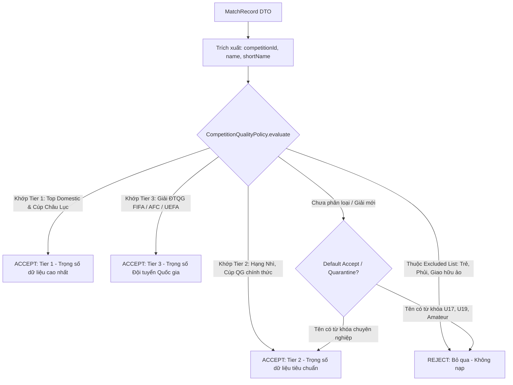
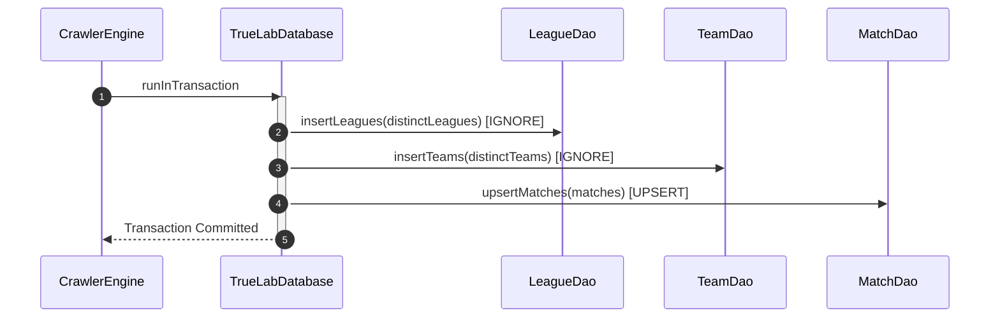
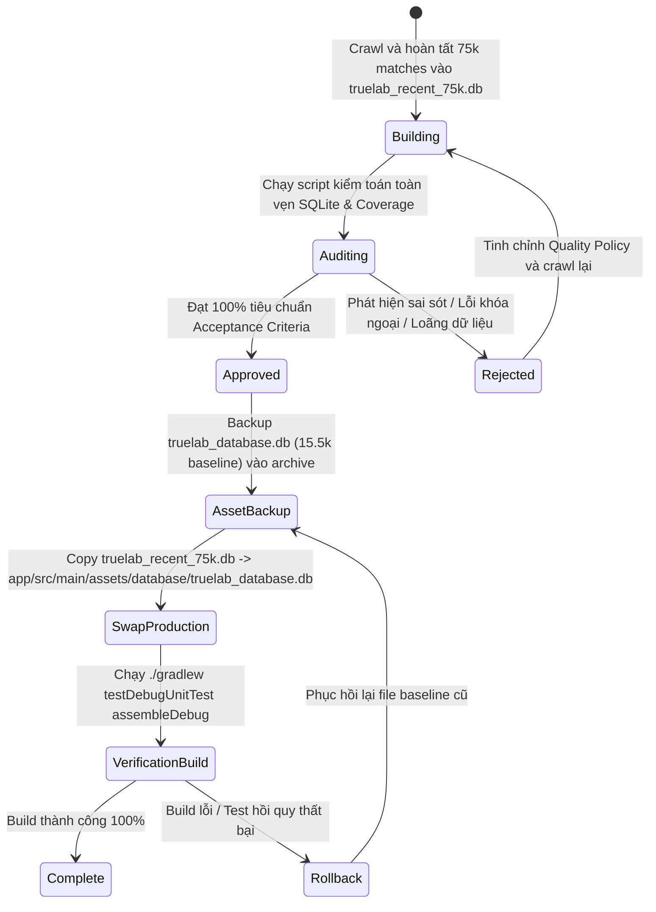

# Technical Specification: Phase A — Recent-First Quality-Controlled Bulk Crawler

> **Tài liệu đặc tả kỹ thuật:** `docs/plans/recent-first-crawler-spec.md`  
> **Phiên bản:** `1.0.0-PROPOSED`  
> **Ngày lập:** 01/10/2026  
> **Trạng thái:** `SPECIFICATION ONLY` (Không sửa mã nguồn, không migrate DB, không crawl thật, không commit/push).  
> **Mục tiêu:** Định nghĩa toàn diện kiến trúc, giao thức mạng, chính sách lọc chất lượng, cơ chế lưu trữ an toàn và quy trình xác thực cho Crawler xây dựng tập dữ liệu mới $75,000\text{ matches}$ (`truelab_recent_75k.db`).

---

## 1. Nguồn Dữ Liệu & Đối Chiếu Hiện Trạng (Source of Truth Alignment)

Qua đối chiếu trực tiếp với mã nguồn hiện tại trong module `:core:data` và các tài liệu kiến trúc:

| Thành Phần | Hiện Trạng Mã Nguồn (`:core:data`) | Quy Ước Áp Dụng Trong Crawler |
|:---|:---|:---|
| **API Endpoint** | `MatchApi.getMatches(date, status, page, pageSize, sort)` | `GET /sport/v1.0/matches?date=YYYY-MM-DD&page={p}&page_size=50&sort=time_asc` |
| **Pagination Model** | `MetaResponse` (`last_page`, `total_page`, `total_count`, `per_page`) | Sử dụng `MetaResponse.effectiveLastPage` (`lastPage ?: totalPage ?: 1`) để quét trọn vẹn mọi trang. |
| **DTO Structure** | `MatchRecord` đã chứa sẵn `home_team`, `away_team`, `competition_id`, `competition.name`, `status`, `start_time_date`, `home_score`, `away_score`. | **Tái sử dụng $100\%$ DTO**: Trích xuất trực tiếp Match, Teams, League từ `MatchRecord`, **triệt tiêu hoàn toàn $N+1$ requests**. |
| **Database Target** | `TrueLabDatabase` (Schema v3) | Tạo database SQLite mới: **`truelab_recent_75k.db`**. Giữ nguyên $100\%$ Entity & Room Schema v3. |
| **Persistence DAOs** | `MatchDao.upsertMatches`, `TeamDao.insertTeams`, `LeagueDao.insertLeagues` | Giao dịch theo từng trang (`runInTransaction`) với thứ tự phụ thuộc: `Leagues` $\to$ `Teams` $\to$ `Matches`. |
| **Resilience & Retry** | `RetryExecutor`, `DefaultRetryClassifier`, `RetryPolicy` | Bọc toàn bộ HTTP call qua `RetryExecutor` với cơ chế Exponential Backoff + Jitter. |

---

## 2. Mục Tiêu & Các Mốc Checkpoint Của Dataset

Crawler được thiết kế để tạo một cơ sở dữ liệu SQLite mới độc lập hoàn toàn: **`truelab_recent_75k.db`**, không làm thay đổi file baseline hiện tại (`truelab_database.db` $\approx 15.5\text{k}$).

### 2.1. Hướng duyệt thời gian (Recent-First Direction)
Crawler duyệt ngược từ hiện tại về quá khứ theo từng ngày:
$$\text{Current Date } (D_0) \longrightarrow (D_0 - 1) \longrightarrow (D_0 - 2) \longrightarrow \dots \longrightarrow (D_0 - K)$$
Dừng lại khi tổng số trận duy nhất được lọc và lưu trữ đạt chỉ tiêu.

### 2.2. Các mốc Checkpoint & Ngưỡng chấp nhận

```text
[Bắt đầu: Ngày hiện tại D0]
         │
         ▼
 ┌───────────────┐
 │ CHECKPOINT 1  │ ──► Đạt ≥ 30,000 Unique Matches ──► Chạy Validation & Audit 30k
 └───────┬───────┘
         │ (Tiếp tục crawl lùi)
         ▼
 ┌───────────────┐
 │ CHECKPOINT 2  │ ──► Đạt ≥ 50,000 Unique Matches ──► Chạy Validation & Audit 50k
 └───────┬───────┘
         │ (Tiếp tục crawl lùi)
         ▼
 ┌───────────────┐
 │ CHECKPOINT 3  │ ──► Đạt ≥ 75,000 Unique Matches ──► Hoàn tất Crawler & Final Audit
 └───────────────┘
```

> [!NOTE]
> Con số cuối cùng có thể dao động $\ge 75,000$ (ví dụ $75,120$) để đảm bảo nạp trọn vẹn toàn bộ các trang của ngày cuối cùng, tránh tình trạng cắt ngang giữa chừng một ngày thi đấu.

---

## 3. Đặc Tả Thuật Toán Date Crawling & Phân Trang Động

### 3.1. Tham số & Cấu hình Duyệt Ngày
- **Ngày bắt đầu ($D_0$):** Ngày hiện tại theo múi giờ hệ thống / UTC ISO (`YYYY-MM-DD`, ví dụ: `2026-10-01`).
- **Bước nhảy:** Lùi đúng $1\text{ ngày}$ (`LocalDate.minusDays(1)`).
- **Page Size:** Cố định `page_size = 50` (kích thước tối ưu cho throughput và RAM).
- **Status Filter:** Không truyền status filter để lấy toàn bộ các trạng thái của ngày đó (`ended`, `live`, `pending`, `cancelled`).

### 3.2. Thuật toán quét từng ngày (Day-Level Page Crawling Engine)

```kotlin
suspend fun crawlDay(date: String, qualityPolicy: CompetitionQualityPolicy): DayCrawlResult {
    var currentPage = 1
    var effectiveLastPage = 1
    val acceptedRecordsForDay = mutableListOf<MatchRecord>()

    while (currentPage <= effectiveLastPage) {
        // 1. Gọi API có retry & throttle
        val response = retryExecutor.executeWithRetry(crawlerRetryPolicy) {
            matchApi.getMatches(date = date, page = currentPage, pageSize = 50, sort = "time_asc")
        }

        val matchRecords = response.data.data
        val meta = response.data.meta

        // 2. Cập nhật effectiveLastPage từ response metadata
        effectiveLastPage = meta?.effectiveLastPage ?: 1

        if (matchRecords.isEmpty()) break

        // 3. Lọc chất lượng theo CompetitionQualityPolicy
        val filtered = matchRecords.filter { record ->
            qualityPolicy.isAccepted(record)
        }

        // 4. Lưu theo từng trang vào SQLite Room
        if (filtered.isNotEmpty()) {
            persistBatch(filtered)
            acceptedRecordsForDay.addAll(filtered)
        }

        // 5. Throttling giữa các trang
        delay(crawlerConfig.interPageDelayMs)
        currentPage++
    }

    return DayCrawlResult(date = date, totalAccepted = acceptedRecordsForDay.size)
}
```

### 3.3. Xử lý các tình huống biên (Edge Cases)
- **Ngày không có trận đấu:** API trả về mảng rỗng `[]` $\to$ ghi nhận $0$ trận, ghi log và chuyển sang $D-1$.
- **Ngày có số trang lớn ($> 20\text{ trang}$):** Tiếp tục lặp đến `effectiveLastPage`, không cắt xén.
- **Ngày bị lỗi mạng liên tục sau khi hết retry:** Ghi nhận vào `failed_dates_queue.json` để retry sau, không làm crash toàn bộ tiến trình.

---

## 4. Đặc Tả Competition Quality Policy (Chống Loãng Dữ Liệu)

### 4.1. Bản chất của "Recent-First"
"Recent-First" **KHÔNG PHẢI** là:
- Lấy $75\text{k}$ bản ghi đầu tiên bất kể chất lượng.
- Lấy bừa bãi bóng đá phong trào, phủi, giải trẻ vô danh.

"Recent-First" là: **Tập dữ liệu ưu tiên độ tươi mới (2024–2026), nhưng được kiểm soát chất lượng giải đấu nghiêm ngặt để đảm bảo giá trị dự đoán và tính xác thực của thuật toán.**

### 4.2. Khung Đánh Giá Chất Lượng (Quality Policy Framework)



### 4.3. Interface Đặc Tả Quality Policy trong Mã Nguồn
```kotlin
enum class QualityTier {
    TIER_1_TOP_DOMESTIC_AND_CONTINENTAL,
    TIER_2_SECOND_TIER_AND_DOMESTIC_CUPS,
    TIER_3_OFFICIAL_INTERNATIONAL,
    EXCLUDED_UNQUALIFIED
}

interface CompetitionQualityPolicy {
    fun evaluate(record: MatchRecord): QualityTier
    
    fun isAccepted(record: MatchRecord): Boolean {
        return evaluate(record) != QualityTier.EXCLUDED_UNQUALIFIED
    }
}
```

#### Tiêu chí đầu vào để Policy đánh giá:
1. `record.competitionId`: Định danh giải đấu.
2. `record.competition?.name`: Tên đầy đủ của giải đấu (ví dụ: *"Premier League"*, *"FIFA World Cup Asian Qualifiers"*, *"OCA Women's Asian Games"*).
3. `record.competition?.shortName`: Tên viết tắt chuẩn hóa.
4. `record.homeTeam.name` & `record.awayTeam.name`: Hỗ trợ phát hiện các đội trẻ (chứa *"U18"*, *"U19"*, *"Reserves"*).

*(Danh mục danh sách cụ thể các ID và Regex giải đấu sẽ được đặc tả chi tiết trong Phase B).*

---

## 5. Cơ Chế Khử Trùng Lặp (Deduplication Strategy)

Khóa định danh bất biến duy nhất của toàn hệ thống là: **`MatchRecord.id` (`Long`)**.

### 5.1. Các tầng khử trùng lặp (Multi-Level Deduplication)
1. **In-Memory Buffer Dedup:** Duy trì `HashSet<Long>` chứa danh sách các `matchId` đã được nạp trong phiên chạy hiện tại.
2. **Page-Response Dedup:** Loại bỏ các record trùng lặp xuất hiện trong cùng 1 page response:
   ```kotlin
   val uniquePageRecords = matchRecords.distinctBy { it.id }
   ```
3. **Database-Level Unique Constraint:** Bảng `matches` trong Room có `PRIMARY KEY(id)`. Khi nạp dữ liệu, sử dụng cơ chế `@Upsert` để:
   - Nếu `matchId` chưa có $\to$ thực thi `INSERT`.
   - Nếu `matchId` đã tồn tại $\to$ thực thi `UPDATE` tại chỗ (giữ nguyên foreign key và odds con).
   - Tuyệt đối không tạo ra 2 hàng có cùng `matchId`.

---

## 6. Lưu Trữ An Toàn & Bảo Vệ Khóa Ngoại (Persistence Safety)

### 6.1. Ranh giới giao dịch theo trang (Page-Level Transaction Boundary)
Để vừa đảm bảo hiệu năng, vừa tiết kiệm RAM và chống mất dữ liệu khi mất điện/crash, giao dịch được thực hiện ở cấp độ **Từng Trang (Page Level)**:



### 6.2. Bảo vệ bảng Odds & Ngăn ngừa Cascade Delete
- Tuyệt đối **KHÔNG SỬ DỤNG `OnConflictStrategy.REPLACE`** trên `MatchEntity` vì bảng `odds` có Foreign Key `ON DELETE CASCADE`. Dùng `REPLACE` sẽ kích hoạt SQLite xóa row và làm mất toàn bộ Odds liên kết.
- Sử dụng **`@Upsert fun upsertMatches(...)`**: SQLite sinh câu lệnh `INSERT INTO matches (...) VALUES (...) ON CONFLICT(id) DO UPDATE SET ...`, bảo toàn $100\%$ các bản ghi trong bảng `odds`.

---

## 7. Phạm Vi Odds & Quy Chuẩn Triệt Tiêu $N+1$

### 7.1. Hiện trạng của Daily Match API đối với Odds
- API `GET /sport/v1.0/matches?date=...` **KHÔNG trả kèm mảng Odds**.
- Odds là một tài nguyên độc lập, yêu cầu gọi `GET /sport/v1.0/matches/{matchId}/odds`.

### 7.2. Ràng buộc bất biến cho Bulk Crawler: KHÔNG CRAWL ODDS HÀNG LOẠT
- **CẤM:** Tuyệt đối không được gọi `OddsApi.getOdds(matchId)` trong lúc chạy Bulk Crawler $75\text{k}$.
  - Lý do: $75,000\text{ matches} \times 1\text{ odds request} = \mathbf{75,000\text{ HTTP Requests bổ sung}}$, sẽ làm tắc nghẽn băng thông, kéo dài thời gian crawl lên nhiều ngày và có nguy cơ bị server khóa IP.
- **Quy chuẩn kiến trúc:** Bulk Crawler **chỉ tập trung đồng bộ Match, Team, League**. Dữ liệu Odds cho các trận đấu mục tiêu sẽ được xử lý thông qua **Tầng 2: On-Demand Prediction Odds Hydration** khi người dùng thực sự xem trận đó.

---

## 8. Quản Lý Metadata Đội Bóng & Giải Đấu (Zero Extra Network Calls)

### 8.1. Tận dụng triệt để Metadata có sẵn trong MatchRecord
Trong mỗi phần tử `MatchRecord` trả về từ `MatchApi.getMatches`, backend đã đính kèm đầy đủ:
- `home_team`: `{ id, name, logo }`
- `away_team`: `{ id, name, logo }`
- `competition`: `{ id, name, shortName, logo }`

### 8.2. Chiến lược trích xuất tự động (Embedded Extraction)
- **Không gọi `TeamApi` riêng lẻ** cho từng đội.
- **Không gọi `CompetitionApi` riêng lẻ** cho từng giải.
- Crawler trích xuất trực tiếp `TeamEntity` và `LeagueEntity` từ mảng trận đấu của từng trang, khử trùng lặp trong bộ nhớ và nạp vào DB trước khi nạp Match:
  $$\text{Extra API Calls for Teams/Leagues} = \mathbf{0}$$

---

## 9. Điều Tiết Băng Thông, Giới Hạn Tốc Độ & Retry (Rate Limit & Resilience)

### 9.1. Client-Side Throttling (Kỹ thuật an toàn chủ động)
Do server backend có thể áp dụng cơ chế giám sát tải, crawler thiết lập các khoảng nghỉ kỹ thuật (Safety Margins):
- **Khoảng nghỉ giữa các trang (`interPageDelayMs`):** $150\text{ms} \to 250\text{ms}$.
- **Khoảng nghỉ giữa các ngày (`interDayDelayMs`):** $300\text{ms} \to 500\text{ms}$.

### 9.2. Ma Trận Phân Loại Lỗi & Chính Sách Retry

| Mã Lỗi / Ngoại Lệ | Phân Loại | Hành Động Xử Lý | Số Lần Thử Lại Tối Đa |
|:---|:---:|:---|:---:|
| `SocketTimeoutException` / `ConnectException` | **Retryable** | Tạm dừng với Exponential Backoff ($1\text{s} \to 2\text{s} \to 4\text{s}$) rồi gọi lại. | $3$ lần |
| HTTP `429 Too Many Requests` | **Rate Limited** | Tạm dừng khẩn cấp $10\text{s} \to 30\text{s}$ trước khi tiếp tục trang đó. | $5$ lần |
| HTTP `500` / `502` / `503` Server Error | **Retryable** | Tạm dừng $2\text{s} \to 5\text{s}$ rồi thử lại. | $3$ lần |
| HTTP `400` / `404` Bad Request | **Non-Retryable** | Bỏ qua trang đó, ghi log cảnh báo vào `error_log.json`. | $0$ lần (Skip page) |
| `SerializationException` (Lỗi parse JSON) | **Non-Retryable** | Bỏ qua record lỗi, tiếp tục các record hợp lệ. | $0$ lần |

---

## 10. Cơ Chế Checkpoint, Lưu Trạng Thái & Khôi Phục Tiến Trình (Resume Engine)

Crawl $75,000$ trận là một tác vụ dài. Tiến trình bắt buộc phải có khả năng **tiếp tục (Resume)** chính xác tại điểm dừng mà không phải chạy lại từ đầu nếu mất điện, mất mạng hoặc crash ứng dụng.

### 10.1. Cấu trúc Checkpoint State File (`crawler_checkpoint.json`)
```json
{
  "targetUniqueMatches": 75000,
  "currentAcceptedUniqueMatches": 34520,
  "lastProcessedDate": "2025-04-12",
  "lastProcessedPage": 4,
  "totalProcessedDays": 537,
  "failedDates": [],
  "sessionStartTime": 1790680000000,
  "lastUpdatedTime": 1790685400000,
  "qualityTiersCount": {
    "TIER_1": 18200,
    "TIER_2": 11200,
    "TIER_3": 5120
  }
}
```

### 10.2. Nguyên tắc Khôi phục (Resume Workflow)
1. Khi khởi động, Crawler kiểm tra xem file `crawler_checkpoint.json` có tồn tại hay không.
2. Nếu có $\to$ đọc `lastProcessedDate` và `lastProcessedPage`, mở file database SQLite hiện tại `truelab_recent_75k.db`, nạp lại `HashSet<Long>` các ID đã có trong DB và tiếp tục crawl ngày tiếp theo.
3. Checkpoint metadata **hoàn toàn độc lập** với schema database của ứng dụng, không làm ảnh hưởng đến dữ liệu domain.

---

## 11. Quản Lý Bộ Nhớ & Giới Hạn Tài Nguyên (Bounded Memory Strategy)

- **Tuyệt đối không lưu trữ $75\text{k}$ đối tượng trong RAM:**
  $$\text{Dòng dữ liệu Stream}: \text{API Page} \longrightarrow \text{Filter} \longrightarrow \text{Dedup} \longrightarrow \text{Room Commit} \longrightarrow \text{Giải phóng RAM (GC)}$$
- Dung lượng RAM tối đa chiếm dụng tại bất kỳ thời điểm nào: **$< 15\text{MB}$**.

---

## 12. Quy Trình Kiểm Toán Chất Lượng Tại Các Mốc Checkpoint (Validation Audit)

Tại mỗi mốc **30k, 50k, 75k matches**, tiến trình tự động xuất file báo cáo kiểm toán toàn diện:

### Bảng Chỉ Số Kiểm Toán Bắt Buộc:
1. **Total Matches & Unique Match IDs:** Tổng số bản ghi so với số ID duy nhất (Tỷ lệ trùng lặp phải là $0\%$).
2. **Date Range Continuity:** Ngày sớm nhất ($\text{minDate}$) và ngày muộn nhất ($\text{maxDate}$) của dataset; phát hiện các khoảng trống thời gian bất thường.
3. **Match Status Breakdown:** Tỷ lệ các trận `ended` (phải đạt $\ge 98\%$), `live`, `pending`, `cancelled`.
4. **Valid Scores:** Số trận có `homeScore` và `awayScore` hợp lệ (phải đạt $100\%$ đối với các trận `ended`).
5. **Team & Competition Integrity:**
   - Tổng số đội bóng (`totalTeams`).
   - Tổng số giải đấu (`totalCompetitions`).
   - Tỷ lệ orphan teams / orphan leagues (phải là **$0$**).
6. **SQLite Integrity & Performance:**
   - Chạy lệnh `PRAGMA integrity_check;` (kết quả bắt buộc `ok`).
   - Kích thước file database (MB).
   - Tồn tại đầy đủ các chỉ mục (`index_matches_startTimeDate`, `index_matches_homeTeamId`, `index_matches_awayTeamId`, `index_matches_leagueId`).

---

## 13. Bộ Chỉ Số Phát Hiện Loãng Dữ Liệu (Data Dilution Metrics)

Để đảm bảo dataset $75\text{k}$ không bị chiếm giữ bởi các giải đấu rác:
- **Tỷ lệ phân bổ theo Tier:**
  - $\text{Tier 1} \ge 40\%$
  - $\text{Tier 2} \ge 30\%$
  - $\text{Tier 3} \ge 15\%$
  - $\text{Excluded} = 0\%$ (Toàn bộ đã bị loại bỏ ở bước lọc).
- **Phân bổ số trận theo đội bóng (Team Match Depth):**
  - Số lượng đội có $\ge 5$ trận lịch sử.
  - Số lượng đội có $\ge 15$ trận lịch sử.
  - Số lượng đội có $\ge 30$ trận lịch sử.
- **Cảnh báo độc quyền giải đấu (Competition Monopoly Warning):** Nếu có $1$ giải đấu đơn lẻ chiếm $> 15\%$ tổng số trận của toàn dataset $\to$ hệ thống tự động ghi cảnh báo để điều chỉnh Quality Policy trong Phase B.

---

## 14. Quy Trình Hoán Đổi Asset An Toàn & Rollback (Asset Swap & Rollback)



---

## 15. Bảo Vệ Thuật Toán Backtest & Dynamic Elo Replay

### 15.1. Đóng băng Bulk Dataset cho Backtest
- File `truelab_recent_75k.db` sau khi được swap thành production asset sẽ đóng vai trò là **Tập dữ liệu đóng băng (Frozen Bulk Dataset)**.
- Thuật toán Backtest chỉ quét trên tập dữ liệu này để đảm bảo tính **xác định (deterministic)** và **kết quả kiểm nghiệm có thể tái lập (reproducible)**.

### 15.2. Bảo toàn tính toàn vẹn thời gian (Temporal Integrity)
- Mọi trường `startTimeDate` phải giữ nguyên chuẩn ISO 8601 UTC từ backend.
- Tuyệt đối không convert múi giờ làm thay đổi thứ tự thời gian trước/sau của các trận đấu.
- Đảm bảo điều kiện bất biến cho Dynamic Elo:
  $$\forall M_{\text{history}} \text{ used for Elo replay}: \quad M_{\text{history}}.\text{startTimeDate} < M_{\text{target}}.\text{startTimeDate}$$

---

## 16. Ma Trận Tiêu Chuẩn Nghiệm Thu Cho Phase A (Acceptance Criteria)

| # | Tiêu Chuẩn | Yêu Cầu Kỹ Thuật | Phương Pháp Kiểm Tra |
|:---:|:---|:---|:---|
| **1** | **Cơ chế duyệt ngày** | Crawl lùi tuần tự từ ngày hiện tại về quá khứ theo từng ngày | Code review thuật toán `LocalDate.minusDays(1)` |
| **2** | **Phân trang động** | Đọc `MetaResponse.effectiveLastPage`, không hardcode số trang | Kiểm tra xử lý `currentPage <= effectiveLastPage` |
| **3** | **Quality Policy Interface** | Tiếp nhận `MatchRecord` và phân loại rõ ràng thành các Tier | Kiểm tra định nghĩa `CompetitionQualityPolicy` |
| **4** | **Khử trùng lặp** | Không tạo ra 2 bản ghi có cùng `matchId` | Khóa chính `PRIMARY KEY(id)` trong Room |
| **5** | **Bảo vệ Odds & FK** | Không dùng `REPLACE`, sử dụng `@Upsert` an toàn | Kiểm tra Room Dao mapping và SQLite logs |
| **6** | **Triệt tiêu $N+1$** | $0$ extra requests cho Teams, Leagues và Odds trong bulk crawl | Kiểm tra pipeline trích xuất DTO |
| **7** | **Cơ chế Resume** | Lưu và đọc trạng thái từ `crawler_checkpoint.json` | Kiểm tra luồng khôi phục tiến trình khi khởi động lại |
| **8** | **Mốc Checkpoint** | Có báo cáo kiểm toán tại các mốc 30k, 50k, 75k | Xác thực định dạng output validation report |
| **9** | **Bảo vệ Baseline** | Không ghi đè hay làm hỏng file baseline $15.5\text{k}$ cũ | Tạo file DB mới `truelab_recent_75k.db` |
| **10** | **Toàn vẹn thời gian** | Giữ nguyên ISO 8601 UTC, đảm bảo thứ tự replay Elo | Kiểm tra schema và query sắp xếp `startTimeDate ASC` |
| **11** | **Không sửa code Phase A** | Không thay đổi code runtime, không sửa Entity, không commit | Xác nhận trạng thái git không có thay đổi mã nguồn |
