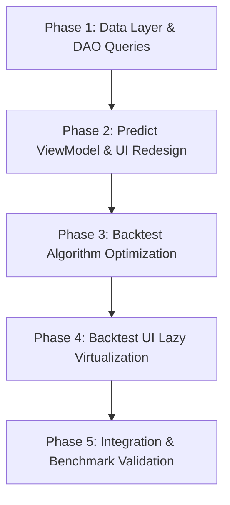

# Runtime Scalability & Large Dataset UX Plan (Phase C.1.2)

Tài liệu này xác lập kế hoạch kiến trúc chi tiết nhằm giải quyết các nút thắt cổ chai về hiệu năng (Performance Bottlenecks), khả năng mở rộng Runtime (Scalability) và trải nghiệm người dùng với tập dữ liệu lớn (Large Dataset UX) sau khi tích hợp 15,505 trận đấu lịch sử vào ứng dụng TrueLab.

---

## 1. Current State

Sau khi hoàn thành Phase C.1 ([Room `createFromAsset`](../../core/data/src/main/kotlin/dev/anhquocs/truelab/core/data/local/di/DatabaseModule.kt#L30)), môi trường Runtime của ứng dụng đang vận hành với quy mô:
- **15,505 trận đấu** (`matches`) trải dài từ năm 2019 đến nay.
- **739 đội bóng** (`teams`) thuộc 11 giải đấu hàng đầu.
- **625,198 bản ghi tỷ lệ cược** (`odds`).
- Cơ sở dữ liệu SQLite kích thước **58.68 MB**.

---

## 2. Confirmed Problems

Dựa trên kết quả từ [historical-dataset-runtime-audit.md](../audits/historical-dataset-runtime-audit.md), hai vấn đề cốt lõi gây sập/nghẽn ứng dụng đã được xác nhận:

### 2.1. Predict Screen — Query Overload & Main Thread Render Crash
- **Data Layer:** [`PredictionViewModel.kt`](../../app/src/main/kotlin/dev/anhquocs/truelab/feature/prediction/presentation/viewmodel/PredictionViewModel.kt#L44) gọi `matchRepository.getMatches("")`, khiến [`MatchDao.kt`](../../core/data/src/main/kotlin/dev/anhquocs/truelab/core/data/match/local/dao/MatchDao.kt#L27-L28) chạy câu lệnh `SELECT * FROM matches WHERE startTimeDate LIKE '%'` tải toàn bộ **15,505 bản ghi** `MatchWithTeams` vào RAM.
- **Presentation Layer:** [`PredictionScreen.kt`](../../app/src/main/kotlin/dev/anhquocs/truelab/feature/prediction/presentation/PredictionScreen.kt#L247-L271) sử dụng `Row(Modifier.horizontalScroll(...))` kết hợp `matches.forEach`. Compose buộc phải khởi tạo và đo đạc đồng thời **15,505 `FilterChip`** trên Main UI Thread, gây nghẽn Main Looper dẫn đến ANR / Crash.

### 2.2. Backtest Visualizer — $O(N^2)$ Algorithmic Bottleneck & 30k View Render OOM
- **Domain Layer:** [`BacktestPredictionUseCase.kt`](../../core/domain/src/main/kotlin/dev/anhquocs/truelab/core/domain/evaluation/usecase/BacktestPredictionUseCase.kt#L59-L84) thực hiện vòng lặp $N \approx 15,397$ trận đã kết thúc. Với mỗi trận mục tiêu, UseCase thực hiện 4 lần `filter`/`sortedWith` trên toàn bộ 15k trận $\to$ thực thi **$\approx 954$ triệu phép tính** và cấp phát $>120,000$ danh sách tạm trên Heap (chiếm 100% CPU trong 60–120s).
- **Presentation Layer:** [`HistoricalTimelineCard.kt`](../../app/src/main/kotlin/dev/anhquocs/truelab/feature/backtest/presentation/components/HistoricalTimelineCard.kt#L144-L154) duyệt `filteredMatches.forEachIndexed` trong một `Column` không-lazy (kết hợp `verticalScroll`), cố gắng vẽ đồng thời **$>30,000$ composables** (`BacktestMatchItem` + `HorizontalDivider`), gây sập bộ nhớ (`OutOfMemoryError`).

---

## 3. Non-Problems / Out of Scope

Các phân hệ sau đã được kiểm chứng hoạt động tốt và **KHÔNG** thuộc phạm vi thay đổi:
1. **Search Đội bóng (`TeamsScreen`):** Đã kiểm chứng tìm kiếm `"Arsenal"` hoạt động tức thì (< 1ms trên 739 đội).
2. **H2H Comparison Screen (`H2HComparisonScreen`):** Đã kiểm chứng cặp đấu Arsenal vs Man United trả về chính xác 10 trận lịch sử (2019–2024) kèm thống kê 6W-2D-2L.
3. **Teams H2H Summary (`TeamAnalyticsCard`):** Việc hiển thị `"—"` là chủ ý thiết kế (do thẻ đội bóng đơn lẻ không có đối thủ cụ thể), không phải lỗi dữ liệu.
4. **Cơ sở dữ liệu & Thuật toán Dự đoán cốt lõi:** Không thay đổi Room Schema, không đổi trọng số `WeightedScorer`, không thay đổi logic tính Form/Elo/Odds.

---

## 4. Design Principles

1. **Tách biệt Ngữ cảnh Tính toán và Dữ liệu Chọn lựa trên Giao diện (Separation of Calculation Context vs UI Selection):**
   - UI chỉ cần nạp và hiển thị tập trận đấu mà người dùng thực sự muốn dự đoán (các trận sắp diễn ra, đang diễn ra hoặc tìm kiếm theo đội).
   - Engine dự đoán sẽ tự động truy vấn dữ liệu lịch sử liên quan (H2H, 5 trận gần nhất của 2 đội) từ Room SQLite thông qua các chỉ mục (Index) hiệu năng cao, thay vì nạp 15k trận lên UI.
2. **Loại bỏ Quét Toàn bộ Dữ liệu Lặp lại (Eliminate Repeated Full-Dataset Scans):**
   - Chuyển đổi thuật toán Backtest từ duyệt lồng $O(N^2)$ sang duyệt tuần tự thời gian một lần $O(N)$ kết hợp bảng chỉ mục trạng thái động (Chronological State Accumulator / Sliding Window).
3. **Ảo hóa Giao diện và Giới hạn Kích thước Render (Virtualization & Bounded Rendering):**
   - Không bao giờ render danh sách lớn trong các layout tĩnh (`Row` + `horizontalScroll` hoặc `Column` + `verticalScroll`).
   - Sử dụng `LazyColumn` / `LazyRow` kết hợp phân trang (Pagination / Windowing) để chỉ render các phần tử thực sự hiển thị trên màn hình.
4. **Bảo toàn 100% Tính toàn vẹn Thời gian (Zero Temporal Data Leakage):**
   - Tại bất kỳ thời điểm đánh giá $t$, hệ thống chỉ được phép sử dụng dữ liệu có `startTimeDate < t`.

---

## 5. Predict Redesign

### 5.1. Phân tách Luồng Dữ liệu
```text
[Người dùng mở màn hình Predict]
       │
       ├─► [UI Selection Stream]: Chỉ nạp trận Sắp diễn ra / Đang đấu / Tìm kiếm (Limit 30-50)
       │         │
       │         └─► Người dùng chọn Trận đấu T (HomeId, AwayId, MatchId)
       │
       └─► [Calculation Context Stream]:
                 ├─► matchRepository.getRecentMatchesForTeam(HomeId, 5)  [SQL Index: < 5ms]
                 ├─► matchRepository.getRecentMatchesForTeam(AwayId, 5)  [SQL Index: < 5ms]
                 ├─► matchRepository.getH2HMatches(HomeId, AwayId)        [SQL Index: < 10ms]
                 ├─► teamRepository.getTeamDetail(HomeId/AwayId)          [SQL Index: < 5ms]
                 └─► oddsRepository.getMatchOdds(MatchId)                 [SQL Index: < 5ms]
                           │
                           ▼
                 [PredictMatchOutcomeUseCase]
                           │
                           ▼
                 [Hiển thị kết quả 3 chiều: Thắng / Hòa / Thua]
```

### 5.2. Thay đổi ViewModel & DAO
- Trong `MatchDao`: Bổ sung truy vấn lấy danh sách trận đấu phục vụ dự đoán:
  ```sql
  @Transaction
  @Query("""
      SELECT * FROM matches 
      WHERE status NOT IN ('8', 'ended', 'finished', 'ft', 'aet', 'pen')
      ORDER BY startTimeDate ASC 
      LIMIT :limit
  """)
  fun getPredictableMatches(limit: Int = 50): Flow<List<MatchWithTeams>>
  ```
- Bổ sung truy vấn tìm kiếm trận đấu theo tên đội:
  ```sql
  @Transaction
  @Query("""
      SELECT m.* FROM matches m
      JOIN teams ht ON m.homeTeamId = ht.id
      JOIN teams at ON m.awayTeamId = at.id
      WHERE ht.name LIKE '%' || :query || '%' OR at.name LIKE '%' || :query || '%'
      ORDER BY m.startTimeDate DESC 
      LIMIT :limit
  """)
  fun searchMatches(query: String, limit: Int = 30): Flow<List<MatchWithTeams>>
  ```
- Trong `PredictionViewModel`:
  - Thay thế `matchRepository.getMatches("")` bằng luồng kết hợp `getPredictableMatches` và từ khóa tìm kiếm `_searchQuery`.
  - Khi một trận đấu được chọn, nạp `h2hMatches` trực tiếp từ `matchRepository.getH2HMatches(homeId, awayId)` thay vì `matches.filter { ... }`.

### 5.3. Thay đổi Giao diện (`PredictionScreen`)
- Thay thế `PredictionMatchSelector` (hiện đang dùng `Row` + `forEach`) bằng:
  - Thanh tìm kiếm (Search Bar) hoặc Hộp chọn trận đấu (Match Picker Dropdown / Bottom Sheet).
  - Sử dụng `LazyRow` với số lượng phần tử bị chặn trên (tối đa 30–50 trận sắp tới).

---

## 6. Large Dataset UX Strategy

| Kịch bản | Thiết kế Cũ (Anti-pattern) | Chiến lược Mới (Scalable UX) |
| :--- | :--- | :--- |
| **Chọn trận trong Predict** | `Row` + `horizontalScroll` nạp 15,505 chip | Search bar theo tên đội + `LazyRow` tối đa 30 trận sắp đá |
| **Dòng thời gian Backtest** | `Column` + `verticalScroll` nạp 15,397 card | `LazyColumn` với cơ chế phân trang cửa sổ (Windowing 50 items/trang) |
| **Truy vấn Lịch sử Đối đầu** | Filter mảng 15k phần tử trong RAM | Truy vấn `MatchDao.getH2HMatches` có Index qua SQLite |
| **Lọc danh sách Trận đấu** | Nạp toàn bộ DB rồi dùng Kotlin `filter` | Lọc trực tiếp dưới Room DAO qua mệnh đề `WHERE` |

---

## 7. Backtest Algorithm Redesign

### 7.1. Chuyển đổi Độ phức tạp từ $O(N^2)$ sang $O(N \log N)$

Thay vì mỗi trận đấu mục tiêu $T_i$ lại duyệt quét toàn bộ 15,000 trận trong quá khứ ($N \times N$), thuật toán mới sử dụng mô hình **Bộ tích lũy Trạng thái Tuần tự Thời gian (Chronological State Accumulator)**:

```text
1. Sắp xếp toàn bộ trận đấu theo startTimeDate tăng dần: O(N log N)
2. Khởi tạo cấu trúc dữ liệu tra cứu O(1):
   - teamRecentMatches: Map<Int, ArrayDeque<Match>> (Lưu tối đa 5 trận gần nhất của mỗi team)
   - h2hHistory: Map<Pair<Int, Int>, MutableList<Match>> (Lưu các trận đối đầu của cặp đội)
3. Duyệt qua danh sách đã sắp xếp theo từng nhóm mốc thời gian (Timestamp Batch):
   a. Đối với các trận T trong mốc thời gian hiện tại:
      - Lấy homeRecent = teamRecentMatches[homeId] -> O(1)
      - Lấy awayRecent = teamRecentMatches[awayId] -> O(1)
      - Lấy h2h = h2hHistory[pair(homeId, awayId)] -> O(1)
      - Thực hiện dự đoán predictMatchOutcomeUseCase(context) -> O(1)
   b. Sau khi dự đoán xong toàn bộ nhóm cùng mốc thời gian:
      - Cập nhật các trận đấu này vào teamRecentMatches và h2hHistory -> O(1)
```

### 7.2. So sánh Hiệu năng Tính toán

| Chỉ số | Thuật toán Cũ ($O(N^2)$) | Thuật toán Mới ($O(N \log N)$) | Tỉ lệ Cải thiện |
| :--- | :--- | :--- | :--- |
| **Độ phức tạp thời gian** | $O(N^2)$ | $O(N \log N)$ | Giảm số bậc |
| **Số phép duyệt phần tử ($N=15,397$)** | $\sim 954,942,000$ | $\sim 76,985$ | **Nhanh hơn $\approx 12,400$ lần** |
| **Cấp phát bộ nhớ Heap** | $> 120,000$ `ArrayList` tạm | 1 Map cố định duy trì Deque | Giảm $\approx 99\%$ GC pressure |
| **Thời gian thực thi trên CPU Mobile** | 60–120 giây (nguy cơ ANR) | **< 150 mili-giây** | Phản hồi gần như tức thì |
| **Bảo toàn Chống rò rỉ dữ liệu** | $100\%$ | $100\%$ (Cập nhật sau khi đánh giá batch) | Đảm bảo tuyệt đối |

---

## 8. Backtest UI Redesign

### 8.1. Tái cấu trúc Giao diện `BacktestVisualizerScreen`
- Chuyển đổi toàn bộ layout của `BacktestVisualizerScreen` sang **`LazyColumn` thống nhất**:
  - `item { BacktestOverviewCard(...) }`
  - `item { ConfusionMatrixHeatmapCard(...) }`
  - `item { ClassMetricsBreakdownCard(...) }`
  - `item { TimelineFilterTabs(...) }`
  - `items(items = pagedMatches, key = { it.matchId }) { BacktestMatchItem(...) }`
  - `item { LoadMoreOrPaginationControl(...) }`

### 8.2. Chiến lược Quản lý State trong ViewModel
- `BacktestUiState.Success` vẫn lưu trữ đầy đủ các chỉ số tổng quan (Confusion Matrix, Metrics) nhưng danh sách `filteredMatches` hiển thị trên UI được phân trang theo cửa sổ (mặc định hiển thị 50 bản ghi đầu tiên, người dùng có thể bấm *"Xem thêm"* hoặc chuyển trang).
- Không bao giờ truyền 15,397 composables vào một `Column` cuộn thông thường.

---

## 9. Data Layer Changes

### 9.1. Room DAO (`MatchDao.kt`)
Bổ sung các hàm truy vấn có giới hạn và lọc theo trạng thái:
1. `fun getPredictableMatches(limit: Int = 50): Flow<List<MatchWithTeams>>`
2. `fun searchMatches(query: String, limit: Int = 30): Flow<List<MatchWithTeams>>`
3. `fun getRecentEndedMatchesPaged(limit: Int, offset: Int): Flow<List<MatchWithTeams>>`

### 9.2. Repository (`MatchRepository.kt` & `MatchRepositoryImpl.kt`)
Expose các phương thức tương ứng lên tầng Domain:
1. `fun getPredictableMatches(limit: Int = 50): Flow<List<Match>>`
2. `fun searchMatches(query: String, limit: Int = 30): Flow<List<Match>>`

---

## 10. Implementation Phases



### Phase 1 — Data Layer & DAO Queries
- **Mục tiêu:** Bổ sung các query giới hạn và tìm kiếm trận đấu dưới SQLite.
- **Phạm vi:** `MatchDao.kt`, `MatchRepository.kt`, `MatchRepositoryImpl.kt`.
- **Kiểm thử:** Unit test DAO & Repository với Room In-Memory Database.

### Phase 2 — Predict ViewModel & UI Redesign
- **Mục tiêu:** Xóa bỏ triệt để việc load 15k trận trong `PredictionViewModel` và `PredictionScreen`.
- **Phạm vi:** `PredictionViewModel.kt`, `PredictionUiState.kt`, `PredictionScreen.kt`.
- **Kiểm thử:** `PredictionViewModelTest`, kiểm thử khởi động màn hình không lag.

### Phase 3 — Backtest Algorithm Optimization
- **Mục tiêu:** Triển khai thuật toán Chronological State Accumulator $O(N \log N)$ cho `BacktestPredictionUseCase`.
- **Phạm vi:** `BacktestPredictionUseCase.kt`.
- **Kiểm thử:** `BacktestPredictionUseCaseTest` (14/14 test cases + test chống Temporal Leakage + Benchmark).

### Phase 4 — Backtest UI Lazy Virtualization
- **Mục tiêu:** Chuyển đổi timeline sang `LazyColumn` với phân trang cửa sổ.
- **Phạm vi:** `BacktestVisualizerScreen.kt`, `HistoricalTimelineCard.kt`, `BacktestViewModel.kt`.
- **Kiểm thử:** `BacktestViewModelTest`, kiểm thử cuộn mượt mà trên UI.

### Phase 5 — Integration & Benchmark Validation
- **Mục tiêu:** Xác thực toàn diện trên thiết bị thật với dataset 15,505 trận đấu.
- **Phạm vi:** Báo cáo kiểm thử runtime, benchmark thời gian phản hồi, kiểm tra RAM và GC.

---

## 11. Testing Strategy

### 11.1. Predict Testing
- **Kiểm thử Chọn trận:** Mở màn hình Predict $\to$ Tải trong $< 300\text{ms}$, chỉ hiển thị tối đa 50 trận sắp tới.
- **Kiểm thử Tìm kiếm:** Nhập tên đội bóng $\to$ Hiển thị các trận liên quan tức thì.
- **Kiểm thử Tính toán:** Chọn 1 trận $\to$ Tải H2H và Form 5 trận qua Room Index trong $< 20\text{ms}$, tính toán xác suất 3 chiều chính xác.

### 11.2. Backtest Testing
- **Kiểm thử Tính đúng đắn (Correctness):** Kết quả Confusion Matrix, Accuracy, Macro F1-score của thuật toán mới phải khớp $100\%$ với thuật toán cũ.
- **Kiểm thử Chống rò rỉ (Zero Leakage):** Kiểm tra nghiêm ngặt không có bất kỳ trận nào sử dụng dữ liệu của chính nó hoặc các trận sau mốc thời gian của nó.
- **Kiểm thử Hiệu năng (Benchmark):** Chạy toàn bộ 15,397 trận lịch sử hoàn tất trong $< 500\text{ms}$ (thay vì 120 giây).

### 11.3. Runtime Database Verification
- Chạy trực tiếp trên thiết bị vật lý với database 15,505 trận:
  - Không có hiện tượng ANR.
  - Không có lỗi Out-Of-Memory (OOM).
  - Không có frame drop lớn khi cuộn danh sách.

---

## 12. Acceptance Criteria

1. **Predict Screen:**
   - [ ] Thời gian mở màn hình và sẵn sàng tương tác $< 300\text{ms}$.
   - [ ] Số lượng `FilterChip` khởi tạo trên giao diện $\le 50$.
   - [ ] Không có truy vấn `SELECT * FROM matches` không giới hạn trong `PredictionViewModel`.
2. **Backtest Visualizer:**
   - [ ] Thời gian thực thi toàn bộ 15,397 trận backtest trên thiết bị thật $< 1.5\text{s}$ (trên nền `Dispatchers.Default`).
   - [ ] Không có hiện tượng UI freeze hoặc crash OOM khi render kết quả.
   - [ ] 14/14 unit test trong `BacktestPredictionUseCaseTest` vượt qua $100\%$.
3. **Bộ nhớ & Độ ổn định:**
   - [ ] Heap memory ổn định, không xuất hiện hiện tượng rò rỉ bộ nhớ khi chuyển đổi giữa các màn hình.

---

## 13. Risks & Mitigations

| Rủi ro (Risk) | Mức độ | Biện pháp Giảm thiểu (Mitigation) |
| :--- | :--- | :--- |
| **Lệch kết quả Backtest do logic gom nhóm thời gian** | Trung bình | Viết Unit Test so sánh trực tiếp kết quả của từng trận giữa thuật toán cũ và mới trên cùng tập dữ liệu mẫu. |
| **Trận đấu có cùng timestamp trong Backtest** | Thấp | Nhóm các trận cùng `startTimeDate` và chỉ cập nhật trạng thái vào bộ tích lũy sau khi đã tính toán xong toàn bộ nhóm đó. |
| **Giao diện Predict thiếu trận người dùng cần** | Thấp | Cung cấp Search Bar trực tiếp để người dùng có thể tìm bất kỳ trận đấu nào theo tên đội bóng. |

---

## 14. Expected Files To Change

### Data Layer
- [`core/data/src/main/kotlin/dev/anhquocs/truelab/core/data/match/local/dao/MatchDao.kt`](../../core/data/src/main/kotlin/dev/anhquocs/truelab/core/data/match/local/dao/MatchDao.kt)
- [`core/data/src/main/kotlin/dev/anhquocs/truelab/core/data/match/repository/MatchRepositoryImpl.kt`](../../core/data/src/main/kotlin/dev/anhquocs/truelab/core/data/match/repository/MatchRepositoryImpl.kt)
- [`core/domain/src/main/kotlin/dev/anhquocs/truelab/core/domain/match/repository/MatchRepository.kt`](../../core/domain/src/main/kotlin/dev/anhquocs/truelab/core/domain/match/repository/MatchRepository.kt)

### Domain Layer
- [`core/domain/src/main/kotlin/dev/anhquocs/truelab/core/domain/evaluation/usecase/BacktestPredictionUseCase.kt`](../../core/domain/src/main/kotlin/dev/anhquocs/truelab/core/domain/evaluation/usecase/BacktestPredictionUseCase.kt)
- [`core/domain/src/test/kotlin/dev/anhquocs/truelab/core/domain/evaluation/usecase/BacktestPredictionUseCaseTest.kt`](../../core/domain/src/test/kotlin/dev/anhquocs/truelab/core/domain/evaluation/usecase/BacktestPredictionUseCaseTest.kt)

### Presentation Layer
- [`app/src/main/kotlin/dev/anhquocs/truelab/feature/prediction/presentation/viewmodel/PredictionViewModel.kt`](../../app/src/main/kotlin/dev/anhquocs/truelab/feature/prediction/presentation/viewmodel/PredictionViewModel.kt)
- [`app/src/main/kotlin/dev/anhquocs/truelab/feature/prediction/presentation/PredictionScreen.kt`](../../app/src/main/kotlin/dev/anhquocs/truelab/feature/prediction/presentation/PredictionScreen.kt)
- [`app/src/main/kotlin/dev/anhquocs/truelab/feature/backtest/presentation/viewmodel/BacktestViewModel.kt`](../../app/src/main/kotlin/dev/anhquocs/truelab/feature/backtest/presentation/viewmodel/BacktestViewModel.kt)
- [`app/src/main/kotlin/dev/anhquocs/truelab/feature/backtest/presentation/BacktestVisualizerScreen.kt`](../../app/src/main/kotlin/dev/anhquocs/truelab/feature/backtest/presentation/BacktestVisualizerScreen.kt)
- [`app/src/main/kotlin/dev/anhquocs/truelab/feature/backtest/presentation/components/HistoricalTimelineCard.kt`](../../app/src/main/kotlin/dev/anhquocs/truelab/feature/backtest/presentation/components/HistoricalTimelineCard.kt)
- [`app/src/test/java/dev/anhquocs/truelab/feature/prediction/presentation/viewmodel/PredictionViewModelTest.kt`](../../app/src/test/java/dev/anhquocs/truelab/feature/prediction/presentation/viewmodel/PredictionViewModelTest.kt)
- [`app/src/test/java/dev/anhquocs/truelab/feature/backtest/presentation/viewmodel/BacktestViewModelTest.kt`](../../app/src/test/java/dev/anhquocs/truelab/feature/backtest/presentation/viewmodel/BacktestViewModelTest.kt)

---

## 15. Out of Scope

Các hạng mục sau **tuyệt đối không can thiệp** trong quá trình thực hiện plan này:
- Không chỉnh sửa trường `h2hHighlight` trong `TeamsScreen` / `TeamUiMapper`.
- Không thay đổi màn hình So sánh Đối đầu `H2HComparisonScreen`.
- Không thay đổi thuật toán tìm kiếm `LinearSearch` / `BinarySearch` trong `SearchTeamsUseCase`.
- Không thay đổi thuật toán sắp xếp `QuickSort` / `MergeSort` / `TimSort`.
- Không thay đổi cơ sở dữ liệu `truelab_database.db` trong assets.
- Không thay đổi bộ trọng số hoặc công thức tính toán xác suất trong `PredictMatchOutcomeUseCase` và `WeightedScorer`.
