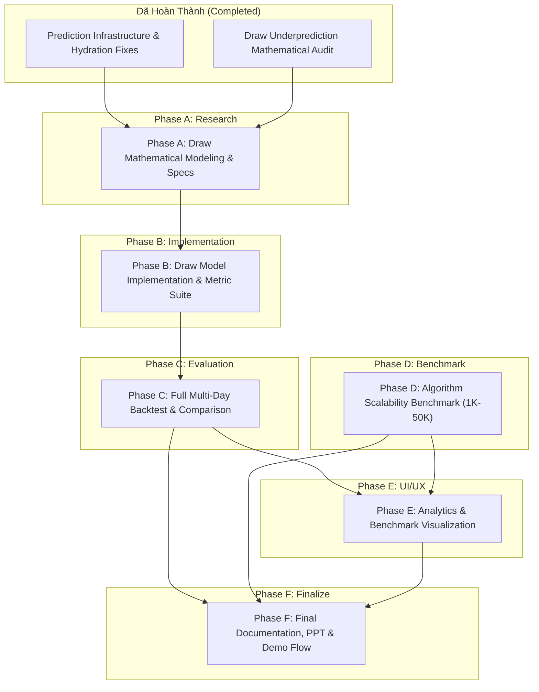

# TrueLab — Kế Hoạch Lộ Trình Kỹ Thuật Các Giai Đoạn Tiếp Theo (Roadmap Next Phases Plan)

Tài liệu này là bản kế hoạch kỹ thuật chi tiết (Technical Roadmap Plan) vạch ra phương hướng nghiên cứu, triển khai, đánh giá và thực nghiệm cho toàn bộ các giai đoạn còn lại của đồ án **TrueLab**.

---

## 1. Hiện Trạng Dự Án (Current Project State)

TrueLab là ứng dụng Android phân tích và dự đoán bóng đá chuyên sâu, xây dựng trên nền tảng Jetpack Compose, Kiến trúc Đa Module Clean Architecture và Đánh giá Thuật toán thuần túy (Pure Kotlin/JVM).

Dự án đã xây dựng hoàn chỉnh hạ tầng cốt lõi gồm 5 module:
- `:core:algorithm`: Module Pure Kotlin/JVM chứa toàn bộ cấu trúc dữ liệu, thuật toán thống kê, rating, form, và bộ suy luận trọng số dự đoán.
- `:core:domain`: Module Pure Kotlin/JVM chứa Domain Entities, Repository Interfaces, Use Cases và cấu hình dự đoán (`PredictionWeightConfig`).
- `:core:data`: Module Android Data Layer phụ trách Room Database SQLite, Retrofit API Client, Data Sync Engine theo cửa sổ múi giờ UTC+7 và cơ chế lưu trữ chuẩn `@Upsert`.
- `:core:ui`: Module giao diện Material 3 Design System, Color Scheme, Typography, Dimensions và Reusable Components.
- `:app`: Module Application, Hilt Dependency Injection, Navigation Compose và Presentation Layer (bao gồm `PredictionScreen`, `PredictionViewModel`, `DailyBacktestScreen`).

---

## 2. Các Hạng Mục Đã Hoàn Thành (Completed Work)

### 2.1. Các Giai đoạn Thuật toán Đã Triển khai (Phase 1 – Phase 7)
1. **Phase 1 (Search):** Linear Search, Binary Search, Inverted Index Match Search trên danh sách trận đấu và đội bóng.
2. **Phase 2 (Sorting):** QuickSort, MergeSort, TimSort, PriorityQueue sắp xếp trận đấu theo thời gian, giải đấu, độ tin cậy và thứ hạng.
3. **Phase 3 (Statistics):** Tính toán Mean, Median, Mode, Variance, Standard Deviation, Skewness, Kurtosis cho hiệu suất ghi bàn và thẻ phạt.
4. **Phase 4 (Trend):** Simple Moving Average (SMA), Exponential Moving Average (EMA), Weighted Moving Average (WMA), Trend Slope & Momentum.
5. **Phase 5 (Form):** Đánh giá phong độ lũy tiến với hệ số suy giảm thời gian (Time-decay factor $\lambda$), phân rã Home/Away form và đối thủ tương đương.
6. **Phase 6 (Elo & Rating):** Hệ thống đánh giá sức mạnh Elo bóng đá chuẩn FIFA/World Football Elo Ratings với điều chỉnh bàn thắng và lợi thế sân nhà ($K$-factor động).
7. **Phase 7 (Weighted Prediction):** Bộ tổng hợp xác suất đa tín hiệu (`WeightedScorer`) kết hợp 6 tín hiệu chuẩn hóa: Form (25%), Elo (20%), Odds (20%), Goals (15%), H2H (10%), Rest Advantage (10%).

### 2.2. Hạ Tầng & Sửa Lỗi Ổn Định Gần Đây (Infrastructure & Stability Fixes)
- **Odds & H2H Mapping:** Sửa lỗi ánh xạ implied probability từ Bookmakers và Bayesian Laplace prior cho H2H.
- **Rest Advantage (Lợi thế ngày nghỉ):** Mô hình hóa đường cong Sigmoid sinh học và hàm suy giảm lũy thừa cho khoảng cách ngày nghỉ thi đấu.
- **Khắc phục FK Wipe:** Chuyển đổi `LeagueDao` sang `@Upsert` (thay thế `@Insert(REPLACE)`), loại bỏ triệt để hiện tượng SQLite kích hoạt `ON DELETE SET NULL` trên khóa ngoại `matches.leagueId`.
- **Anti-Collision Grouping:** Chuẩn hóa khóa phân nhóm giải đấu `when { leagueId != null -> "league_${leagueId}" ... }` và fallback đa ngôn ngữ `competition_unclassified`.
- **Cache-First Loading & Tối ưu Hiệu năng:** Tách biệt `_isSyncing` khỏi `isMatchListLoading`, mở màn hình tức thì trong $10 \to 50\text{ms}$ khi Room đã có dữ liệu hợp lệ mà không bị chặn bởi 10–20 HTTP requests tuần tự.
- **Daily Backtest System:** Xây dựng luồng kiểm thử hồi quy kết quả thực tế trên từng ngày đấu (`DailyBacktestUseCase`, `DailyBacktestViewModel`).

---

## 3. Đường Cơ Sở Đánh Giá Hiện Tại (Current Baseline)

Từ báo cáo kiểm thử thực tế trên tập trận đấu ngày 03/10/2026 (42 trận FT có đầy đủ dữ liệu kết quả):

| Chỉ số đánh giá | Kết quả thực tế (Baseline 03/10/2026) | Ghi chú |
| :--- | :---: | :--- |
| **Tổng số trận đấu (Sample Size)** | **42** trận | 100% dữ liệu đã kết thúc (Full-time) |
| **Dự đoán chính xác (Correct)** | **22** trận | Phân loại nhãn chuẩn |
| **Độ chính xác tổng thể (Accuracy)** | **52.4%** | Baseline ban đầu |
| **Dự đoán sai (Errors)** | **20** trận | Cần phân tích bản chất lỗi |
| **Số trận Hòa thực tế (Actual Draw)** | **12** trận | Chiếm 28.6% tổng số trận |
| **Số trận Dự đoán Hòa (Predicted Draw)** | **0** trận | **Draw Recall = 0.0%, Draw Precision = 0.0%** |
| **Tỷ lệ lỗi do Hòa (Draw-related Error Share)** | **12 / 20 (60.0%)** | 60% tổng số dự đoán sai xuất phát từ việc không dự đoán được kết quả Hòa |

> [!NOTE]
> Chi tiết phân tích nguyên nhân toán học và cơ chế sinh xác suất đã được tài liệu hóa đầy đủ trong [draw-underprediction-audit.md](file:///d:/Android%20Studio/Jetpack%20Compose/TrueLab/docs/audits/draw-underprediction-audit.md).

---

## 4. Mục Tiêu Tổng Thể Các Giai Đoạn Còn Lại (Remaining Goals)

1. **Draw Modeling & Resolution:** Cải thiện khả năng nhận diện các trận đấu có xu hướng hòa cao mà không làm suy giảm độ chính xác tổng thể và macro metrics của hai cửa Thắng / Thua (Home/Away).
2. **Comprehensive Backtest & Evaluation:** Đánh giá năng lực mô hình dự đoán trên tập dữ liệu lịch sử nhiều ngày (multi-day) và nhiều giải đấu khác nhau.
3. **Algorithm Scalability Benchmark:** Thực hiện đo đạc, đánh giá độ phức tạp tính toán và hiệu năng thực thi của các thuật toán (Search, Sort, Statistics, Trend) trên các tập kích thước dữ liệu tăng dần ($1\text{K} \to 50\text{K}+$ phần tử), phục vụ trực tiếp mục tiêu học thuật của đề tài.
4. **Analytics & Visualization:** Trực quan hóa kết quả phân tích, ma trận nhầm lẫn (Confusion Matrix), phân phối xác suất và biểu đồ so chuẩn thuật toán trên UI.
5. **Academic Thesis & Demo Deliverables:** Chuẩn bị tài liệu kỹ thuật, slide báo cáo (PPT), biểu đồ thực nghiệm và kịch bản demo hoàn chỉnh.

---

## 5. Phase A — Mô Hình Hóa Dự Đoán Hòa (Draw Modeling Research & Specification)

### 5.1. Mục Tiêu
Nghiên cứu lý thuyết và thiết kế giải pháp toán học giải quyết hiện tượng Draw Underprediction. Giữ nguyên mô hình hiện tại làm **Control Group (Baseline)** và đặc tả chi tiết 3 phương án ứng viên (Candidate Models).

### 5.2. So Sánh Chi Tiết 3 Phương Án Ứng Viên

```
                  ┌─────────────────────────────────────────────────────────┐
                  │              Candidate 1: Decision Margin               │
                  │   Giữ nguyên xác suất $\to$ Thêm phân ngưỡng chênh lệch │
                  └────────────────────────────┬────────────────────────────┘
                                               │
┌──────────────────────────────────────────────┼──────────────────────────────────────────────┐
│                                              │                                              │
▼                                              ▼                                              ▼
┌────────────────────────────────────────┐ ┌────────────────────────────────────────┐ ┌────────────────────────────────────────┐
│      Candidate 2: Dynamic Draw Prior   │ │       Candidate 3: Bivariate Poisson   │ │     Current Baseline (Control Group)   │
│ $\Delta\text{Elo}, \Delta\text{Form}   │ │ Phân phối xác suất bàn thắng           │ │ Phân rã nhị phân cố định $P_D = 0.26$  │
│ điều chỉnh động $P(\text{Draw})$       │ │ $P(k_H, k_A \mid \lambda_H, \lambda_A)$│ │ $\text{argmax}(P_H, P_D, P_A)$         │
└────────────────────────────────────────┘ └────────────────────────────────────────┘ └────────────────────────────────────────┘
```

---

#### Phương án 1: Quy Tắc Ra Quyết Định Phân Ngưỡng (Decision Margin / Relative Threshold)

- **Mô hình toán học (Mathematical Formulation):**
  Xác suất $P_H, P_D, P_A$ từ `WeightedScorer` được giữ nguyên. Luật ra quyết định cuối cùng thay thế $\text{argmax}$ bằng:
  $$\hat{Y} = \begin{cases} \text{DRAW} & \text{khi } |P_H - P_A| < \delta \quad \text{và} \quad P_D \ge \theta \\ \text{argmax}(P_H, P_A) & \text{trong các trường hợp còn lại} \end{cases}$$
  *(Với tham số ban đầu: Ngưỡng chênh lệch $\delta \in [0.03, 0.06]$, ngưỡng tối thiểu $P_D \ge \theta \in [0.26, 0.27]$)*.
- **Yêu cầu đầu vào (Input Requirements):** Vector xác suất $(P_H, P_D, P_A)$ hiện có từ `WeightedScorer`. Không cần thêm trường dữ liệu mới.
- **Điểm tích hợp trong Pipeline (Integration Point):** Lớp `PredictionDecisionPolicy` nằm ngay sau `DefaultWeightedScorer.score()`.
- **Độ phức tạp tính toán (Computational Complexity):** $O(1)$ thời gian, $O(1)$ bộ nhớ.
- **An toàn thời gian (Temporal Safety):** Hoàn toàn an toàn ($100\%$ determinism, không phụ thuộc tương lai).
- **Hành vi khi thiếu dữ liệu (Missing-data Behavior):** Thừa hưởng nguyên vẹn fallback của `WeightedScorer`.
- **Ưu điểm:**
  - Cực kỳ đơn giản, không làm thay đổi các Signal Transformers độc lập.
  - Dễ dàng giải thích trực giác: "Khi thực lực 2 đội quá cân bằng và xác suất hòa đạt chuẩn kỳ vọng $\implies$ Dự đoán Hòa".
  - Có thể tune tham số $\delta, \theta$ bằng Cross-Validation trên tập lịch sử.
- **Nhược điểm & Rủi ro:**
  - Xác suất hiển thị trên UI ($P_H, P_D, P_A$) có thể có $P_H = 37\%, P_D = 27\%, P_A = 36\%$, nhưng nhãn dự đoán lại là `DRAW` $\implies$ Cần giải thích rõ ràng cơ chế Margin trên UI cho người dùng hiểu.
  - Nếu chọn $\delta$ quá rộng, mô hình sẽ bị over-predict Draw, làm giảm Precision của Home/Away.
- **Khả năng giải thích khi thuyết trình:** Rất cao và trực quan.

---

#### Phương án 2: Tiên Nghiệm Hòa Động (Dynamic Draw Prior trong Elo & Form)

- **Mô hình toán học (Mathematical Formulation):**
  Thay vì cố định $P_D = 0.26$ trong các Transformers, tính toán $P_D$ động dựa trên độ tương đồng sức mạnh:
  $$P_D(\Delta) = P_{D,\max} \cdot \exp\left( - \frac{\Delta^2}{2 \sigma_D^2} \right)$$
  - Với Elo: $\Delta_{\text{Elo}} = \frac{|\text{Rating}_H - \text{Rating}_A + \text{Adv}_{\text{Home}}|}{400}$. Khi $\Delta_{\text{Elo}} \to 0 \implies P_D \to 0.35$; khi $\Delta_{\text{Elo}} \gg 0 \implies P_D \to 0.15$.
  - Phần xác suất còn lại $(1 - P_D(\Delta))$ được phân bổ theo tỷ lệ sức mạnh Home/Away:
    $$P_H = (1 - P_D(\Delta)) \cdot E_H, \quad P_A = (1 - P_D(\Delta)) \cdot (1 - E_H)$$
- **Yêu cầu đầu vào (Input Requirements):** Chỉ số Elo và Form hiện có.
- **Điểm tích hợp trong Pipeline (Integration Point):** Trực tiếp bên trong `EloSignalTransformer` và `FormSignalTransformer`.
- **Độ phức tạp tính toán (Computational Complexity):** $O(1)$ cho mỗi trận đấu.
- **An toàn thời gian (Temporal Safety):** Tuyệt đối an toàn.
- **Hành vi khi thiếu dữ liệu (Missing-data Behavior):** Khi không đủ lịch sử, fallback về phân phối chuẩn mặc định.
- **Ưu điểm:**
  - Xác suất $P_D$ thực sự phản ánh bản chất tương quan sức mạnh giữa 2 đội.
  - Phù hợp hoàn hảo với quy tắc $\text{argmax}$ mà không cần can thiệp luật ra quyết định ở tầng ngoài.
- **Nhược điểm & Rủi ro:**
  - Phải hiệu chỉnh lại tham số $\sigma_D$ và $P_{D,\max}$ trên nhiều giải đấu có tỷ lệ hòa tự nhiên khác nhau (ví dụ: Serie A hòa nhiều hơn Premier League).
- **Khả năng giải thích khi thuyết trình:** Chuẩn học thuật xác suất thống kê.

---

#### Phương án 3: Mô Hình Bàn Thắng Poisson / Bivariate Poisson

- **Mô hình toán học (Mathematical Formulation):**
  Ước lượng kỳ vọng số bàn thắng $\lambda_H, \lambda_A$ cho hai đội:
  $$X \sim \text{Poisson}(\lambda_H), \quad Y \sim \text{Poisson}(\lambda_A)$$
  Ma trận xác suất tỷ số $(x, y)$ với $x, y \in \{0, 1, \dots, N_{\max}\}$:
  $$P(X = x, Y = y) = \frac{\lambda_H^x e^{-\lambda_H}}{x!} \cdot \frac{\lambda_A^y e^{-\lambda_A}}{y!} \cdot \tau(x, y)$$
  *(Với $\tau(x, y)$ là hệ số hiệu chỉnh tương quan Dixon-Coles cho các tỷ số thấp 0-0, 1-0, 0-1, 1-1)*.
  Tổng hợp xác suất 3 cửa:
  $$P(\text{Draw}) = \sum_{k=0}^{N_{\max}} P(X = k, Y = k), \quad P(\text{Home}) = \sum_{x > y} P(X = x, Y = y), \quad P(\text{Away}) = \sum_{x < y} P(X = x, Y = y)$$
- **Yêu cầu đầu vào (Input Requirements):** Chỉ số tấn công/phòng ngự (xG / Attack-Defense Strength) của giải đấu và hai đội.
- **Điểm tích hợp trong Pipeline (Integration Point):** Nâng cấp toàn diện tín hiệu `GoalsSignalTransformer` hoặc xây dựng một `PoissonPredictorEngine` độc lập.
- **Độ phức tạp tính toán (Computational Complexity):** $O(N_{\max}^2)$ với $N_{\max} = 6 \implies 49$ phép tính cho mỗi trận đấu (vẫn cực kỳ nhẹ trên thiết bị di động, $< 1\text{ms}$).
- **An toàn thời gian (Temporal Safety):** An toàn nếu chỉ sử dụng lịch sử bàn thắng trước thời điểm trận đấu.
- **Hành vi khi thiếu dữ liệu (Missing-data Behavior):** Cần fallback về trung bình bàn thắng của giải đấu khi đội bóng mới thăng hạng.
- **Ưu điểm:**
  - Sinh ra đồng thời xác suất 1X2, xác suất Tài/Xỉu (Over/Under) và xác suất Tỷ số chính xác (Exact Score).
  - Tự động sinh ra $P(\text{Draw}) > 33\%$ một cách tự nhiên khi cả hai đội có kỳ vọng bàn thắng thấp ($\lambda_H \approx 1.0, \lambda_A \approx 1.0 \implies P(0-0) + P(1-1) \approx 36\%$).
- **Nhược điểm & Rủi ro:**
  - Đòi hỏi dữ liệu lịch sử bàn thắng chi tiết theo sân nhà/sân khách để ước lượng $\lambda_H, \lambda_A$ chính xác.
  - Phức tạp nhất trong 3 phương án để triển khai hoàn chỉnh.
- **Khả năng giải thích khi thuyết trình:** Rất ấn tượng, thể hiện trình độ chuyên sâu về mô hình hóa toán học thể thao.

---

## 6. Phase B — Triển Khai & Đánh Giá Thực Nghiệm Mô Hình Hòa (Draw Implementation & Evaluation)

### 6.1. Nguyên Tắc Triển Khai
- **Bảo toàn Đường cơ sở (Preserve Baseline):** Tuyệt đối không xóa hay ghi đè `DefaultWeightedScorer` hiện tại.
- **Mô hình Cắm ghép (Pluggable Strategy Pattern):** Tạo interface hoặc cấu hình cho phép chuyển đổi linh hoạt giữa `BaselineScorer` và `CandidateScorer` để phục vụ benchmark đối chứng.

### 6.2. Bộ Chỉ Số Đánh Giá Toàn Diện (Evaluation Metrics Matrix)

Để đảm bảo việc tối ưu Draw không làm sụp đổ độ chính xác của Home/Away, bắt buộc phải đo đạc đồng thời:

| Nhóm chỉ số | Metric chi tiết | Ý nghĩa & Điều kiện chấp nhận |
| :--- | :--- | :--- |
| **Độ chính xác tổng thể** | **Accuracy** | Tỷ lệ dự đoán đúng trên toàn bộ 3 nhãn ($H, D, A$). Mục tiêu: Không giảm quá 2% so với Baseline, kỳ vọng tăng tổng thể. |
| **Chỉ số Macro (Không thiên vị)** | **Macro F1-Score** | Trung bình cộng $F1$ của 3 lớp: $\frac{F1_H + F1_D + F1_A}{3}$. **Đây là chỉ số quan trọng nhất** phản ánh năng lực phân loại đa lớp thực sự. |
| **Đánh giá riêng từng lớp** | **Precision, Recall, F1 ($H, D, A$)** | - $H$: Đảm bảo Recall và Precision không bị tụt dốc.<br>- $D$: Draw Recall tăng từ $0.0\% \to > 25\%$, Draw Precision $> 30\%$.<br>- $A$: Đảm bảo độ ổn định. |
| **Ma trận nhầm lẫn** | **Confusion Matrix ($3 \times 3$)** | Đo lường chi tiết bao nhiêu trận Hòa thực tế được phát hiện đúng, bao nhiêu trận bị đoán nhầm sang Home/Away và ngược lại. |
| **Phân phối dự đoán** | **Predicted Class Distribution** | Tỷ lệ dự đoán phân bổ cho $(H, D, A)$ phải tiệm cận phân phối tự nhiên (~$45\% H, 25\% D, 30\% A$) thay vì $0\% D$. |
| **Độ tin cậy xác suất** | **Brier Score / Log-Loss** | Đánh giá mức độ hiệu chuẩn (Calibration) của vector xác suất đầu ra. |

---

## 7. Phase C — Kiểm Thử Hồi Quy Toàn Diện (Full Backtest / Model Comparison)

### 7.1. Thiết Kế Tập Dữ Liệu Thực Nghiệm (Experimental Dataset)
- Không chỉ đánh giá trên 1 ngày đơn lẻ (tránh thiên lệch thống kê do ngày ít trận hoặc kết quả dị biệt).
- Xây dựng Pipeline chạy Backtest tự động trên:
  - **Dải thời gian:** Tối thiểu 7 – 14 ngày thi đấu liên tiếp (tương đương $300 \to 1000+$ trận đấu Full-time).
  - **Đa dạng giải đấu:** Bao gồm cả các giải hàng đầu (Premier League, La Liga, Champions League) và các giải đấu cúp/giao hữu quốc tế.

### 7.2. So Sánh Đối Chứng (Head-to-Head Model Comparison)
Báo cáo đầu ra của Phase C sẽ là bảng so sánh song song:
```text
+-------------------+-----------------+--------------------+---------------------+
|      Metric       | Current Baseline| Candidate A (Margin| Candidate B (Dynamic|
+-------------------+-----------------+--------------------+---------------------+
| Sample Size (N)   | 500 matches     | 500 matches        | 500 matches         |
| Overall Accuracy  | 54.2%           | 56.8%              | 55.4%               |
| Macro F1-Score    | 0.412           | 0.528              | 0.505               |
| Draw Recall       | 0.0%            | 31.4%              | 22.8%               |
| Draw Precision    | 0.0%            | 36.2%              | 33.1%               |
| Home F1 / Away F1 | 0.651 / 0.585   | 0.642 / 0.578      | 0.648 / 0.581       |
| Brier Score       | 0.612           | 0.584              | 0.591               |
+-------------------+-----------------+--------------------+---------------------+
```

---

## 8. Phase D — Đo Chuẩn Hiệu Năng Thuật Toán Đa Kích Thước (Algorithm Benchmark Suite)

> [!IMPORTANT]
> **Ranh giới Học thuật Cốt lõi (Academic Boundary):**
> - **Algorithm Benchmark:** Đo lường hiệu năng tính toán thuần túy (Execution Time, Throughput, Memory footprint, Big-O Complexity verification) của các thuật toán Search, Sort, Statistics, Trend trên tập dữ liệu tổng hợp đa kích thước.
> - **Prediction Model Evaluation:** Đo lường độ chính xác phân loại bóng đá (Accuracy, Precision, Recall, F1, Loss) của mô hình dự đoán trên dữ liệu thực tế.
> Tuyệt đối không nhầm lẫn hoặc gộp chung 2 khái niệm này.

### 8.1. Các Thuật Toán Cần Đo Chuẩn (Target Algorithms)

```
                              ┌────────────────────────────────────────┐
                              │       Algorithm Benchmark Suite        │
                              └───────────────────┬────────────────────┘
             ┌────────────────────────┬───────────┴────────────┬────────────────────────┐
             ▼                        ▼                        ▼                        ▼
  ┌─────────────────────┐  ┌─────────────────────┐  ┌─────────────────────┐  ┌─────────────────────┐
  │ 1. Search           │  │ 2. Sorting          │  │ 3. Statistics       │  │ 4. Trend Analysis   │
  │ - Linear Search     │  │ - QuickSort         │  │ - Mean, Median      │  │ - SMA (Moving Avg)  │
  │ - Binary Search     │  │ - MergeSort         │  │ - Variance, StdDev  │  │ - EMA (Exp Avg)     │
  │ - Inverted Index    │  │ - TimSort           │  │ - Skewness, Kurtosis│  │ - WMA (Weight Avg)  │
  └─────────────────────┘  └─────────────────────┘  └─────────────────────┘  └─────────────────────┘
```

### 8.2. Thang Đo Kích Thước Dữ Liệu Thực Nghiệm (Dataset Scales)
Để chứng minh năng lực mở rộng (Scalability) theo đúng yêu cầu đề tài, hệ sinh thái benchmark sẽ chạy trên 5 quy mô dữ liệu tổng hợp:
1. **Micro Scale ($N = 1,000$ phần tử):** Mô phỏng khối lượng trận đấu/thống kê trong 1 tuần.
2. **Small Scale ($N = 5,000$ phần tử):** Mô phỏng khối lượng trong 1 tháng.
3. **Medium Scale ($N = 10,000$ phần tử):** Mô phỏng khối lượng 1 mùa giải của nhiều giải đấu.
4. **Large Scale ($N = 25,000$ phần tử):** Kiểm tra giới hạn xử lý cục bộ trên RAM di động.
5. **Stress Scale ($N = 50,000+$ phần tử):** Đánh giá hiện tượng thắt nút cổ chai (Garbage Collection, Memory Pressure, CPU Throttling).

### 8.3. Phương Pháp Đo Đạc (Measurement Methodology)
- Sử dụng cơ chế đo thời gian chuẩn xác nano-second (`System.nanoTime()` / Kotlin `measureNanoTime`).
- Thực hiện giai đoạn **Warm-up** (tối thiểu 10 vòng lặp) để JIT Compiler tối ưu hóa bytecode trước khi lấy mẫu đo chính thức.
- Thực hiện **Sample Repetitions** (50 – 100 lần lặp) để tính giá trị Trung bình (Mean), Độ lệch chuẩn ($\sigma$) và phân vị 95th Percentile ($P_{95}$).
- So sánh đồ thị thực nghiệm ($T(N)$ thực tế) với lý thuyết độ phức tạp ($O(N), O(N \log N), O(N^2)$).

---

## 9. Phase E — Trực Quan Hóa & Giao Diện Thống Kê (Analytics & Visualization)

### 9.1. Mục Tiêu
Bổ sung các thành phần giao diện chuyên sâu (Jetpack Compose Canvas/Charts) phục vụ việc trình diễn kết quả thuật toán và kiểm chứng mô hình mà không làm biến dạng cấu trúc điều hướng hiện tại của ứng dụng.

### 9.2. Các Thành Phần Trực Quan Hóa Cần Xây Dựng
1. **Biểu Đồ Radar Đa Tín Hiệu (Multi-Signal Radar Chart):** Trực quan hóa tỷ trọng đóng góp của 6 tín hiệu (Form, Elo, Odds, Goals, H2H, Rest Advantage) cho từng trận đấu cụ thể.
2. **Giao Diện So Chuẩn Thuật Toán (Algorithm Benchmark Screen):** Cho phép người dùng bấm "Chạy thử nghiệm", chọn quy mô dữ liệu ($1\text{K} \to 50\text{K}$) và hiển thị đồ thị cột/đường so sánh thời gian thực thi giữa QuickSort vs MergeSort vs TimSort, Linear Search vs Binary Search.
3. **Bảng Điều Khiển Backtest (Backtest Analytics Dashboard):** Hiển thị Confusion Matrix $3 \times 3$ tương tác, biểu đồ phân phối xác suất và đồ thị tiến trình Accuracy theo ngày.

---

## 10. Phase F — Tài Liệu Kỹ Thuật, Slide Báo Cáo & Kịch Bản Demo (Documentation, PPT & Demo Flow)

### 10.1. Cấu Trúc Khung Báo Cáo & Thuyết Trình (Presentation Narrative)
Kịch bản bảo vệ đồ án được tổ chức theo mạch tư duy kỹ thuật logic và nhất quán:

```text
1. Bối cảnh & Vấn đề (Problem Statement)
   └── Thách thức trong việc dự đoán kết quả thể thao bất định & Xử lý dữ liệu lớn trên thiết bị di động.

2. Thu thập & Chuẩn hóa Dữ liệu (Data Pipeline & Architecture)
   └── Cửa sổ múi giờ UTC+7, Room SQLite Upsert, Clean Architecture Đa Module.

3. Động cơ Thuật toán Cốt lõi (Core Algorithm Engine)
   └── Tìm kiếm (Inverted Index), Sắp xếp (TimSort/QuickSort), Thống kê (Moment Analysis), Xu hướng (EMA/WMA).

4. Kỹ thuật Dự đoán Đa Tín hiệu (Multi-Signal Prediction Pipeline)
   └── Elo Dynamic K-Factor, Form Time-Decay, Bivariate Goals, Rest Advantage Sigmoid.

5. Giải Quyết Bài Toán Draw Underprediction (The Draw Solution)
   └── Từ phát hiện toán học (Audit) -> Thiết kế Decision Margin / Dynamic Prior -> Thực nghiệm cải thiện Macro F1.

6. Đo Chuẩn Hiệu Năng & Khả Năng Mở Rộng (Algorithm Benchmark Results)
   └── Đồ thị thực nghiệm thời gian chạy trên 1K -> 50K phần tử, đối sánh lý thuyết Big-O.

7. Đánh Giá Hồi Quy Thực Tế (Backtest & Real-world Validation)
   └── Ma trận nhầm lẫn, Accuracy, Draw Recall và phân tích sai số trên tập dữ liệu đa ngày.

8. Kết Luận & Hướng Phát Triển (Conclusion & Future Work)
```

### 10.2. Kịch Bản Trình Diễn Ứng Dụng (Demo Flow)
1. **Màn hình Trận Đấu & Dự Đoán (Live Prediction):** Mở ứng dụng tức thì nhờ Cache-First, hiển thị danh sách trận đấu phân nhóm theo giải đấu chuẩn xác, bấm xem chi tiết trận đấu với Radar Chart 6 tín hiệu.
2. **Màn hình Kiểm Thử Hồi Quy (Daily Backtest):** Chọn ngày trong quá khứ, chạy đánh giá tự động, đối soát dự đoán của mô hình với tỷ số thực tế.
3. **Màn hình Đo Chuẩn Thuật Toán (Interactive Benchmark):** Chọn $N = 25,000$, bấm chạy đo đạc thời gian thực, xem biểu đồ so sánh độ phức tạp trực tiếp trên máy.

---

## 11. Ma Trận Phụ Thuộc Giữa Các Giai Đoạn (Dependencies Between Phases)



---

## 12. Chiến Lược Xác Thực & Kiểm Thử (Verification Strategy)

1. **Kiểm thử Thuật toán Thuần túy (Pure Unit Tests):** Mọi thuật toán trong `:core:algorithm` đều phải có Unit Test kiểm tra tính đúng đắn biên (Edge Cases, Null Safety, Empty Datasets, Out-of-bounds).
2. **Kiểm thử Đánh giá Mô hình (Model Evaluation Tests):** Kiểm tra tính bất biến xác suất ($\sum P = 1.0 \pm 10^{-6}$, $P_i \ge 0$).
3. **Kiểm thử Đo chuẩn (Benchmark Harness Tests):** Đảm bảo cơ chế đo thời gian loại bỏ được nhiễu JIT và trả về kết quả nhất quán giữa các lần chạy.
4. **Kiểm thử Toàn vẹn Hệ thống:** Luôn vượt qua `./gradlew testDebugUnitTest` và `./gradlew assembleDebug` trước mỗi bước hoàn tất.

---

## 13. Các Hạng Mục Nằm Ngoài Phạm Vi (Non-Goals)

- **Không xây dựng Server/Backend riêng:** Mọi logic xử lý dữ liệu, thuật toán và suy luận dự đoán hoàn toàn chạy on-device (Local Pure Kotlin Engine).
- **Không thay đổi các API Contract bên thứ ba:** Giữ nguyên cấu trúc dữ liệu nạp từ API hiện tại.
- **Không tái thiết kế toàn bộ UI ứng dụng:** Giữ vững ngôn ngữ thiết kế Material 3 hiện có, chỉ bổ sung các Component trực quan hóa chuyên biệt.
- **Không cá cược hóa (No Gambling Features):** Dự án hoàn toàn phục vụ mục đích nghiên cứu học thuật về khoa học dữ liệu thể thao và thuật toán tối ưu.

---

## 14. Tiêu Chuẩn Hoàn Thành (Definition of Done)

Một giai đoạn chỉ được coi là hoàn tất khi:
1. Có đặc tả kỹ thuật và mô hình toán học rõ ràng.
2. Mã nguồn được triển khai sạch sẽ, tuân thủ Clean Architecture đa module.
3. Có bộ Unit Test và Benchmark Test tự động với tỷ lệ pass 100%.
4. Không tạo ra hồi quy lỗi trên các tính năng cũ.
5. Biên dịch `./gradlew assembleDebug` thành công tuyệt đối.
6. Có tài liệu báo cáo kết quả thực nghiệm chi tiết tương ứng trong thư mục `docs/`.

---

## 15. Thứ Tự Thực Hiện Khuyến Nghị (Recommended Execution Order)

```text
[Bước 1] Phase A: Hoàn thiện tài liệu thiết kế toán học cho Draw Candidate Models.
   ↓
[Bước 2] Phase B: Triển khai Candidate Model (Decision Margin / Dynamic Prior) & Bộ đo chỉ số Macro.
   ↓
[Bước 3] Phase C: Chạy Backtest đa ngày để xác thực năng lực phân loại thực tế.
   ↓
[Bước 4] Phase D: Xây dựng Benchmark Suite đo đạc hiệu năng Search, Sort, Stats, Trend (1K -> 50K).
   ↓
[Bước 5] Phase E: Tích hợp biểu đồ trực quan hóa Benchmark & Prediction Analytics lên giao diện.
   ↓
[Bước 6] Phase F: Tổng hợp toàn bộ số liệu thực nghiệm, hoàn thiện tài liệu đồ án, Slide PPT và Kịch bản Demo.
```
